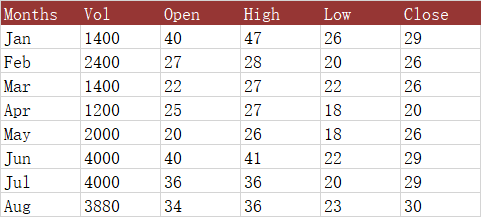

## **Possible Usage Scenarios**
The fourth stock chart we will look at is the Volume Open High Low Close chart. Again it is important to repeat that you must have the data in the correct order. If you need to rearrange your data table, you should do it before you set up your chart. This chart includes a column for volume immediately after the first (category) column, and the charts include a column chart on the primary axis showing this volume, while the prices are moved to the secondary axis.



## **Volume-Open-High-Low-Close (VHLC) stock chart**


## **Sample Code**
The following sample code loads the [sample Excel file](Volume-Open-High-Low-Close.xlsx) and generates the [output Excel file](out.xlsx).

```c++
#include <iostream>
#include "Aspose.Cells.h"
using namespace Aspose::Cells;

int main()
{
    Aspose::Cells::Startup();

    // Create an instance of Workbook
    Workbook workbook(u"Volume-Open-High-Low-Close.xlsx");
    
    // Access the first worksheet
    Worksheet worksheet = workbook.GetWorksheets().Get(0);
    
    // Create High-Low-Close-Stock Chart
    int32_t pieIdx = worksheet.GetCharts().Add(ChartType::StockVolumeOpenHighLowClose, 5, 6, 20, 12);
    
    // Retrieve the Chart object
    Chart chart = worksheet.GetCharts().Get(pieIdx);
    
    // Set the legend to be shown
    chart.SetShowLegend(true);
    
    // Set the chart title name 
    chart.GetTitle().SetText(u"Volume-Open-High-Low-Close Stock");
    
    // Set the Legend at the bottom of the chart area
    chart.GetLegend().SetPosition(LegendPositionType::Bottom);
    
    // Set data range
    chart.SetChartDataRange(u"A1:F9", true);
    
    // Set category data 
    chart.GetNSeries().GetCategoryData() = u"A2:A9";
    
    // Set Color for the first series (Volume) data 
    chart.GetNSeries().Get(0).GetArea().SetForegroundColor(Color{0xff, 79, 129, 189});
    
    // Fill the PlotArea area with nothing 
    chart.GetPlotArea().GetArea().GetFillFormat().SetFillType(FillType::None);
    
    // Save the Excel file
    workbook.Save(u"out.xlsx");

    std::cout << "Chart created and file saved successfully!" << std::endl;

    Aspose::Cells::Cleanup();
}
```

