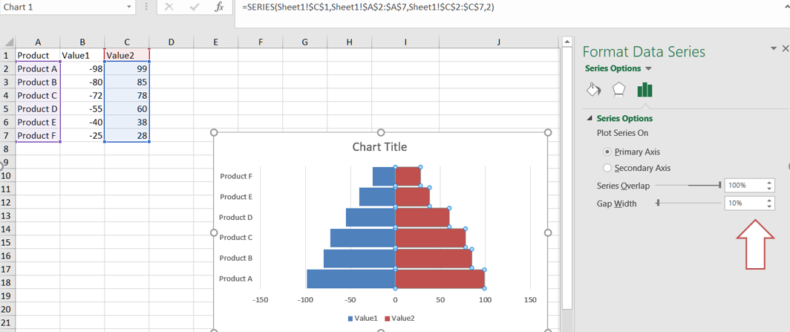
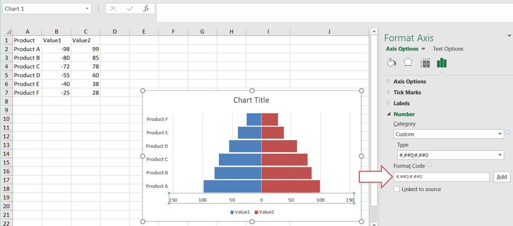

## **Introduction**
A tornado chart, also known as a tornado diagram or tornado graph, is a type of data visualization that is often used for sensitivity analysis in Excel. It helps you understand the impact of changing variables on a particular outcome or result.

## **How to Create a Tornado Chart in Excel**
You can create a tornado chart in Excel by following these steps:
1. Select the data and go to **Insert → Charts → Insert Column or Bar Chart → Stacked Bar Chart**. Click on it.  
   <br>
   
2. Change the Y‑axis: Right‑click on the Y‑axis. Click on **Format Axis**. In **Labels**, click on the label position drop‑down and select the **Low** item.  
   <br>
   
3. Select any bar and go to the **Formatting** pane. Set an appropriate gap width.  
   <br>
   
4. Let's remove the minus sign (‑) from the tornado chart. Select the X‑axis, go to **Formatting**, and in the **Axis Options** click **Number**. In **Category**, select **Custom**, and in the **Format Code** type `###0,###0`. Click **Add**.  
   <br>
   
5. Click on the Y‑axis and go to the **Axis Options**. In the Axis Options, check the **Categories in reverse order** box.  
   <br>
   

## **How to Add a Tornado Chart with Aspose.Cells**
Please see the following sample code. It loads the [sample Excel file](sample.xlsx) that contains some sample data. It then creates the stacked bar chart based on the initial data and sets relevant properties. Finally, it saves the workbook to the [output XLSX format](out.xlsx). The following screenshot shows the tornado chart created by Aspose.Cells in the output Excel file.  
<br>


### **Sample Code**

```cpp
#include <iostream>
#include "Aspose.Cells.h"
using namespace Aspose::Cells;

int main()
{
    Aspose::Cells::Startup();

    // Source directory path
    U16String srcDir(u"..\\Data\\01_SourceDirectory\\");

    // Output directory path
    U16String outDir(u"..\\Data\\02_OutputDirectory\\");

    // Path of input Excel file
    U16String inputFilePath = srcDir + u"sample.xlsx";

    // Path of output Excel file
    U16String outputFilePath = outDir + u"out.xlsx";

    // Create workbook
    Workbook wb(inputFilePath);

    // Get the first worksheet
    Worksheet sheet = wb.GetWorksheets().Get(0);

    // Get the chart collection from the worksheet
    ChartCollection charts = sheet.GetCharts();

    // Add a bar chart
    int index = charts.Add(ChartType::BarStacked, 8, 1, 24, 8);
    Chart chart = charts.Get(index);

    // Set data for the bar chart
    chart.SetChartDataRange(u"A1:C7", true);

    // Set properties for the bar chart
    chart.GetTitle().SetText(u"Tornado chart");
    chart.SetStyle(2);
    chart.GetPlotArea().GetArea().SetForegroundColor(Color::White());
    chart.GetPlotArea().GetBorder().SetColor(Color::White());
    chart.GetLegend().SetPosition(LegendPositionType::Bottom);

    // Set properties for the category axis
    chart.GetCategoryAxis().SetTickLabelPosition(TickLabelPositionType::Low);
    chart.GetCategoryAxis().SetIsPlotOrderReversed(true);

    // Set gap width
    chart.SetGapWidth(10);

    // Set properties for the value axis
    Axis valueAxis = chart.GetValueAxis();
    valueAxis.GetTickLabels().SetNumberFormat(u"#,##0;#,##0");

    // Save the workbook
    wb.Save(outputFilePath);

    std::cout << "Chart created successfully!" << std::endl;

    Aspose::Cells::Cleanup();
}
```

