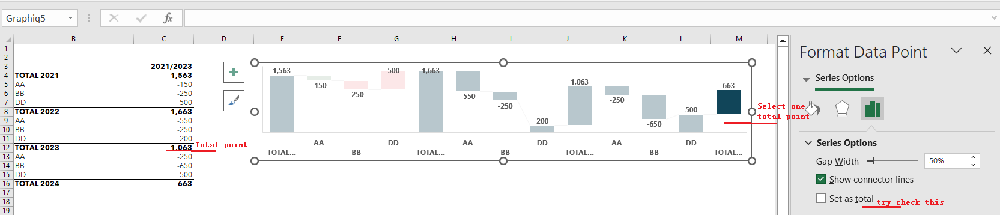
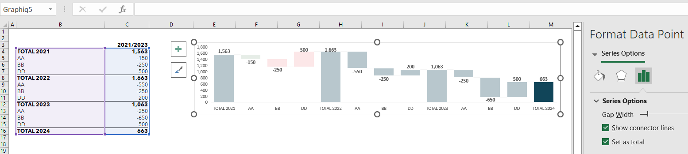

## What is "Set point as total" in Excel Chart

In some Excel chart, for example, waterFall chart, some point data are the sum of the previous points, you may need to "set point as total". We will show the sample code and the illustration below.

## A waterFall Chart need to "Set point as total" 



This picture shows a waterFall chart in Excel. We can see that there are four data points starting with "Total", And they are used to count all the previous data points.
In this picture, the settings are not exactly right, when we select a point "Total 2024" and we can see that the "Set as total" option is not checked in the Excel.
Attached below is the [sample Excel file](SampleSheet.xlsx) that needs to be modified, and we will use Aspose.Cells to set it up correctly.

## Use Aspose.Cells to "Set point as total" 

We use the following code to get the file set up correctly:

```c++
#include <iostream>
#include "Aspose.Cells.h"

using namespace Aspose::Cells;

int main()
{
    Aspose::Cells::Startup();

    // Initialize file path
    U16String filePath(u"");

    // Load the workbook
    Workbook wb(filePath + u"SampleSheet.xlsx");

    // Get the first worksheet
    Worksheet worksheet = wb.GetWorksheets().Get(0);

    // Get the chart by name
    Chart chart = worksheet.GetCharts().Get(u"Graphiq5");

    // Set some points as total column
    // In this example, we set points 0, 4, 8, 12 as total
    Vector<int32_t> subtotals = {0, 4, 8, 12};
    chart.GetNSeries().Get(0).GetLayoutProperties().SetSubtotals(subtotals);

    // Save the workbook
    wb.Save(filePath + u"output.xlsx");

    std::cout << "Chart subtotals set successfully!" << std::endl;

    Aspose::Cells::Cleanup();
}
```

You can get the following correct [output file](output.xlsx)

As shown in the figure below, the four "Total" data points are set correctly, and you can see the difference from the previous chart.

