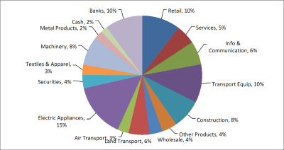

{}

This article explains how to create a pie chart with leader lines from scratch while using Aspose.Cells for C++ API. In Excel, the 'Show leader lines' option is set by default so when you create a pie chart in Excel the leader lines are shown. However, while creating a similar chart with Aspose.Cells APIs, you have to explicitly set the [**Series.GetHasLeaderLines()**](https://reference.aspose.com/cells/cpp/aspose.cells.charts/series/gethasleaderlines/) property.

{}

To demonstrate the usage of Aspose.Cells for C++ API to create a pie chart with leader lines, we will first create a new [**Workbook**](https://reference.aspose.com/cells/cpp/aspose.cells/workbook/) and input some data that will serve as the series data source. Once the data is in place, we will add a [**Chart**](https://reference.aspose.com/cells/cpp/aspose.cells.charts/chart/) of type [**ChartType.Pie**](https://reference.aspose.com/cells/cpp/aspose.cells.charts/charttype/) to the collection of charts and set its different aspects to get the desired chart view.

```cpp
#include <iostream>
#include "Aspose.Cells.h"
using namespace Aspose::Cells;

int main()
{
    Aspose::Cells::Startup();

    // Source directory path
    U16String srcDir(u"..\\Data\\01_SourceDirectory\\");

    // Output directory path
    U16String outDir(u"..\\Data\\02_OutputDirectory\\");

    // Create an instance of Workbook in XLSX format
    Workbook workbook(FileFormatType::Xlsx);

    // Access the first worksheet
    Worksheet worksheet = workbook.GetWorksheets().Get(0);

    // Add two columns of data
    worksheet.GetCells().Get(u"A1").PutValue(u"Retail");
    worksheet.GetCells().Get(u"A2").PutValue(u"Services");
    worksheet.GetCells().Get(u"A3").PutValue(u"Info & Communication");
    worksheet.GetCells().Get(u"A4").PutValue(u"Transport Equip");
    worksheet.GetCells().Get(u"A5").PutValue(u"Construction");
    worksheet.GetCells().Get(u"A6").PutValue(u"Other Products");
    worksheet.GetCells().Get(u"A7").PutValue(u"Wholesale");
    worksheet.GetCells().Get(u"A8").PutValue(u"Land Transport");
    worksheet.GetCells().Get(u"A9").PutValue(u"Air Transport");
    worksheet.GetCells().Get(u"A10").PutValue(u"Electric Appliances");
    worksheet.GetCells().Get(u"A11").PutValue(u"Securities");
    worksheet.GetCells().Get(u"A12").PutValue(u"Textiles & Apparel");
    worksheet.GetCells().Get(u"A13").PutValue(u"Machinery");
    worksheet.GetCells().Get(u"A14").PutValue(u"Metal Products");
    worksheet.GetCells().Get(u"A15").PutValue(u"Cash");
    worksheet.GetCells().Get(u"A16").PutValue(u"Banks");

    worksheet.GetCells().Get(u"B1").PutValue(10.4);
    worksheet.GetCells().Get(u"B2").PutValue(5.2);
    worksheet.GetCells().Get(u"B3").PutValue(6.4);
    worksheet.GetCells().Get(u"B4").PutValue(10.4);
    worksheet.GetCells().Get(u"B5").PutValue(7.9);
    worksheet.GetCells().Get(u"B6").PutValue(4.1);
    worksheet.GetCells().Get(u"B7").PutValue(3.5);
    worksheet.GetCells().Get(u"B8").PutValue(5.7);
    worksheet.GetCells().Get(u"B9").PutValue(3);
    worksheet.GetCells().Get(u"B10").PutValue(14.7);
    worksheet.GetCells().Get(u"B11").PutValue(3.6);
    worksheet.GetCells().Get(u"B12").PutValue(2.8);
    worksheet.GetCells().Get(u"B13").PutValue(7.8);
    worksheet.GetCells().Get(u"B14").PutValue(2.4);
    worksheet.GetCells().Get(u"B15").PutValue(1.8);
    worksheet.GetCells().Get(u"B16").PutValue(10.1);

    // Create a pie chart and add it to the collection of charts
    int id = worksheet.GetCharts().Add(ChartType::Pie, 3, 3, 23, 13);

    // Access newly created Chart instance
    Chart chart = worksheet.GetCharts().Get(id);

    // Set series data range
    chart.GetNSeries().Add(u"B1:B16", true);

    // Set category data range
    chart.GetNSeries().SetCategoryData(u"A1:A16");

    // Turn off legend
    chart.SetShowLegend(false);

    // Access data labels
    DataLabels dataLabels = chart.GetNSeries().Get(0).GetDataLabels();

    // Turn on category names
    dataLabels.SetShowCategoryName(true);

    // Turn on percentage format
    dataLabels.SetShowPercentage(true);

    // Set position
    dataLabels.SetPosition(LabelPositionType::OutsideEnd);

    // Set separator
    dataLabels.SetSeparatorType(DataLabelsSeparatorType::Comma);

    // Save the workbook
    workbook.Save(outDir + u"PieChart_out.xlsx");

    std::cout << "Pie chart created successfully!" << std::endl;

    Aspose::Cells::Cleanup();
}
```

So far we have created a pie chart and set its different aspects. Now we are going to turn on the leader lines for the chart. Please note, to show the leader lines, we have to move the data labels a little.

The following piece of code turns on the leader lines, refresh the chart, and then calculates the data labels' positions to move them accordingly.

```cpp
#include <iostream>
#include "Aspose.Cells.h"
using namespace Aspose::Cells;
using namespace Aspose::Cells::Charts;

int main()
{
    Aspose::Cells::Startup();

    // Create an instance of Workbook in XLSX format
    Workbook workbook(FileFormatType::Xlsx);

    // Access the first worksheet
    Worksheet worksheet = workbook.GetWorksheets().Get(0);

    // Add two columns of data
    worksheet.GetCells().Get(u"A1").PutValue(u"Retail");
    worksheet.GetCells().Get(u"A2").PutValue(u"Services");
    worksheet.GetCells().Get(u"A3").PutValue(u"Info & Communication");
    worksheet.GetCells().Get(u"A4").PutValue(u"Transport Equip");
    worksheet.GetCells().Get(u"A5").PutValue(u"Construction");
    worksheet.GetCells().Get(u"A6").PutValue(u"Other Products");
    worksheet.GetCells().Get(u"A7").PutValue(u"Wholesale");
    worksheet.GetCells().Get(u"A8").PutValue(u"Land Transport");
    worksheet.GetCells().Get(u"A9").PutValue(u"Air Transport");
    worksheet.GetCells().Get(u"A10").PutValue(u"Electric Appliances");
    worksheet.GetCells().Get(u"A11").PutValue(u"Securities");
    worksheet.GetCells().Get(u"A12").PutValue(u"Textiles & Apparel");
    worksheet.GetCells().Get(u"A13").PutValue(u"Machinery");
    worksheet.GetCells().Get(u"A14").PutValue(u"Metal Products");
    worksheet.GetCells().Get(u"A15").PutValue(u"Cash");
    worksheet.GetCells().Get(u"A16").PutValue(u"Banks");

    worksheet.GetCells().Get(u"B1").PutValue(10.4);
    worksheet.GetCells().Get(u"B2").PutValue(5.2);
    worksheet.GetCells().Get(u"B3").PutValue(6.4);
    worksheet.GetCells().Get(u"B4").PutValue(10.4);
    worksheet.GetCells().Get(u"B5").PutValue(7.9);
    worksheet.GetCells().Get(u"B6").PutValue(4.1);
    worksheet.GetCells().Get(u"B7").PutValue(3.5);
    worksheet.GetCells().Get(u"B8").PutValue(5.7);
    worksheet.GetCells().Get(u"B9").PutValue(3);
    worksheet.GetCells().Get(u"B10").PutValue(14.7);
    worksheet.GetCells().Get(u"B11").PutValue(3.6);
    worksheet.GetCells().Get(u"B12").PutValue(2.8);
    worksheet.GetCells().Get(u"B13").PutValue(7.8);
    worksheet.GetCells().Get(u"B14").PutValue(2.4);
    worksheet.GetCells().Get(u"B15").PutValue(1.8);
    worksheet.GetCells().Get(u"B16").PutValue(10.1);

    // Create a pie chart and add it to the collection of charts
    int id = worksheet.GetCharts().Add(ChartType::Pie, 3, 3, 23, 13);

    // Access newly created Chart instance
    Chart chart = worksheet.GetCharts().Get(id);

    // Set series data range
    chart.GetNSeries().Add(u"B1:B16", true);

    // Set category data range
    chart.GetNSeries().SetCategoryData(u"A1:A16");

    // Turn off legend
    chart.SetShowLegend(false);

    // Access data labels
    DataLabels dataLabels = chart.GetNSeries().Get(0).GetDataLabels();

    // Turn on category names
    dataLabels.SetShowCategoryName(true);

    // Turn on percentage format
    dataLabels.SetShowPercentage(true);

    // Set position
    dataLabels.SetPosition(LabelPositionType::OutsideEnd);

    // Set separator
    dataLabels.SetSeparatorType(DataLabelsSeparatorType::Comma);

    // Turn on leader lines
    chart.GetNSeries().Get(0).SetHasLeaderLines(true);

    // Calculate chart
    chart.Calculate();

    // You need to move DataLabels a little leftward or rightward depending on their position to show leader lines
    int DELTA = 100;
    for (int i = 0; i < chart.GetNSeries().Get(0).GetPoints().GetCount(); i++)
    {
        int X = chart.GetNSeries().Get(0).GetPoints().Get(i).GetDataLabels().GetX();
        // If it is greater than 2000, then move the X position a little right otherwise move the X position a little left
        if (X > 2000)
            chart.GetNSeries().Get(0).GetPoints().Get(i).GetDataLabels().SetX(X + DELTA);
        else
            chart.GetNSeries().Get(0).GetPoints().Get(i).GetDataLabels().SetX(X - DELTA);
    }

    // Save the workbook
    workbook.Save(u"output.xlsx");

    Aspose::Cells::Cleanup();
}
```

Finally, the following code saves the chart in image format and the workbook in XLSX format.

```cpp
#include <iostream>
#include "Aspose.Cells.h"
using namespace Aspose::Cells;
using namespace Aspose::Cells::Charts;
using namespace Aspose::Cells::Drawing;

int main()
{
    Aspose::Cells::Startup();

    // Create an instance of Workbook in XLSX format
    Workbook workbook(FileFormatType::Xlsx);

    // Access the first worksheet
    Worksheet worksheet = workbook.GetWorksheets().Get(0);

    // Add two columns of data
    worksheet.GetCells().Get(u"A1").PutValue(u"Retail");
    worksheet.GetCells().Get(u"A2").PutValue(u"Services");
    worksheet.GetCells().Get(u"A3").PutValue(u"Info & Communication");
    worksheet.GetCells().Get(u"A4").PutValue(u"Transport Equip");
    worksheet.GetCells().Get(u"A5").PutValue(u"Construction");
    worksheet.GetCells().Get(u"A6").PutValue(u"Other Products");
    worksheet.GetCells().Get(u"A7").PutValue(u"Wholesale");
    worksheet.GetCells().Get(u"A8").PutValue(u"Land Transport");
    worksheet.GetCells().Get(u"A9").PutValue(u"Air Transport");
    worksheet.GetCells().Get(u"A10").PutValue(u"Electric Appliances");
    worksheet.GetCells().Get(u"A11").PutValue(u"Securities");
    worksheet.GetCells().Get(u"A12").PutValue(u"Textiles & Apparel");
    worksheet.GetCells().Get(u"A13").PutValue(u"Machinery");
    worksheet.GetCells().Get(u"A14").PutValue(u"Metal Products");
    worksheet.GetCells().Get(u"A15").PutValue(u"Cash");
    worksheet.GetCells().Get(u"A16").PutValue(u"Banks");

    worksheet.GetCells().Get(u"B1").PutValue(10.4);
    worksheet.GetCells().Get(u"B2").PutValue(5.2);
    worksheet.GetCells().Get(u"B3").PutValue(6.4);
    worksheet.GetCells().Get(u"B4").PutValue(10.4);
    worksheet.GetCells().Get(u"B5").PutValue(7.9);
    worksheet.GetCells().Get(u"B6").PutValue(4.1);
    worksheet.GetCells().Get(u"B7").PutValue(3.5);
    worksheet.GetCells().Get(u"B8").PutValue(5.7);
    worksheet.GetCells().Get(u"B9").PutValue(3);
    worksheet.GetCells().Get(u"B10").PutValue(14.7);
    worksheet.GetCells().Get(u"B11").PutValue(3.6);
    worksheet.GetCells().Get(u"B12").PutValue(2.8);
    worksheet.GetCells().Get(u"B13").PutValue(7.8);
    worksheet.GetCells().Get(u"B14").PutValue(2.4);
    worksheet.GetCells().Get(u"B15").PutValue(1.8);
    worksheet.GetCells().Get(u"B16").PutValue(10.1);

    // Create a pie chart and add it to the collection of charts
    int id = worksheet.GetCharts().Add(ChartType::Pie, 3, 3, 23, 13);

    // Access newly created Chart instance
    Chart chart = worksheet.GetCharts().Get(id);

    // Set series data range
    chart.GetNSeries().Add(u"B1:B16", true);

    // Set category data range
    chart.GetNSeries().SetCategoryData(u"A1:A16");

    // Turn off legend
    chart.SetShowLegend(false);

    // Access data labels
    DataLabels dataLabels = chart.GetNSeries().Get(0).GetDataLabels();

    // Turn on category names
    dataLabels.SetShowCategoryName(true);

    // Turn on percentage format
    dataLabels.SetShowPercentage(true);

    // Set position
    dataLabels.SetPosition(LabelPositionType::OutsideEnd);

    // Set separator
    dataLabels.SetSeparatorType(DataLabelsSeparatorType::Comma);

    // In order to save the chart image, create an instance of ImageOrPrintOptions
    ImageOrPrintOptions anOption;

    // Set image format
    anOption.SetImageType(ImageType::Png);

    // Set resolution
    anOption.SetHorizontalResolution(200);
    anOption.SetVerticalResolution(200);

    // Render chart to image
    chart.ToImage(u"output_out.png", anOption);

    // Save the workbook to see chart inside the Excel
    workbook.Save(u"output_out.xlsx");

    Aspose::Cells::Cleanup();
}
```

|**Resultant Pie Chart**|
| :- |
||

## **Advance topics**
- [Custom Slice or Sector Colors in Pie Chart](/cells/cpp/custom-slice-or-sector-colors-in-pie-chart/)
- [Find if Data Points are in the Second Pie or Bar on a Pie of Pie or Bar of Pie Chart](/cells/cpp/find-if-data-points-are-in-the-second-pie-or-bar-on-a-pie-of-pie-or-bar-of-pie-chart/)

## Related Articles

- [Creating Charts](/cells/cpp/creating-charts/)
- [Customizing Charts](/cells/cpp/customizing-charts/)
- [Data Formatting in Charts](/cells/cpp/data-formatting-in-charts/)
- [Setting Chart Appearance](/cells/cpp/setting-chart-appearance/)

