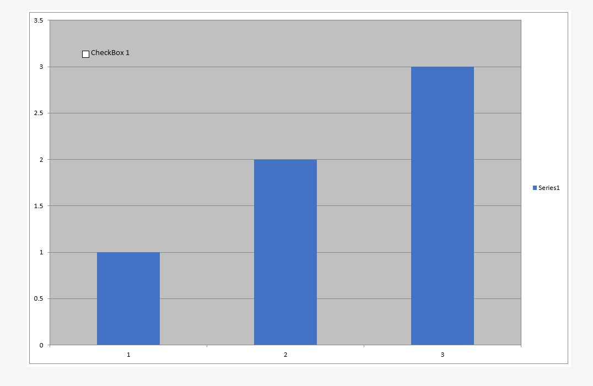

{}

Sometimes you need to insert drawing objects like labels, text boxes, pictures and so on into a chart. Aspose.Cells can add the controls to a chart at runtime.

{}

## **Adding Label Control to the Chart**

Labels provide a means for giving information to users about a spreadsheet's content.
Aspose.Cells allows you to add and manipulate labels even into charts.

The [**Aspose::Cells::Drawing::ShapeCollection**](https://reference.aspose.com/cells/cpp/aspose.cells.drawing/shapecollection/) class provides a method named [**AddLabelInChart**](https://reference.aspose.com/cells/cpp/aspose.cells.drawing/shapecollection/addlabelinchart/), used to add a label control to a chart. Below is a list of the parameters used for the method:

- **top** – the vertical offset of the label from the upper left corner in units of 1/4000 of the chart area.
- **left** – the vertical offset of the label from the upper left corner in units of 1/4000 of the chart area.
- **height** – the height of the label, in units of 1/4000 of the chart area.
- **width** – the width of label, in units of 1/4000 of the chart area.

The method returns [**Aspose::Cells::Drawing::Label**](https://reference.aspose.com/cells/cpp/aspose.cells.drawing/label/) object. The [**Label**](https://reference.aspose.com/cells/cpp/aspose.cells.drawing/label/) class represents a label in the chart. It has some important members:

- [**Text**](https://reference.aspose.com/cells/cpp/aspose.cells.drawing/shape/gettext/) (property) – specifies a label's caption string.
- [**Fill**](https://reference.aspose.com/cells/cpp/aspose.cells.drawing/shape/getfill/) (property) – specifies the fill color attributes.

The following example shows how to add a label to the chart. The example uses a designer file (**exp_piechart.xls**) which has a chart in it. We use this file to insert a label into the chart. Below is the original code for adding a label to the chart. The following output is generated when executing the code.

```cpp
#include <iostream>
#include "Aspose.Cells.h"
using namespace Aspose::Cells;
using namespace Aspose::Cells::Drawing;

int main()
{
    Aspose::Cells::Startup();

    // Source directory path
    U16String srcDir(u"..\\Data\\01_SourceDirectory\\");

    // Output directory path
    U16String outDir(u"..\\Data\\02_OutputDirectory\\");

    // Path of input excel file
    U16String inputFilePath = srcDir + u"chart.xls";

    // Path of output excel file
    U16String outputFilePath = outDir + u"chart.out.xls";

    // Create workbook
    Workbook workbook(inputFilePath);

    // Get the designer chart in the second sheet
    Worksheet sheet = workbook.GetWorksheets().Get(1);
    Aspose::Cells::Charts::Chart chart = sheet.GetCharts().Get(0);

    // Add a new label to the chart
    Label label = chart.GetShapes().AddLabelInChart(100, 100, 350, 900);

    // Set the caption of the label
    label.SetText(u"A Label In Chart");

    // Set the Placement Type, the way the Label is attached to the cells
    label.SetPlacement(PlacementType::FreeFloating);

    // Save the excel file
    workbook.Save(outputFilePath);

    std::cout << "Label added to chart successfully!" << std::endl;

    Aspose::Cells::Cleanup();
}
```

## **Adding TextBox Control to the Chart**

One way to highlight important information in a report is to use a text box. For example, enter text to highlight the company name or to indicate the geographic region with the highest sales. The [**Aspose::Cells::Drawing::ShapeCollection**](https://reference.aspose.com/cells/cpp/aspose.cells.drawing/shapecollection/) class provides a method named [**AddTextBoxInChart**](https://reference.aspose.com/cells/cpp/aspose.cells.drawing/shapecollection/addtextboxinchart/), which is used to add a text box control to a chart. Following is the parameters list used for the method:

- **top** – the vertical offset of the text box from the upper left corner in units of 1/4000 of the chart area.
- **left** – the vertical offset of text box from the upper left corner in units of 1/4000 of the chart area.
- **height** – the height of text box, in units of 1/4000 of the chart area.
- **width** – the width of the text box, in units of 1/4000 of the chart area.

The method returns [**Aspose::Cells::Drawing::TextBox**](https://reference.aspose.com/cells/cpp/aspose.cells.drawing/textbox/) object. The [**TextBox**](https://reference.aspose.com/cells/cpp/aspose.cells.drawing/textbox/) class represents a text box in the chart.

The following example shows how to add a text box to a chart. The example uses the previous designer file (**exp_piechart.xls**) which has a chart in it. We use this file to insert a text box into the chart to show the chart title. Below is the original code for adding text box to the chart.

```cpp
#include <iostream>
#include "Aspose.Cells.h"
using namespace Aspose::Cells;
using namespace Aspose::Cells::Drawing;

int main()
{
    Aspose::Cells::Startup();

    // Source directory path
    U16String srcDir(u"..\\Data\\01_SourceDirectory\\");

    // Output directory path
    U16String outDir(u"..\\Data\\02_OutputDirectory\\");

    // Path of input excel file
    U16String inputFilePath = srcDir + u"chart.xls";

    // Path of output excel file
    U16String outputFilePath = outDir + u"chart.out.xls";

    // Create workbook
    Workbook workbook(inputFilePath);

    // Get the designer chart in the second sheet
    Worksheet sheet = workbook.GetWorksheets().Get(1);
    Aspose::Cells::Charts::Chart chart = sheet.GetCharts().Get(0);

    // Add a new textbox to the chart
    TextBox textbox0 = chart.GetShapes().AddTextBoxInChart(100, 1100, 350, 2550);

    // Fill the text
    textbox0.SetText(u"Sales By Region");

    // Set the font color
    textbox0.GetFont().SetColor(Color::Maroon());

    // Set the font to bold
    textbox0.GetFont().SetIsBold(true);

    // Set the font size
    textbox0.GetFont().SetSize(14);

    // Set font attribute to italic
    textbox0.GetFont().SetIsItalic(true);

    // Get the fill format of the textbox
    FillFormat fillformat = textbox0.GetFill();

    // Get the line format type of the textbox
    LineFormat lineformat = textbox0.GetLine();

    // Set the line weight
    lineformat.SetWeight(2);

    // Set the dash style to solid
    lineformat.SetDashStyle(MsoLineDashStyle::Solid);

    // Save the excel file
    workbook.Save(outputFilePath);

    std::cout << "Textbox added to chart successfully!" << std::endl;

    Aspose::Cells::Cleanup();
}
```

## **Adding Picture to the Chart**

Aspose.Cells allows you to insert images into a chart. For example, add a picture to emphasize or give more meaning to a chart or its contents, or insert a brand image file.

The [**Aspose::Cells::Drawing::ShapeCollection**](https://reference.aspose.com/cells/cpp/aspose.cells.drawing/shapecollection/) class provides a method named [**AddPictureInChart**](https://reference.aspose.com/cells/cpp/aspose.cells.drawing/shapecollection/addpictureinchart/), which is used to add a picture object to the chart. Following is the parameters list used for the method:

- **top** – the vertical offset of the picture from the upper left corner in units of 1/4000 of the chart area.
- **left** – the vertical offset of the picture from the upper left corner in units of 1/4000 of the chart area.
- **stream** – a stream object which contains the image data.
- **widthScale** – the scale of image width, a percentage value.
- **heightScale** – the scale of image height, a percentage value.

The method returns an [**Aspose::Cells::Drawing::Picture**](https://reference.aspose.com/cells/cpp/aspose.cells.drawing/picture/) object. The [**Picture**](https://reference.aspose.com/cells/cpp/aspose.cells.drawing/picture/) class represents a picture object in the chart.

The following example shows how to add a picture to the chart. The example utilizes the previous designer file (**exp_piechart.xls**) which has a chart in it. We use this file to insert an image into the chart. Below is the original code for adding picture to the chart.

```c++
#include <iostream>
#include <fstream>
#include <vector>
#include "Aspose.Cells.h"

using namespace Aspose::Cells;
using namespace Aspose::Cells::Charts;
using namespace Aspose::Cells::Drawing;

std::vector<uint8_t> ReadFileData(const U16String& filePath) {
    std::ifstream file(filePath.ToUtf8(), std::ios::binary | std::ios::ate);
    std::streamsize size = file.tellg();
    file.seekg(0, std::ios::beg);

    std::vector<uint8_t> buffer(size);
    if (!file.read(reinterpret_cast<char*>(buffer.data()), size)) {
        throw std::runtime_error("Error reading file");
    }
    return buffer;
}

int main() {
    Aspose::Cells::Startup();

    U16String srcDir(u"..\\Data\\01_SourceDirectory\\");
    U16String outDir(u"..\\Data\\02_OutputDirectory\\");

    Workbook workbook(srcDir + u"chart.xls");
    std::vector<uint8_t> imageData = ReadFileData(srcDir + u"logo.jpg");

    Worksheet sheet = workbook.GetWorksheets().Get(0);
    Chart chart = sheet.GetCharts().Get(0);
    Vector<uint8_t> data(imageData.data(), static_cast<int32_t>(imageData.size()));
    Picture pic0 = chart.GetShapes().AddPictureInChart(50, 50, data, 40, 40);
    LineFormat lineFormat = pic0.GetLine();

    lineFormat.SetDashStyle(MsoLineDashStyle::Solid);
    lineFormat.SetWeight(4);

    workbook.Save(outDir + u"chart.out.xls");
    std::cout << "Chart modified successfully." << std::endl;

    Aspose::Cells::Cleanup();
    return 0;
}
```

## **Adding Checkbox in the Chart**

Aspose.Cells allows you to insert checkboxes into a chart sheet by using [**MsoDrawingType**](https://reference.aspose.com/cells/cpp/aspose.cells.drawing/msodrawingtype/) enumeration. The following example demonstrates adding a checkbox to a chart sheet.

The following image shows the chart sheet with the checkbox in the output file.



The [output file](101089316.xlsx) generated by the following code snippet is attached for your reference.

```cpp
#include <iostream>
#include "Aspose.Cells.h"

using namespace Aspose::Cells;
using namespace Aspose::Cells::Drawing;

int main()
{
    Aspose::Cells::Startup();

    // Source directory path
    U16String outDir(u"..\\Data\\02_OutputDirectory\\");

    // Create a new workbook
    Workbook workbook;

    // Add a chart sheet to the workbook
    int32_t index = workbook.GetWorksheets().Add(SheetType::Chart);

    // Get the newly added chart sheet
    Worksheet sheet = workbook.GetWorksheets().Get(index);

    // Add a floating chart to the sheet
    sheet.GetCharts().AddFloatingChart(ChartType::Column, 0, 0, 1024, 960);

    // Add data series to the chart
    sheet.GetCharts().Get(0).GetNSeries().Add(U16String(u"{1,2,3}"), false);

    // Add a checkbox to the chart
    sheet.GetCharts().Get(0).GetShapes().AddShapeInChart(MsoDrawingType::CheckBox, PlacementType::Move, 400, 400, 1000, 600);

    // Set text for the checkbox
    sheet.GetCharts().Get(0).GetShapes().Get(0).SetText(U16String(u"CheckBox 1"));

    // Save the workbook
    workbook.Save(outDir + u"InsertCheckboxInChartSheet_out.xlsx");

    std::cout << "Checkbox added to chart sheet successfully!" << std::endl;

    Aspose::Cells::Cleanup();
}
```

## **Advance topics**
- [Add WordArt Watermark to Chart](/cells/cpp/add-wordart-watermark-to-chart/)
