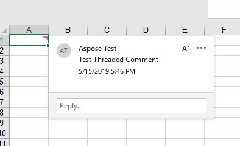

## **Threaded Comments**

MS Excel 365 provides a feature to add threaded comments. These comments work as conversations and can be used for discussions. The comments now come with a Reply box that allows for threaded conversations. The old comments are called Notes in Excel 365. The screenshot below shows how threaded comments are displayed when opened in Excel.



Threaded comments are shown like this in older versions of Excel. The following images have been taken by opening the sample file in Excel 2016.


Aspose.Cells also provides the feature to manage threaded comments.

## **Add Threaded Comments**

### **Add Threaded comment with Excel**

To add threaded comments in Excel 365, follow the following steps.

- Method 1
  - Click the **Review** Tab
  - Click the **New Comment** button
  - This will open a dialogue to enter comments in the active cell.
  - 
- Method 2
  - Right click on the cell where you want to insert the comment.
  - Click the **New Comment** option.
  - This will open a dialogue to enter comments in the active cell.
  - 

### **Add Threaded Comment using Aspose.Cells**

Aspose.Cells provides [**Comments.AddThreadedComment**](https://reference.aspose.com/cells/cpp/aspose.cells/commentcollection/addthreadedcomment/) method to add threaded comments. The [**Comments.AddThreadedComment**](https://reference.aspose.com/cells/cpp/aspose.cells/commentcollection/addthreadedcomment/) method accepts the following three parameters.

- Cell Name: The name of the cell where the comment will be inserted.
- Comment Text: The text of the comment.
- [**ThreadedCommentAuthor**](https://reference.aspose.com/cells/cpp/aspose.cells/threadedcommentauthor/): The author of the comment

The following code sample demonstrates the use of [**Comments.AddThreadedComment**](https://reference.aspose.com/cells/cpp/aspose.cells/commentcollection/addthreadedcomment/) method to add threaded Comment to cell A1. Please see the [output Excel file](89849859.xlsx) generated by the code for reference.

#### **Sample Code**

```c++
#include <iostream>
#include "Aspose.Cells.h"
using namespace Aspose::Cells;

int main()
{
    Aspose::Cells::Startup();

    // Output directory path
    U16String outDir(u"..\\Data\\02_OutputDirectory\\");

    // Create a new workbook
    Workbook workbook;

    // Add Author
    int authorIndex = workbook.GetWorksheets().GetThreadedCommentAuthors().Add(u"Aspose Test", u"", u"");
    ThreadedCommentAuthor author = workbook.GetWorksheets().GetThreadedCommentAuthors()[authorIndex];

    // Add Threaded Comment
    workbook.GetWorksheets()[0].GetComments().AddThreadedComment(u"A1", u"Test Threaded Comment", author);

    // Save the workbook
    workbook.Save(outDir + u"AddThreadedComments_out.xlsx");

    std::cout << "Threaded comment added successfully!" << std::endl;

    Aspose::Cells::Cleanup();
}
```

## **Read Threaded Comments**

### **Read Threaded comments with Excel**

To read threaded comments in Excel, simply hover your mouse over the cell containing comments to view the comments. The comments view will look like the view in the following image.


### **Read Threaded comments using Aspose.Cells**

Aspose.Cells provides [**Comments.GetThreadedComments**](https://reference.aspose.com/cells/cpp/aspose.cells/commentcollection/getthreadedcomments/) method to retrieve threaded comments for the specified column. [**Comments.GetThreadedComments**](https://reference.aspose.com/cells/cpp/aspose.cells/commentcollection/getthreadedcomments/) method accepts the column name as a parameter and returns the [**ThreadedCommentCollection**](https://reference.aspose.com/cells/cpp/aspose.cells/threadedcommentcollection/). You can iterate over the [**ThreadedCommentCollection**](https://reference.aspose.com/cells/cpp/aspose.cells/threadedcommentcollection/) to view the comments.

The following example demonstrates reading comments from column A1 by loading the [sample Excel File](89849861.xlsx). Please see the console output generated by the code for reference.

#### **Sample Code**

```cpp
#include <iostream>
#include "Aspose.Cells.h"

using namespace Aspose::Cells;
using namespace std;

int main()
{
    Aspose::Cells::Startup();

    // Source directory path
    U16String srcDir(u"..\\Data\\01_SourceDirectory\\");

    // Create workbook
    Workbook workbook(srcDir + u"ThreadedCommentsSample.xlsx");

    // Access first worksheet
    Worksheet worksheet = workbook.GetWorksheets().Get(0);

    // Get Threaded Comments
    ThreadedCommentCollection threadedComments = worksheet.GetComments().GetThreadedComments(u"A1");

    // Iterate through threaded comments
    for (int i = 0; i < threadedComments.GetCount(); i++)
    {
        ThreadedComment comment = threadedComments.Get(i);
        cout << "Comment: " << comment.GetNotes().ToUtf8() << endl;
        cout << "Author: " << comment.GetAuthor().GetName().ToUtf8() << endl;
    }

    Aspose::Cells::Cleanup();
    return 0;
}
```

#### **Console Output**



Comment: Test Threaded Comment

Author: Aspose Test



### **Read Created Time of threaded comments**

Aspose.Cells provides [**Comments.GetThreadedComments**](https://reference.aspose.com/cells/cpp/aspose.cells/commentcollection/getthreadedcomments/) method to retrieve threaded comments for the specified column. [**Comments.GetThreadedComments**](https://reference.aspose.com/cells/cpp/aspose.cells/commentcollection/getthreadedcomments/) method accepts the column name as a parameter and returns the [**ThreadedCommentCollection**](https://reference.aspose.com/cells/cpp/aspose.cells/threadedcommentcollection/). You can iterate over the [**ThreadedCommentCollection**](https://reference.aspose.com/cells/cpp/aspose.cells/threadedcommentcollection/) and use the [**ThreadedComment.GetCreatedTime()**](https://reference.aspose.com/cells/cpp/aspose.cells/threadedcomment/getcreatedtime/) property.

The following example demonstrates reading the created time of threaded comments by loading the [sample Excel File](89849861.xlsx). Please see the console output generated by the code for reference.

#### **Sample Code**

```cpp
#include <iostream>
#include "Aspose.Cells.h"

using namespace Aspose::Cells;
using namespace std;

int main()
{
    Aspose::Cells::Startup();

    // Source directory path
    U16String srcDir(u"..\\Data\\01_SourceDirectory\\");

    // Create workbook
    Workbook workbook(srcDir + u"ThreadedCommentsSample.xlsx");

    // Access first worksheet
    Worksheet worksheet = workbook.GetWorksheets().Get(0);

    // Get Threaded Comments
    ThreadedCommentCollection threadedComments = worksheet.GetComments().GetThreadedComments(u"A1");

    // Iterate through threaded comments
    for (int i = 0; i < threadedComments.GetCount(); i++)
    {
        ThreadedComment comment = threadedComments.Get(i);
        cout << "Comment: " << comment.GetNotes().ToUtf8() << endl;
        cout << "Author: " << comment.GetAuthor().GetName().ToUtf8() << endl;
        cout << "Created Time: " << comment.GetCreatedTime().ToString().ToUtf8() << endl;
    }

    Aspose::Cells::Cleanup();
    return 0;
}
```

#### **Console Output**



Comment: Test Threaded Comment

Author: Aspose Test

Created Time: 5/15/2019 12:46:23 PM



## **Edit Threaded Comments**

### **Edit Threaded comment with Excel**

To edit a threaded comment in Excel, click the **Edit** link on the comment as shown in the following image.


### **Edit Threaded comment using Aspose.Cells**

Aspose.Cells provides [**Comments.GetThreadedComments**](https://reference.aspose.com/cells/cpp/aspose.cells/commentcollection/getthreadedcomments/) method to retrieve threaded comments for the specified column. [**Comments.GetThreadedComments**](https://reference.aspose.com/cells/cpp/aspose.cells/commentcollection/getthreadedcomments/) method accepts the column name as a parameter and returns the [**ThreadedCommentCollection**](https://reference.aspose.com/cells/cpp/aspose.cells/threadedcommentcollection/). You can update the required comment in the [**ThreadedCommentCollection**](https://reference.aspose.com/cells/cpp/aspose.cells/threadedcommentcollection/) and save the workbook.

The following example demonstrates editing the first threaded comment in column A1 by loading the [sample Excel File](89849861.xlsx). Please see the [output Excel file](89849862.xlsx) generated by the code showing the updated comment for reference.

#### **Sample Code**

```cpp
#include <iostream>
#include "Aspose.Cells.h"

using namespace Aspose::Cells;

int main()
{
    Aspose::Cells::Startup();

    // Source directory path
    U16String srcDir(u"..\\Data\\01_SourceDirectory\\");

    // Output directory path
    U16String outDir(u"..\\Data\\02_OutputDirectory\\");

    // Load the workbook
    Workbook workbook(srcDir + u"ThreadedCommentsSample.xlsx");

    // Access the first worksheet
    Worksheet worksheet = workbook.GetWorksheets().Get(0);

    // Get the threaded comment from cell A1
    ThreadedComment comment = worksheet.GetComments().GetThreadedComments(u"A1").Get(0);

    // Update the comment text
    comment.SetNotes(u"Updated Comment");

    // Save the workbook
    workbook.Save(outDir + u"EditThreadedComments.xlsx");

    std::cout << "Threaded comment updated successfully!" << std::endl;

    Aspose::Cells::Cleanup();
}
```

## **Remove Threaded Comments**

### **Remove Threaded comments with Excel**

To remove threaded comments in Excel, right click on the cell containing the comments and click the **Delete Comment** option as shown in the following image.


### **Remove Threaded comments using Aspose.Cells**

Aspose.Cells provides [**Comments.RemoveAt**](https://reference.aspose.com/cells/cpp/aspose.cells/commentcollection/removeat/) method to remove comments for the specified column. [**Comments.RemoveAt**](https://reference.aspose.com/cells/cpp/aspose.cells/commentcollection/removeat/) method accepts the column name as a parameter removes the comments in that column.

The following example demonstrates removing comments in column A1 by loading the [sample Excel File](89849861.xlsx). Please see the [output Excel file](89849864.xlsx) generated by the code for reference.

#### **Sample Code**

```cpp
#include <iostream>
#include "Aspose.Cells.h"
using namespace Aspose::Cells;

int main()
{
    Aspose::Cells::Startup();

    // Source directory path
    U16String srcDir(u"..\\Data\\01_SourceDirectory\\");

    // Output directory path
    U16String outDir(u"..\\Data\\02_OutputDirectory\\");

    // Load the workbook
    Workbook workbook(srcDir + u"ThreadedCommentsSample.xlsx");

    // Access first worksheet
    Worksheet worksheet = workbook.GetWorksheets().Get(0);

    // Get the comments collection
    CommentCollection comments = worksheet.GetComments();

    // Get the author of the first threaded comment in cell A1
    ThreadedCommentAuthor author = worksheet.GetComments().GetThreadedComments(u"A1").Get(0).GetAuthor();

    // Remove the comment at cell A1
    comments.RemoveAt(u"A1");

    // Get the threaded comment authors collection
    ThreadedCommentAuthorCollection authors = workbook.GetWorksheets().GetThreadedCommentAuthors();

    // Remove the author of the first comment in A1
    authors.RemoveAt(authors.IndexOf(author));

    // Save the workbook
    workbook.Save(outDir + u"ThreadedCommentsSample_Out.xlsx");

    std::cout << "Threaded comments processed successfully!" << std::endl;

    Aspose::Cells::Cleanup();
}
```

{}

Please note that by removing comment with Aspose.Cells, the author is not removed automatically. If you need to remove the author as well, please use the RemoveAt method of [**ThreadedCommentAuthorCollection**](https://reference.aspose.com/cells/cpp/aspose.cells/threadedcommentauthorcollection/) class as shown in the example above.

{}