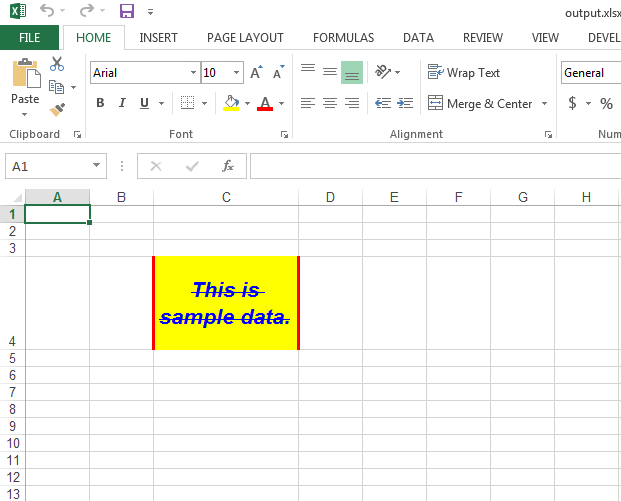

## **Format Cell or Range of Cells**
If you want to format a cell or a range of cells, Aspose.Cells provides the [Style](https://reference.aspose.com/cells/cpp/aspose.cells/style/) class. You can accomplish all formatting of cells or ranges using this class. Some of the formatting tasks that can be accomplished with the IStyle class are as follows:

- Set fill color of the cell
- Set the text wrap of the cell
- Set the borders of the cells, such as the top, left, bottom, and right borders
- Set the font color, font size, font name, strike, bold, italic, underline, etc.
- Set the text horizontal or vertical alignment to right, left, top, bottom, center, etc.

If you want to set the style of a single cell, please use the [Cell.SetStyle()](https://reference.aspose.com/cells/cpp/aspose.cells/cell/setstyle/) method, and if you want to set the style of a range of cells, please use the [Range.ApplyStyle()](https://reference.aspose.com/cells/cpp/aspose.cells/range/applystyle/) method.

## **Sample Code**
The following sample code formats cell **C4** of the worksheet in various ways, and the screenshot shows the output **Excel** file ([21266438.xlsx](21266438.xlsx)) generated by it for your reference.



