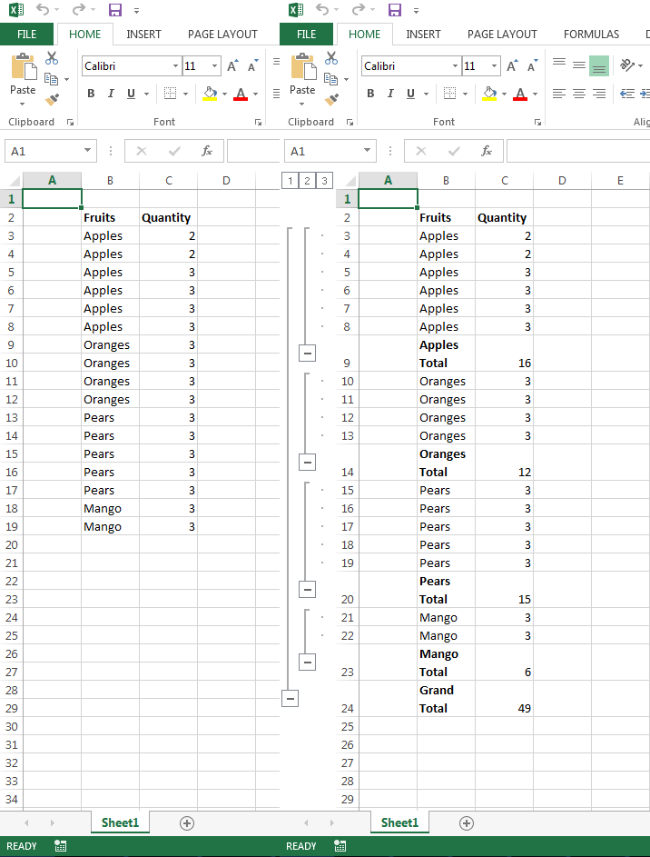

## **Creating Subtotals**
The following sample code shows how to create subtotals using Aspose.Cells. The code loads the [sample Excel file](21266433.xlsx), creates subtotals on the cell range B13:C19, and saves the [output Excel file](21266437.xlsx). The following screenshot shows how the sample and output Excel files look after the execution of the code.

## **Sample Code**


