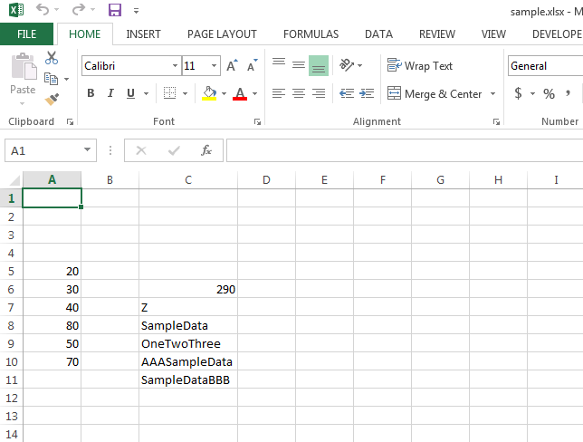

## **Find or Search Data**
You can use Aspose.Cells to find or search data in various ways using the following method.

- [GetEnumerator](https://reference.aspose.com/cells/cpp/aspose.cells/cells/getenumerator/)
- [GetFormula](https://reference.aspose.com/cells/cpp/aspose.cells/cell/getformula/)
- [GetType](https://reference.aspose.com/cells/cpp/aspose.cells/cell/gettype/)
- [GetStringValue](https://reference.aspose.com/cells/cpp/aspose.cells/cell/getstringvalue/)
- [GetIntValue](https://reference.aspose.com/cells/cpp/aspose.cells/cell/getintvalue/)
- [GetBoolValue](https://reference.aspose.com/cells/cpp/aspose.cells/cell/getboolvalue/)
- [GetDateTimeValue](https://reference.aspose.com/cells/cpp/aspose.cells/cell/getdatetimevalue/)
- [GetDoubleValue](https://reference.aspose.com/cells/cpp/aspose.cells/cell/GetDoubleValue/)
- [GetFloatValue](https://reference.aspose.com/cells/cpp/aspose.cells/cell/GetFloatValue/)

View [more](https://reference.aspose.com/cells/cpp/aspose.cells/cell/) methods.

The following sample code illustrates the usage of the above methods using the [sample excel file](21266434.xlsx) as shown in this screenshot.

## **Sample Code**

## **Console Output**
This is the console output of the above sample code when executed with the given [sample excel file](21266434.xlsx).



Name of the cell containing formula =SUM(A5:A10): C6
Name of the cell containing the formula that contains CHA: C7
Name of the cell containing the number 80: A8
Name of the cell containing specified string: C8
Name of the cell containing the string that contains Two: C9
Name of the cell containing specified string: C10
Name of the cell containing specified string: C11



