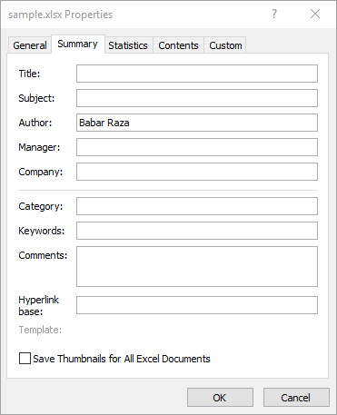

## **Introduction**

Microsoft Excel provides the ability to add properties to spreadsheet files. These document properties provide useful information and are divided into 2 categories as detailed below.

- System-defined (built-in) properties: Built-in properties contain general information about the document like document title, author name, document statistics and so on.
- User-defined (custom) properties: Custom properties defined by the end user in the form of name-value pair.

{}

The most important point to know about built-in and custom properties is that built-in properties can be accessed and modified, but not created or removed. However, custom properties can be created and managed.

{}

## **How to Manage Document Properties Using Microsoft Excel**

Microsoft Excel allows you to manage the document properties of the Excel files in a WYSIWYG manner. Please follow the below steps to open the **Properties** dialog in Excel 2016.

1. From the **File** menu, select **Info**.

|**Selecting Info Menu**|
| :- |
||
1. Click on **Properties** heading and select "Advanced Properties".

|**Clicking Advanced Properties Selection**|
| :- |
||
1. Manage the file's document properties.

|**Properties Dialog**|
| :- |
||
In the Properties dialog, there are different tabs, like General, Summary, Statistics, Contents, and Customs. Each tab helps configure different kinds of information related to the file. The Custom tab is used to manage custom properties.

## **How to Work with Document Properties Using Aspose.Cells**

Developers can dynamically manage the document properties using the Aspose.Cells APIs. This feature helps the developers to store useful information along with the file, such as when the file was received, processed, time-stamped and so on.

{}

Aspose.Cells for C++ directly writes the information about API and Version Number in output documents. For example, upon rendering Document to PDF, Aspose.Cells for C++ populates **Application** field with value 'Aspose.Cells' and **PDF Producer** field with the value, e.g 'Aspose.Cells v17.9'.

Please note that you cannot instruct Aspose.Cells for C++ to change or remove this information from output Documents.

{}

### **How to Access Document Properties**

Aspose.Cells APIs support both types of document properties, built-in and custom. Aspose.Cells' [**Workbook**](https://reference.aspose.com/cells/cpp/aspose.cells/workbook/) class represents an Excel file and, like an Excel file, the [**Workbook**](https://reference.aspose.com/cells/cpp/aspose.cells/workbook/) class can contain multiple worksheets, each represented by the [**Worksheet**](https://reference.aspose.com/cells/cpp/aspose.cells/worksheet/) class whereas the collection of worksheets is represented by the [**WorksheetCollection**](https://reference.aspose.com/cells/cpp/aspose.cells/worksheetcollection/) class.

Use the [**WorksheetCollection**](https://reference.aspose.com/cells/cpp/aspose.cells/worksheetcollection/) to access the file's document properties as described below.

- To access built-in document properties, use [**WorksheetCollection.GetBuiltInDocumentProperties()**](https://reference.aspose.com/cells/cpp/aspose.cells/worksheetcollection/getbuiltindocumentproperties/).
- To access custom document properties, use [**WorksheetCollection.GetCustomDocumentProperties()**](https://reference.aspose.com/cells/cpp/aspose.cells/worksheetcollection/getcustomdocumentproperties/).

Both the [**WorksheetCollection.GetBuiltInDocumentProperties()**](https://reference.aspose.com/cells/cpp/aspose.cells/worksheetcollection/getbuiltindocumentproperties/) and [**WorksheetCollection.GetCustomDocumentProperties()**](https://reference.aspose.com/cells/cpp/aspose.cells/worksheetcollection/getcustomdocumentproperties/) return the instance of [**Aspose.Cells.Properties.DocumentPropertyCollection**](https://reference.aspose.com/cells/cpp/aspose.cells.properties/documentpropertycollection/). This collection contains [**Aspose.Cells.Properties.DocumentProperty**](https://reference.aspose.com/cells/cpp/aspose.cells.properties/documentproperty/) objects, each of which represents a single built-in or custom document property.

It is up to the application requirement how to access a property, that is; by using the index or name of the property from the [**DocumentPropertyCollection**](https://reference.aspose.com/cells/cpp/aspose.cells.properties/documentpropertycollection/) as demonstrated in the example below.

```c++
#include <iostream>
#include "Aspose.Cells.h"
using namespace Aspose::Cells;
using namespace Aspose::Cells::Properties;

int main()
{
    Aspose::Cells::Startup();

    // Source directory path
    U16String srcDir(u"..\\Data\\01_SourceDirectory\\");

    // Path of input excel file
    U16String inputFilePath = srcDir + u"sample-document-properties.xlsx";

    // Instantiate a Workbook object and open an Excel file
    Workbook workbook(inputFilePath);

    // Retrieve a list of all custom document properties of the Excel file
    CustomDocumentPropertyCollection customProperties = workbook.GetCustomDocumentProperties();

    // Accessing a custom document property by using the property name
    DocumentProperty customProperty1 = customProperties.Get(u"ContentTypeId");
    std::cout << customProperty1.GetName().ToUtf8() << " " << customProperty1.GetValue().ToString().ToUtf8() << std::endl;

    // Accessing the same custom document property by using the property index
    DocumentProperty customProperty2 = customProperties.Get(0);
    std::cout << customProperty2.GetName().ToUtf8() << " " << customProperty2.GetValue().ToString().ToUtf8() << std::endl;

    Aspose::Cells::Cleanup();
}
```

The [**Aspose.Cells.Properties.DocumentProperty**](https://reference.aspose.com/cells/cpp/aspose.cells.properties/documentproperty/) class allows to retrieve the name, value, and type of the document property:

- To get the property name, use [**DocumentProperty.Name**](https://reference.aspose.com/cells/cpp/aspose.cells/name/).
- To get the property value, use [**DocumentProperty.Value**](https://reference.aspose.com/cells/cpp/aspose.cells.properties/documentproperty/value/). [**DocumentProperty.Value**](https://reference.aspose.com/cells/cpp/aspose.cells.properties/documentproperty/value/) returns the value as an Object.
- To get the property type, use [**DocumentProperty.Type**](https://reference.aspose.com/cells/cpp/aspose.cells.properties/documentproperty/type/). This returns one of the [**PropertyType**](https://reference.aspose.com/cells/cpp/aspose.cells.properties/propertytype/) enumeration values. After you get the property type, use one of the **DocumentProperty.ToXXX** methods to obtain the value of the appropriate type instead of using [**DocumentProperty.Value**](https://reference.aspose.com/cells/cpp/aspose.cells.properties/documentproperty/value/). The **DocumentProperty.ToXXX** methods are described in the table below.

{}

The [**DocumentProperty**](https://reference.aspose.com/cells/cpp/aspose.cells.properties/documentproperty/) class also provides a set of methods that return the values of other data types.

{}

|**Member Name**|**Description**|**ToXXX Method**|
| :- | :- | :- |
|Boolean|The property data type is Boolean|ToBool|
|Date|The property data type is DateTime. Note that Microsoft Excel stores only <br>the date portion, no time can be stored in a custom property of this type|ToDateTime|
|Float|The property data type is Double|ToDouble|
|Number|The property data type is Int32|ToInt|
|String|The property data type is String|ToString|

```c++
#include <iostream>
#include "Aspose.Cells.h"
using namespace Aspose::Cells;
using namespace Aspose::Cells::Properties;

int main()
{
    Aspose::Cells::Startup();

    // Source directory path
    U16String srcDir(u"..\\Data\\01_SourceDirectory\\");

    // Path of input excel file
    U16String inputFilePath = srcDir + u"sample-document-properties.xlsx";

    // Create workbook
    Workbook workbook(inputFilePath);

    // Retrieve a list of all custom document properties of the Excel file
    DocumentPropertyCollection customProperties = workbook.GetCustomDocumentProperties();

    // Accessing a custom document property
    DocumentProperty customProperty1 = customProperties.Get(0);

    // Storing the value of the document property as an object
    Aspose::Cells::Object objectValue = customProperty1.GetValue();

    // Accessing a custom document property
    DocumentProperty customProperty2 = customProperties.Get(1);

    // Checking the type of the document property and then storing the value of the
    // document property according to that type
    if (customProperty2.GetType() == PropertyType::String)
    {
        U16String value = customProperty2.ToString();
        std::cout << customProperty2.GetName().ToUtf8() << " : " << value.ToUtf8() << std::endl;
    }

    Aspose::Cells::Cleanup();
}
```

### **How to Add or Remove Custom Document Properties**

As we have described earlier at the beginning of this topic, developers can't add or remove built-in properties because these properties are system-defined but it's possible to add or remove custom properties because these are user-defined.

### **How to Add Custom Properties**

Aspose.Cells APIs have exposed the [**Add**](https://reference.aspose.com/cells/cpp/aspose.cells.properties/customdocumentpropertycollection/add/) method for the [**CustomDocumentPropertyCollection**](https://reference.aspose.com/cells/cpp/aspose.cells.properties/customdocumentpropertycollection/) class in order to add custom properties to the collection. The [**Add**](https://reference.aspose.com/cells/cpp/aspose.cells.properties/customdocumentpropertycollection/add/) method adds the property to the Excel file and returns a reference for the new document property as an [**Aspose.Cells.Properties.DocumentProperty**](https://reference.aspose.com/cells/cpp/aspose.cells.properties/documentproperty/) object.

```c++
#include <iostream>
#include "Aspose.Cells.h"
using namespace Aspose::Cells;
using namespace Aspose::Cells::Properties;

int main()
{
    Aspose::Cells::Startup();

    // Source directory path
    U16String srcDir(u"..\\Data\\01_SourceDirectory\\");

    // Output directory path
    U16String outDir(u"..\\Data\\02_OutputDirectory\\");

    // Path of input Excel file
    U16String inputFilePath = srcDir + u"sample-document-properties.xlsx";

    // Path of output Excel file
    U16String outputFilePath = outDir + u"out_sample-document-properties.xlsx";

    // Create workbook
    Workbook workbook(inputFilePath);

    // Retrieve a list of all custom document properties of the Excel file
    CustomDocumentPropertyCollection customProperties = workbook.GetCustomDocumentProperties();

    // Adding a custom document property to the Excel file
    DocumentProperty publisher = customProperties.Add(u"Publisher", u"Aspose");

    // Save the resultant spreadsheet
    workbook.Save(outputFilePath);

    std::cout << "Custom document property added successfully!" << std::endl;

    Aspose::Cells::Cleanup();
}
```

### **How to Configure “Link to content” Custom Property**

To create a custom property linked to the content of a given range, call the [**CustomDocumentPropertyCollection.AddLinkToContent**](https://reference.aspose.com/cells/cpp/aspose.cells.properties/customdocumentpropertycollection/addlinktocontent/) method and pass property name and source. You can check whether a property is configured as linked to content using the [**DocumentProperty.IsLinkedToContent**](https://reference.aspose.com/cells/cpp/aspose.cells.properties/documentproperty/islinkedtocontent/) property. Moreover, it is also possible to get the source range using the [**Source**](https://reference.aspose.com/cells/cpp/aspose.cells.properties/documentproperty/source/) property of the [**DocumentProperty**](https://reference.aspose.com/cells/cpp/aspose.cells.properties/documentproperty/) class.

We use a simple template Microsoft Excel file in the example. The workbook has a defined named range labeled **MyRange** which refers to a cell value.

```c++
c++
#include <iostream>
#include "Aspose.Cells.h"
using namespace Aspose::Cells;
using namespace Aspose::Cells::Properties;

int main()
{
    Aspose::Cells::Startup();

    U16String srcDir(u"..\\Data\\01_SourceDirectory\\");
    U16String outDir(u"..\\Data\\02_OutputDirectory\\");
    U16String inputFilePath = srcDir + u"sample-document-properties.xlsx";
    U16String outputFilePath = outDir + u"out_sample-document-properties.xlsx";

    Workbook workbook(inputFilePath);

    auto customProperties = workbook.GetCustomDocumentProperties();

    customProperties->AddLinkToContent(u"Owner", u"MyRange");

    auto customProperty1 = customProperties->Get(u"Owner");

    bool isLinkedToContent = customProperty1->IsLinkedToContent();
    U16String source = customProperty1->GetSource();

    workbook.Save(outputFilePath);

    std::cout << "Custom document properties updated successfully!" << std::endl;

    Aspose::Cells::Cleanup();
}
```

### **How to Remove Custom Properties**

To remove custom properties using Aspose.Cells, call the [**DocumentPropertyCollection.Remove**](https://reference.aspose.com/cells/cpp/aspose.cells.properties/documentpropertycollection/remove/) method and pass the name of the document property to be removed.

```c++
#include <iostream>
#include "Aspose.Cells.h"
using namespace Aspose::Cells;
using namespace Aspose::Cells::Properties;

int main()
{
    Aspose::Cells::Startup();

    // Source directory path
    U16String srcDir(u"..\\Data\\01_SourceDirectory\\");

    // Output directory path
    U16String outDir(u"..\\Data\\02_OutputDirectory\\");

    // Path of input Excel file
    U16String inputFilePath = srcDir + u"sample-document-properties.xlsx";

    // Path of output Excel file
    U16String outputFilePath = outDir + u"out_sample-document-properties.xlsx";

    // Instantiate a Workbook object and open the Excel file
    Workbook workbook(inputFilePath);

    // Retrieve a list of all custom document properties of the Excel file
    CustomDocumentPropertyCollection customProperties = workbook.GetCustomDocumentProperties();

    // Removing a custom document property
    customProperties.Remove(u"Publisher");

    // Save the file
    workbook.Save(outputFilePath);

    std::cout << "Custom document property removed successfully!" << std::endl;

    Aspose::Cells::Cleanup();
}
```

## **Advance topics**
- [Adding Custom Properties visible inside Document Information Panel](/cells/cpp/adding-custom-properties-visible-inside-document-information-panel/)
- [Setting ScaleCrop and LinksUpToDate properties of Built-In Document Properties](/cells/cpp/setting-scalecrop-and-linksuptodate-properties-of-built-in-document-properties/)
- [Specify Document Version of the Excel File using BuiltIn Document Properties](/cells/cpp/specify-document-version-of-the-excel-file-using-builtin-document-properties/)
- [Specify the Language of the Excel File using BuiltIn Document Properties](/cells/cpp/specify-the-language-of-the-excel-file-using-builtin-document-properties/)