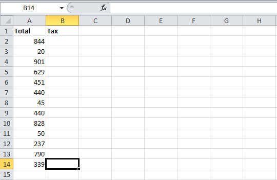

{}

If you want to add a function in a worksheet that will perform calculations, this article explains how to achieve this task using Aspose.Cells.

{}

## Setting Shared Formula using Aspose.Cells

Suppose you have a worksheet filled with data in the format that looks like the following sample worksheet.

|**Input file with one column of data**|
| :- |
||

You want to add a function in B2 that will calculate the sales tax for the first row of data. The tax is **9%**. The formula that calculates the sales tax is: **"=A2*0.09"**. This article explains how to apply this formula with Aspose.Cells.

Aspose.Cells lets you specify a formula using the [**GetFormula**](https://reference.aspose.com/cells/cpp/aspose.cells/cell/getformula/) property. There are two options for adding formulas to the other cells (B3, B4, B5, and so on) in the column.

Either do what you did for the first cell, effectively setting the formula for each cell, updating the cell reference accordingly (A3*0.09, A4*0.09, A5*0.09 and so on). This requires the cell references for each row to be updated. It also requires Aspose.Cells to parse each formula individually, which can be time-consuming for large spreadsheets and complex formulas. It also adds extra lines of code although loops can cut them down somewhat.

Another approach is to use a **shared formula**. With a shared formula, the formulas are automatically updated for the cell references in each row so that the tax would be calculated properly. The [**SetSharedFormula**](https://reference.aspose.com/cells/cpp/aspose.cells/cell/setsharedformula/) method is more efficient than the first method.

The following example demonstrates how to use it.

```c++
#include <iostream>
#include "Aspose.Cells.h"

using namespace Aspose::Cells;

int main()
{
    Aspose::Cells::Startup();

    // Source directory path
    U16String srcDir(u"..\\Data\\01_SourceDirectory\\");

    // Output directory path
    U16String outDir(u"..\\Data\\02_OutputDirectory\\");

    // Path of input excel file
    U16String inputFilePath = srcDir + u"source.xlsx";

    // Path of output excel file
    U16String outputFilePath = outDir + u"Output_out.xlsx";

    // Instantiate a Workbook from existing file
    Workbook workbook(inputFilePath);

    // Get the cells collection in the first worksheet
    Cells cells = workbook.GetWorksheets().Get(0).GetCells();

    // Apply the shared formula in the range i.e.., B2:B14
    cells.Get(u"B2").SetSharedFormula(u"=A2*0.09", 13, 1);

    // Save the excel file
    workbook.Save(outputFilePath, SaveFormat::Xlsx);

    std::cout << "Shared formula applied and file saved successfully!" << std::endl;

    Aspose::Cells::Cleanup();
}
```