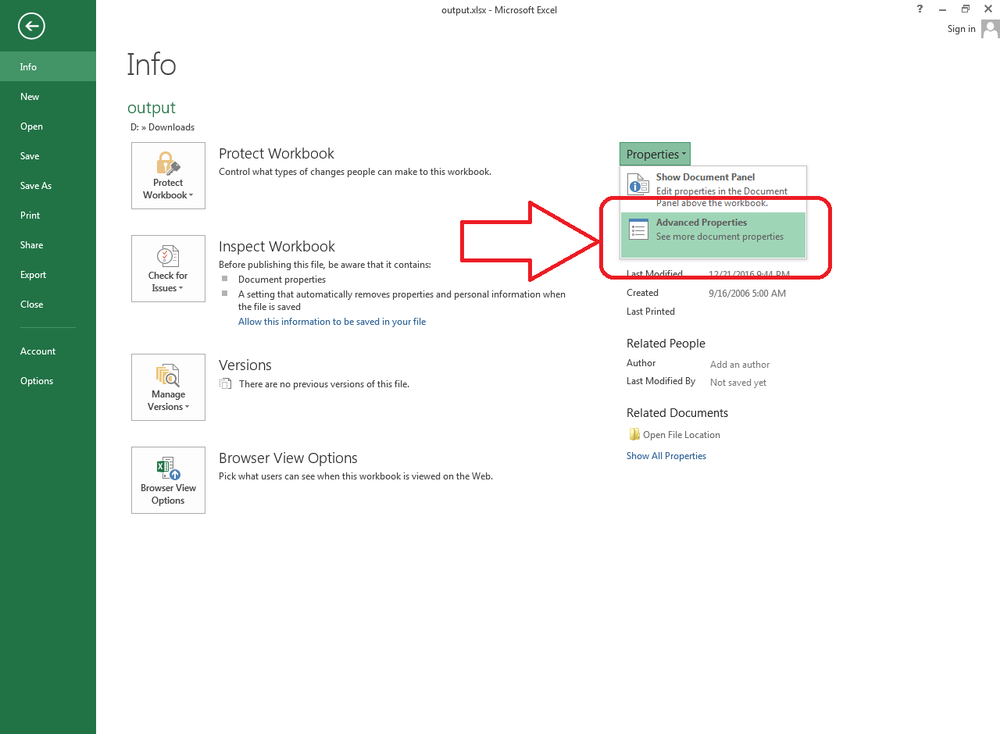

## **Possible Usage Scenario**
Aspose.Cells allows you to work with built‑in and custom document properties. Here is the Microsoft Excel interface for opening these document properties. Just click on **Advanced Properties** as shown in this screenshot to view them.

## **Managing Document Properties**
The following sample code loads the [sample Excel file](23166989.xlsx) and reads the built‑in document properties, e.g., *Title* and *Subject*, and then changes them. It also reads the custom document property, i.e., *MyCustom1*, and then adds a new custom document property, i.e., *MyCustom5*, and writes the [output Excel file](23166986.xlsx). The following screenshot shows the effect of the sample code on the sample Excel file.

## **Sample Code**


## **Console Output**
This is the console output of the above sample code when executed with the provided [sample Excel file](23166989.xlsx).


Title: Aspose Team

Subject: Aspose.Cells for C++

MyCustom1: This is my custom one.



