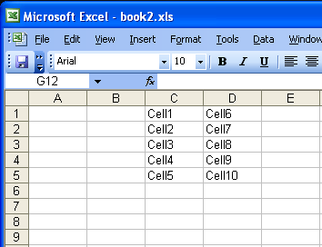

{}

This article shows how to move a range of cells in a worksheet.

{}

## **Move Range of Cells in a Worksheet**
The example code uses a template file to demonstrate the task.

**The input file**


Please see the following generated file with range A1:B5 moved to C1:D5.

**The output file**



```c++
#include <iostream>
#include "Aspose.Cells.h"
using namespace Aspose::Cells;

int main()
{
    Aspose::Cells::Startup();

    // Instantiate the workbook object. Open the Excel file
    U16String inputFilePath = u"book1.xlsx";
    Workbook workbook(inputFilePath);

    // Access the first worksheet and its cells
    Worksheet worksheet = workbook.GetWorksheets().Get(0);
    Cells cells = worksheet.GetCells();

    // Create a range from A1 to B5
    Range range = cells.CreateRange(u"A1", u"B5");

    // Move the range to the right by 2 columns
    range.MoveTo(0, 2);

    Aspose::Cells::Cleanup();
}
```
