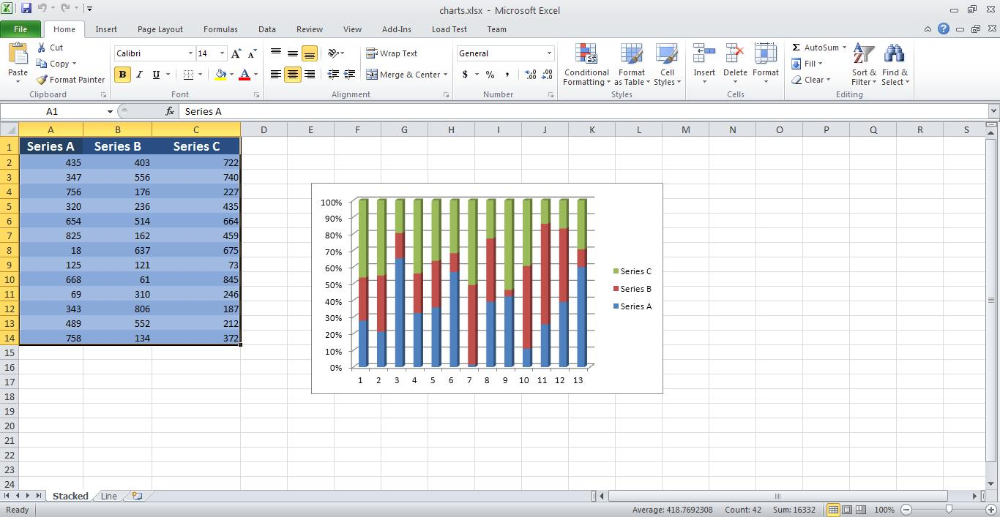
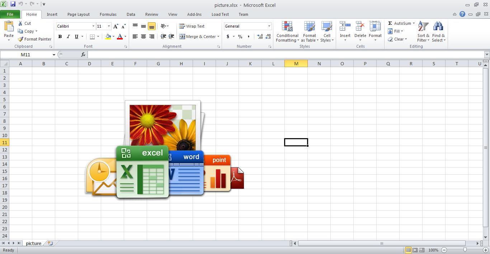

{}

Sometimes, you need to combine workbooks with various content like images, charts, and data into a single workbook. Aspose.Cells supports this feature. This article shows how to create a console application in Visual Studio and combine workbooks with a few, simple lines of code using Aspose.Cells.

{}

## **Combining Workbooks with Images and Charts**

The example code combines two workbooks into a single workbook using Aspose.Cells. The code loads the source workbooks, uses the [**Workbook::Combine()**](https://reference.aspose.com/cells/cpp/aspose.cells/workbook/combine/) method to combine them and saves the output workbook.

### **Source Workbooks**

- [charts.xlsx](5473097.xlsx)
- [picture.xlsx](5473096.xlsx)

### **Output Workbooks**

- [combined.xlsx](5473095.xlsx)

### **Screenshots**

Below are screenshots of the source and output workbooks.

{}

You can use any source workbooks. These images are just for illustration purposes.

{}

**The first worksheet of the charts workbook - stacked** 



**Second worksheet of charts workbook - line** 


**First worksheet of the picture workbook - picture** 



**All three worksheets in the combined workbook - stacked, line, picture** 


```c++
#include <iostream>
#include "Aspose.Cells.h"
using namespace Aspose::Cells;

int main()
{
    Aspose::Cells::Startup();

    // For complete examples and data files, please go to https://github.com/aspose-cells/Aspose.Cells-for-C

    // Source directory path
    U16String srcDir(u"..\\Data\\01_SourceDirectory\\");

    // Path of the first source excel file
    U16String sourceFile1 = srcDir + u"SampleChart.xlsx";
    
    // Path of the second source excel file
    U16String sourceFile2 = srcDir + u"SampleImage.xlsx";

    // Open the first excel file.
    Workbook sourceBook1(sourceFile1);

    // Open the second excel file.
    Workbook sourceBook2(sourceFile2);

    // Combining the two workbooks
    sourceBook1.Combine(sourceBook2);

    // Define the output file path
    U16String outputFilePath = srcDir + u"Combined.out.xlsx";

    // Save the target book file.
    sourceBook1.Save(outputFilePath);

    std::cout << "Workbooks combined and saved successfully!" << std::endl;

    Aspose::Cells::Cleanup();
}
```

## **Advance topics**
- [Combine Multiple Worksheets into a Single Worksheet](/cells/cpp/combine-multiple-worksheets-into-a-single-worksheet/)
- [Merge Files](/cells/cpp/merge-files/)

