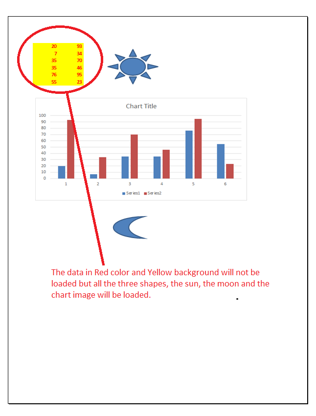

---  
title: Filtering the kind of data while loading the workbook from template file with C++  
linktitle: Filtering Data While Loading Workbook  
type: docs  
weight: 400  
url: /cpp/filtering-the-kind-of-data-while-loading-the-workbook-from-template-file/  
description: Learn how to filter specific data types while loading a workbook from a template file using Aspose.Cells with C++.  
ai_search_scope: cells_cpp
ai_search_endpoint: "https://docsearch.api.aspose.cloud/ask"
---  

{}  

Sometimes, you want to specify which kind of data should be loaded when building the workbook from the template file. Filtering loaded data can improve performance for your specific purpose, especially when using [LightCells APIs](/cells/cpp/using-lightcells-api/). Please use the **[LoadOptions.GetLoadFilter()](https://reference.aspose.com/cells/cpp/aspose.cells/loadoptions/getloadfilter/)** property for this purpose.  

{}  

The following sample code loads only shape objects while loading the workbook from the [template file](5115552.xlsx), which you can download from the given link. The following screenshot shows the [template file](5115552.xlsx) contents and also explains that the data in red color and yellow background will not be loaded because **[LoadOptions.GetLoadFilter()](https://reference.aspose.com/cells/cpp/aspose.cells/loadoptions/getloadfilter/)** property has been set to **[LoadDataFilterOptions.Shape](https://reference.aspose.com/cells/cpp/aspose.cells/loaddatafilteroptions/)**.  

  

The following screenshot shows the [output PDF](5115555.pdf), which you can download from the given link. Here you can see that the data in red color and yellow background is not present, but all shapes are there.  

  

```c++
#include <iostream>
#include "Aspose.Cells.h"

using namespace Aspose::Cells;

int main()
{
    Aspose::Cells::Startup();

    // Source directory path
    U16String srcDir(u"..\\Data\\01_SourceDirectory\\");

    // Output directory path
    U16String outDir(u"..\\Data\\02_OutputDirectory\\");

    // Set the load options; we only want to load shapes and do not want to load data
    LoadOptions loadOptions(LoadFormat::Xlsx);
    loadOptions.SetLoadFilter(new LoadFilter(LoadDataFilterOptions::All & ~LoadDataFilterOptions::Chart));

    // Create workbook object from sample Excel file using load options
    Workbook workbook(srcDir + u"sampleFilterChars.xlsx", loadOptions);

    // Save the output in PDF format
    workbook.Save(outDir + u"sampleFilterChars_out.pdf", SaveFormat::Pdf);

    std::cout << "File saved successfully." << std::endl;

    Aspose::Cells::Cleanup();
}
```

