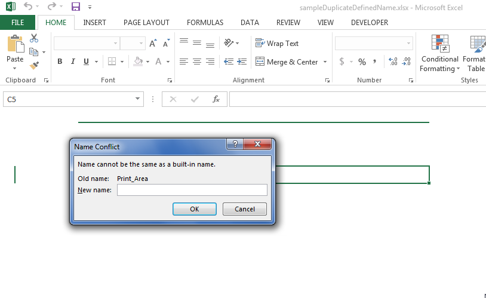

## **Possible Usage Scenarios**

Sometimes the user tries to load a workbook that is somewhat corrupt but still loadable. In such cases, Aspose.Cells throws warnings while loading the workbook. You can catch these warnings by implementing the [**IWarningCallback**](https://reference.aspose.com/cells/cpp/aspose.cells/iwarningcallback/) interface and setting the [**LoadOptions.GetWarningCallback()**](https://reference.aspose.com/cells/cpp/aspose.cells/loadoptions/getwarningcallback/) property.

## **Get Warnings while Loading Excel File**

The following sample code explains how to get warnings while loading an Excel file. The code loads the [sample excel file](sampleDuplicateDefinedName.xlsx), which throws a [**DuplicateDefinedName**](https://reference.aspose.com/cells/cpp/aspose.cells/warningtype/) warning on loading. This warning is then caught by the [**IWarningCallback.Warning()**](https://reference.aspose.com/cells/cpp/aspose.cells/iwarningcallback/warning/) method, which prints the warning messages on the console. The code then saves the workbook as an [output excel file](outputDuplicateDefinedName.xlsx). If you open the sample Excel file in Microsoft Excel, it will also display this warning, as shown in the screenshot below. Please also check the console output of the code given below for more understanding.



## **Sample Code**

```c++
#include <iostream>
#include "Aspose.Cells.h"
using namespace Aspose::Cells;

class WarningCallback : public IWarningCallback {
public:
    void Warning(WarningInfo& warningInfo) override {
        if (warningInfo.GetType() == ExceptionType::DefinedName) {
            std::cout << "Defined Name Warning: " << warningInfo.GetDescription().ToUtf8() << std::endl;
        }
    }
};

int main() {
    Aspose::Cells::Startup();

    U16String srcDir(u"..\\Data\\01_SourceDirectory\\");
    U16String outDir(u"..\\Data\\02_OutputDirectory\\");

    LoadOptions options;
    WarningCallback callback;
    options.SetWarningCallback(&callback);

    U16String inputFilePath = srcDir + u"sampleDuplicateDefinedName.xlsx";
    Workbook book(inputFilePath, options);

    U16String outputFilePath = outDir + u"outputDuplicateDefinedName.xlsx";
    book.Save(outputFilePath);

    std::cout << "Workbook saved successfully with warning handling!" << std::endl;

    Aspose::Cells::Cleanup();
    return 0;
}
```

## **Console Output**

Here is the console output of the above code when executed with the provided [sample excel file](sampleDuplicateDefinedName.xlsx).



Duplicate Defined Name Warning: Name:PRINT_AREA;ReferTo:Introduction!$D$16:$D$17

Duplicate Defined Name Warning: Name:PRINT_AREA;ReferTo:Panel!$B$228

Duplicate Defined Name Warning: Name:PRINT_AREA;ReferTo:'Queries '!$D$14:$D$16


