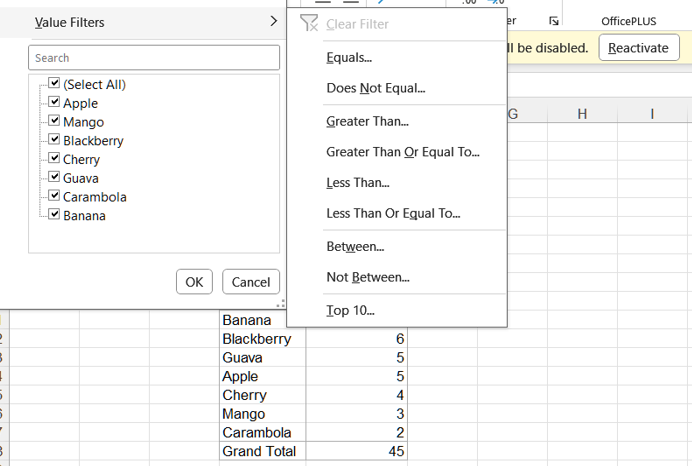
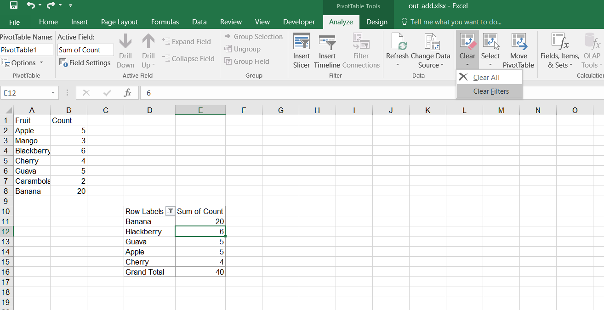

## **Possible Usage Scenarios**
When you create a pivot table with known data and want to filter the pivot table, you need to learn and use a filter. It can help you filter out the data you want effectively. By using the Aspose.Cells API, you can add and clear filters on field values in Pivot Tables. 

## **Add Filter in Pivot Table in Excel**
Add a filter in a Pivot Table in Excel, follow these steps:

1. Select the PivotTable that you want to add a filter to.  
2. Click on the drop‑down arrow for the filter you want to add in the pivot table.  
3. Select **Top 10** from the drop‑down menu.  
   <br>
   
4. Set the show mode and the number of items.  
   <br>
   

## **Add Filter in Pivot Table**
Please see the following sample code. It sets the data and creates a PivotTable based on it. Then it adds a filter on the row field of the pivot table. Finally, it saves the workbook in the [output XLSX](filterout.xlsx) format. After executing the example code, a pivot table with a Top 10 filter is added to the worksheet.

### **Sample Code**
```cpp
#include <iostream>
#include "Aspose.Cells.h"
using namespace Aspose::Cells;

int main()
{
    Aspose::Cells::Startup();

    // Create a new workbook
    Workbook workbook;

    // Get the first worksheet
    Worksheet ws = workbook.GetWorksheets().Get(0);
    Cells cells = ws.GetCells();

    // Set values to cells
    Cell cell = cells.Get(u"A1");
    cell.PutValue(u"Fruit");
    cell = cells.Get(u"B1");
    cell.PutValue(u"Count");

    cell = cells.Get(u"A2");
    cell.PutValue(u"Apple");
    cell = cells.Get(u"A3");
    cell.PutValue(u"Mango");
    cell = cells.Get(u"A4");
    cell.PutValue(u"Blackberry");
    cell = cells.Get(u"A5");
    cell.PutValue(u"Cherry");
    cell = cells.Get(u"A6");
    cell.PutValue(u"Guava");
    cell = cells.Get(u"A7");
    cell.PutValue(u"Carambola");
    cell = cells.Get(u"A8");
    cell.PutValue(u"Banana");
    cell = cells.Get(u"B2");
    cell.PutValue(5);
    cell = cells.Get(u"B3");
    cell.PutValue(3);
    cell = cells.Get(u"B4");
    cell.PutValue(6);
    cell = cells.Get(u"B5");
    cell.PutValue(4);
    cell = cells.Get(u"B6");
    cell.PutValue(5);
    cell = cells.Get(u"B7");
    cell.PutValue(2);
    cell = cells.Get(u"B8");
    cell.PutValue(20);

    // Add a PivotTable to the worksheet
    int32_t i = ws.GetPivotTables().Add(u"=A1:B8", u"D10", u"PivotTable1");

    // Access the instance of the newly added PivotTable
    PivotTable pivotTable = ws.GetPivotTables().Get(i);
    pivotTable.AddFieldToArea(PivotFieldType::Row, 0);

    pivotTable.AddFieldToArea(PivotFieldType::Data, u"Count");
    pivotTable.GetDataFields().Get(0).SetFunction(ConsolidationFunction::Sum);

    PivotField field = pivotTable.GetRowFields().Get(0);
    field.SetIsAutoSort(true);
    field.SetIsAscendSort(false);
    field.SetAutoSortField(0);

    // Add Top 10 filter
    PivotField filterField = pivotTable.GetRowFields().Get(0);
    filterField.FilterTop10(0, PivotFilterType::Count, false, 5);

    pivotTable.RefreshData();
    pivotTable.CalculateData();

    // Save the workbook
    workbook.Save(u"filterout.xlsx");

    Aspose::Cells::Cleanup();
    return 0;
}
```

## **Clear Filter in Pivot Table in Excel**
Clear a filter in a Pivot Table in Excel, follow these steps:

1. Select the PivotTable that you want to clear the filter from.  
2. Click on the drop‑down arrow for the filter you want to clear in the pivot table.  
3. Select **Clear Filter** from the drop‑down menu.  
   <br>
   
4. If you want to clear all filters from the pivot table, you can also click the **Clear Filters** button on the **PivotTable Analyze** tab of the ribbon in Excel.  
   <br>
   

## **Clear Filter in Pivot Table**
Clear a filter in a Pivot Table using Aspose.Cells. Please see the following sample code.  

1. Set the data and create a PivotTable based on it.  
2. Add a filter on the row field of the pivot table.  
3. Save the workbook in the [output XLSX](out_add.xlsx) format. After executing the example code, a pivot table with a Top 10 filter is added to the worksheet.  
4. Clear the filter on a specific PivotField. After executing the code to clear the filter, the filter on the specific PivotField will be removed. Please check the [output XLSX](out_delete.xlsx).

### **Sample Code**
```cpp
#include <iostream>
#include "Aspose.Cells.h"
using namespace Aspose::Cells;

int main() {
    Aspose::Cells::Startup();

    // Create a new workbook
    Workbook workbook;

    // Get the first worksheet
    Worksheet ws = workbook.GetWorksheets().Get(0);
    Cells cells = ws.GetCells();

    // Set values to cells
    Cell cell = cells.Get(u"A1");
    cell.PutValue(u"Fruit");
    cell = cells.Get(u"B1");
    cell.PutValue(u"Count");

    cell = cells.Get(u"A2");
    cell.PutValue(u"Apple");
    cell = cells.Get(u"A3");
    cell.PutValue(u"Mango");
    cell = cells.Get(u"A4");
    cell.PutValue(u"Blackberry");
    cell = cells.Get(u"A5");
    cell.PutValue(u"Cherry");
    cell = cells.Get(u"A6");
    cell.PutValue(u"Guava");
    cell = cells.Get(u"A7");
    cell.PutValue(u"Carambola");
    cell = cells.Get(u"A8");
    cell.PutValue(u"Banana");
    cell = cells.Get(u"B2");
    cell.PutValue(5);
    cell = cells.Get(u"B3");
    cell.PutValue(3);
    cell = cells.Get(u"B4");
    cell.PutValue(6);
    cell = cells.Get(u"B5");
    cell.PutValue(4);
    cell = cells.Get(u"B6");
    cell.PutValue(5);
    cell = cells.Get(u"B7");
    cell.PutValue(2);
    cell = cells.Get(u"B8");
    cell.PutValue(20);

    // Add a PivotTable to the worksheet
    int i = ws.GetPivotTables().Add(u"=A1:B8", u"D10", u"PivotTable1");

    // Access the instance of the newly added PivotTable
    PivotTable pivotTable = ws.GetPivotTables().Get(i);
    pivotTable.AddFieldToArea(PivotFieldType::Row, 0);

    pivotTable.AddFieldToArea(PivotFieldType::Data, u"Count");
    pivotTable.GetDataFields().Get(0).SetFunction(ConsolidationFunction::Sum);

    PivotField field = pivotTable.GetRowFields().Get(0);
    field.SetIsAutoSort(true);
    field.SetIsAscendSort(false);
    field.SetAutoSortField(0);

    // Add Top 10 filter
    PivotField filterField = pivotTable.GetRowFields().Get(0);
    filterField.FilterTop10(0, PivotFilterType::Count, false, 5);

    pivotTable.RefreshData();
    pivotTable.CalculateData();

    workbook.Save(u"out_add.xlsx");

    // Clear PivotFilter from the specific PivotField
    pivotTable.GetPivotFilters().ClearFilter(field.GetBaseIndex());
    pivotTable.RefreshData();
    pivotTable.CalculateData();

    workbook.Save(u"out_delete.xlsx");

    Aspose::Cells::Cleanup();
    return 0;
}
```

