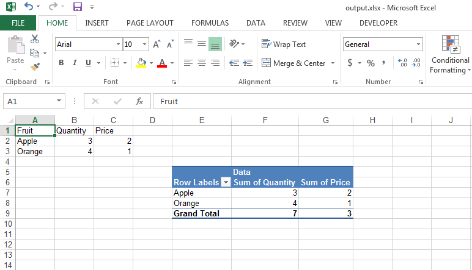

## **Introduction**
Please use [PivotTableCollection.Add()](https://reference.aspose.com/cells/cpp/aspose.cells.pivot/pivottablecollection/add/) method to create a pivot table inside the worksheet. Once, the pivot table is created, you can work with it using the [PivotTable](https://reference.aspose.com/cells/cpp/aspose.cells.pivot/pivottable/) class.
## **Create Pivot Table**
The following sample code shows how to create a pivot table and work with it. Please check the [output excel file](23167010.xlsx) generated with this code and the following screenshot showing the [output excel file](23167010.xlsx) in Microsoft Excel.

## **Sample Code**


