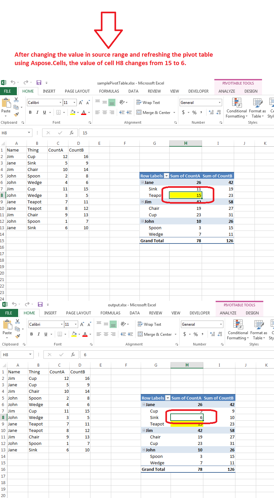

## **Possible Usage Scenarios**
Besides creating new pivot tables, you can manipulate the newly created and existing pivot tables. You can change the data in the source range of a pivot table and then refresh and calculate it to obtain the new values of the pivot table cells. Please use [PivotTable.RefreshData()](https://reference.aspose.com/cells/cpp/aspose.cells.pivot/pivottable/refreshdata/) and [PivotTable.CalculateData()](https://reference.aspose.com/cells/cpp/aspose.cells.pivot/pivottable/calculatedata/) methods after you have changed the values in the source range of the pivot table to refresh the pivot table.

## **Manipulate Pivot Table**
The following sample code loads the [sample excel file](23167013.xlsx) and accesses the existing pivot table inside its first worksheet. It changes the value of cell B3, which is inside the source range of the pivot table, and then refreshes the pivot table. Before refreshing the pivot table, it accesses the value of pivot table cell H8, which is 15; after refreshing, its value changes to 6. Please see the [output excel file](23167014.xlsx) generated with this code and the screenshot showing the effect of the sample code on the sample excel file. Please also see the console output below, which shows the value of the pivot table cell H8 before and after refreshing the pivot table.

## **Sample Code**


## **Console Output**
Below is the console output of the above sample code when executed with the provided [sample excel file](23167013.xlsx).


Before refreshing Pivot Table value of cell H8: 15

After refreshing Pivot Table value of cell H8: 6



