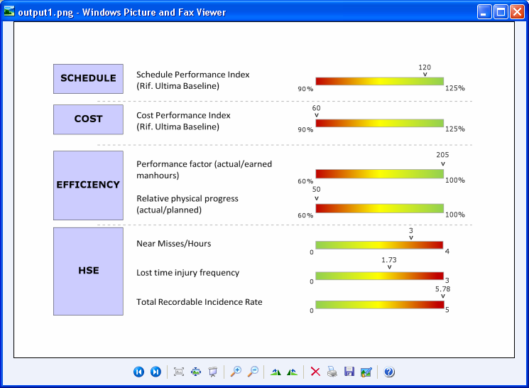

--- 
title: Create Transparent Image of Excel Worksheet with C++ 
linktitle: Create Transparent Image of Excel Worksheet 
type: docs 
weight: 170 
url: /cpp/create-transparent-image-of-excel-worksheet/ 
description: Generate transparent images of Excel worksheets using Aspose.Cells with C++. 
--- 

{} 

Sometimes, you need to generate the image of your worksheet as a transparent image. You want to apply transparency to all cells which have no fill colors. Aspose.Cells provides the [**ImageOrPrintOptions.Transparent**](https://reference.aspose.com/cells/cpp/aspose.cells.rendering/imageorprintoptions/transparent/) property to apply transparency to the worksheet image. When this property is **false**, then cells with no fill colors are drawn with white color and when it is **true**, cells with no fill colors are drawn transparent. 

{} 

In the following worksheet image, transparency has not been applied. The cells with no fill colors are drawn white.

|**Output without transparency: the cell background is white**| 
| :- | 
|| 

While, in the following worksheet image, transparency has been applied. The cells with no fill colors are transparent.

|**Output with transparency enabled**| 
| :- | 
|| 

The following sample code generates a transparent image from an Excel worksheet.

```c++
#include <iostream>
#include "Aspose.Cells.h"
using namespace Aspose::Cells;

int main()
{
    Aspose::Cells::Startup();

    // Source directory path
    U16String sourceDir = u"..\\Data\\01_SourceDirectory\\";
    
    // Output directory path
    U16String outputDir = u"..\\Data\\02_OutputDirectory\\";

    // Create workbook object from source file
    Workbook workbook(sourceDir + u"sampleCreateTransparentImage.xlsx");

    // Apply different image or print options
    ImageOrPrintOptions imgOption;
    imgOption.SetImageType(static_cast<ImageType>(5)); // Png
    imgOption.SetHorizontalResolution(200);
    imgOption.SetVerticalResolution(200);
    imgOption.SetOnePagePerSheet(true);

    // Apply transparency to the output image
    imgOption.SetTransparent(true);

    // Create image after applying image or print options
    SheetRender sr(workbook.GetWorksheets().Get(0), imgOption);
    sr.ToImage(0, outputDir + u"outputCreateTransparentImage.png");

    std::cout << "Image created successfully!" << std::endl;

    Aspose::Cells::Cleanup();
}
```