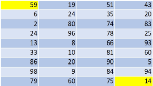

## **Possible Usage Scenarios**

You can make an image of a worksheet using Aspose.Cells. However, sometimes you need to export only a range of cells in a worksheet to an image. This article explains how to achieve this.

## **Export Range of Cells in a Worksheet to Image**

To take an image of a range, set the print area to the desired range and then set all margins to 0. Also set [**ImageOrPrintOptions.GetOnePagePerSheet()**](https://reference.aspose.com/cells/cpp/aspose.cells.rendering/imageorprintoptions/getonepagepersheet/) to **true**. The following code takes an image of the range D8:G16. Below is a screenshot of the [sample Excel file](47153160.xlsx) used in the code. You can try the code with any Excel file.

## **Screenshot of Sample Excel File and its Exported Image**

****

Executing the code creates an image of the range D8:G16 only.

****

## **Sample Code**

```cpp
#include <iostream>
#include "Aspose.Cells.h"
using namespace Aspose::Cells;

int main()
{
    Aspose::Cells::Startup();

    // Source directory path
    U16String srcDir(u"..\\Data\\01_SourceDirectory\\");

    // Output directory path
    U16String outDir(u"..\\Data\\02_OutputDirectory\\");

    // Create workbook from source file
    Workbook workbook(srcDir + u"sampleExportRangeOfCellsInWorksheetToImage.xlsx");

    // Access the first worksheet
    Worksheet worksheet = workbook.GetWorksheets().Get(0);

    // Set the print area with the desired range
    worksheet.GetPageSetup().SetPrintArea(u"D8:G16");

    // Set all margins to 0
    worksheet.GetPageSetup().SetLeftMargin(0);
    worksheet.GetPageSetup().SetRightMargin(0);
    worksheet.GetPageSetup().SetTopMargin(0);
    worksheet.GetPageSetup().SetBottomMargin(0);

    // Set OnePagePerSheet option as true
    ImageOrPrintOptions options;
    options.SetOnePagePerSheet(true);
    options.SetImageType(Aspose::Cells::Drawing::ImageType::Jpeg);
    options.SetHorizontalResolution(200);
    options.SetVerticalResolution(200);

    // Take the image of the worksheet
    SheetRender sr(worksheet, options);
    sr.ToImage(0, outDir + u"outputExportRangeOfCellsInWorksheetToImage.jpg");

    std::cout << "Worksheet image exported successfully!" << std::endl;

    Aspose::Cells::Cleanup();
}
```