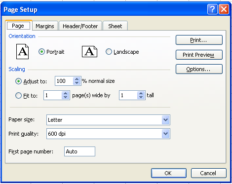

{}

Sometimes, developers need to configure page setup and print settings to control the printing process. Page setup and print settings offer various options and are fully supported in Aspose.Cells.

This article shows how to create a console application in Visual Studio, and apply page setup and printing options to a worksheet with a few simple lines of code using the Aspose.Cells API.

{}

## **Working with Page and Print Settings**

For this example, we created a workbook in Microsoft Excel and use Aspose.Cells to set page setup and print options.

### **Using Aspose.Cells to set Page Setup Options**

First create a simple worksheet in Microsoft Excel. Then apply page setup options to it. Executing the code changes the Page Setup options as in the screenshot below.

|**Output file.**|
| :- |
||

1. Create a worksheet with some data in Microsoft Excel:
   1. Open a new workbook in Microsoft Excel.
   1. Add some data.
1. Set page setup options:
   Apply page setup options to the file. Below is a screenshot of the default options, before the new options are applied.

|**Default page setup options.**|
| :- |
||

1. Download and install Aspose.Cells:
   1. [Download](https://downloads.aspose.com/cells/cpp) Aspose.Cells for C++.
   1. Install it on your development computer.
      All Aspose components, when installed, work in evaluation mode. The evaluation mode has no time limit and it only injects watermarks into produced documents.
1. Create a project:
   1. Start Visual Studio.
   1. Create a new console application.
      This example will show a C++ console application.
1. Add references:
   1. This example uses Aspose.Cells so add a reference to that component to the project. For example:
      …\Program Files\Aspose\Aspose.Cells\Bin\Net1.0\Aspose.Cells.dll
1. Write the application that invokes the API:

```cpp
#include <iostream>
#include "Aspose.Cells.h"
using namespace Aspose::Cells;

int main()
{
    Aspose::Cells::Startup();

    // Source directory path
    U16String srcDir(u"..\\Data\\01_SourceDirectory\\");

    // Output directory path
    U16String outDir(u"..\\Data\\02_OutputDirectory\\");

    // Path of input excel file
    U16String inputFilePath = srcDir + u"CustomerReport.xlsx";

    // Path of output excel file
    U16String outputFilePath = outDir + u"PageSetup_out.xlsx";

    // Create workbook
    Workbook workbook(inputFilePath);

    // Accessing the first worksheet in the Excel file
    Worksheet worksheet = workbook.GetWorksheets().Get(0);

    // Setting the orientation to Portrait
    worksheet.GetPageSetup().SetOrientation(PageOrientationType::Portrait);

    // Setting the number of pages to which the length of the worksheet will be spanned
    worksheet.GetPageSetup().SetFitToPagesTall(1);

    // Setting the number of pages to which the width of the worksheet will be spanned
    worksheet.GetPageSetup().SetFitToPagesWide(1);

    // Setting the paper size to A4
    worksheet.GetPageSetup().SetPaperSize(PaperSizeType::PaperA4);

    // Setting the print quality of the worksheet to 1200 dpi
    worksheet.GetPageSetup().SetPrintQuality(1200);

    // Setting the first page number of the worksheet pages
    worksheet.GetPageSetup().SetFirstPageNumber(2);

    // Save the workbook
    workbook.Save(outputFilePath);

    std::cout << "Page setup applied successfully!" << std::endl;

    Aspose::Cells::Cleanup();
}
```

### **Setting Print options**

Page setup settings also provide several print options (also called sheet options) that allow users to control how worksheet pages are printed. They allow users to:

- Select a specific print area of a worksheet.
- Print titles.
- Print gridlines.
- Print row/column headings.
- Achieve draft quality.
- Print comments.
- Print cell errors.
- Define page ordering.

The example that follows applies print options to the file created in the example above (PageSetup.xls). The screenshot below shows the default print options before new options are applied.

|**Input document**|
| :- |
||
Executing the code changes the print options.

|**Output file**|
| :- |
||

```cpp
#include <iostream>
#include "Aspose.Cells.h"
using namespace Aspose::Cells;

int main()
{
    Aspose::Cells::Startup();

    // Source directory path
    U16String srcDir(u"..\\Data\\01_SourceDirectory\\");

    // Output directory path
    U16String outDir(u"..\\Data\\02_OutputDirectory\\");

    // Path of input excel file
    U16String inputFilePath = srcDir + u"PageSetup.xlsx";

    // Path of output excel file
    U16String outputFilePath = outDir + u"PageSetup_Print_out.xlsx";

    // Create workbook
    Workbook workbook(inputFilePath);

    // Accessing the first worksheet in the Excel file
    Worksheet worksheet = workbook.GetWorksheets().Get(0);

    // Get PageSetup object
    PageSetup pageSetup = worksheet.GetPageSetup();

    // Specifying the cells range (from A1 cell to E30 cell) of the print area
    pageSetup.SetPrintArea(u"A1:E30");

    // Defining column numbers A & E as title columns
    pageSetup.SetPrintTitleColumns(u"$A:$E");

    // Defining row numbers 1 as title rows
    pageSetup.SetPrintTitleRows(u"$1:$2");

    // Allowing to print gridlines
    pageSetup.SetPrintGridlines(true);

    // Allowing to print row/column headings
    pageSetup.SetPrintHeadings(true);

    // Allowing to print worksheet in black & white mode
    pageSetup.SetBlackAndWhite(true);

    // Allowing to print comments as displayed on worksheet
    pageSetup.SetPrintComments(PrintCommentsType::PrintInPlace);

    // Allowing to print worksheet with draft quality
    pageSetup.SetPrintDraft(true);

    // Allowing to print cell errors as N/A
    pageSetup.SetPrintErrors(PrintErrorsType::PrintErrorsNA);

    // Setting the printing order of the pages to over then down
    pageSetup.SetOrder(PrintOrderType::OverThenDown);

    // Save the workbook
    workbook.Save(outputFilePath);

    std::cout << "Page setup applied successfully!" << std::endl;

    Aspose::Cells::Cleanup();
}
```
