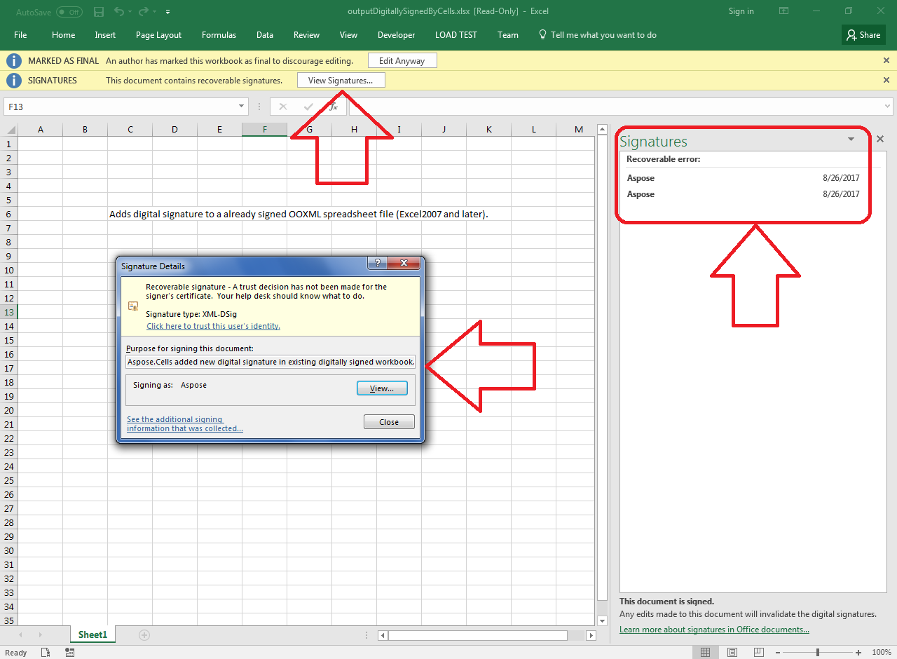

## **Possible Usage Scenarios**

Aspose.Cells provides the [**Workbook::AddDigitalSignature(DigitalSignatureCollectionPtr digitalSignatureCollection)**](https://reference.aspose.com/cells/cpp/aspose.cells/workbook/adddigitalsignature/) method to add digital signatures to already signed Excel files.

{}

Please note while adding a digital signature to an already signed Excel document: if the original document was generated by Aspose.Cells, it works properly. However, if the document was created by other engines (e.g. Microsoft Excel), Aspose.Cells for C++ cannot preserve the exact file structure after loading and re-saving, which may invalidate existing signatures.

{}

## **How to Add Digital Signature to an Already Signed Excel File**

The following code sample demonstrates using [**Workbook::AddDigitalSignature**](https://reference.aspose.com/cells/cpp/aspose.cells/workbook/adddigitalsignature/) to add digital signatures to signed Excel files. The [sample Excel file](50528280.xlsx) comes pre-signed. The [output file](50528281.xlsx) demonstrates the result. We use a demo certificate [AsposeDemo.pfx](50528279.pfx) with password **aspose**.



## **Sample Code**

```c++
#include <iostream>
#include "Aspose.Cells.h"
using namespace Aspose::Cells;
using namespace Aspose::Cells::DigitalSignatures;

int main()
{
    Aspose::Cells::Startup();

    // Source and output directories
    U16String srcDir(u"..\\Data\\01_SourceDirectory\\");
    U16String outDir(u"..\\Data\\02_OutputDirectory\\");

    // Certificate and workbook paths
    U16String certFilePath = srcDir + u"AsposeDemo.pfx";
    U16String inputFilePath = srcDir + u"sampleDigitallySignedByCells.xlsx";
    U16String outputFilePath = outDir + u"outputDigitallySignedByCells.xlsx";

    // Load digitally signed workbook
    Workbook workbook(inputFilePath);

    // Create digital signature collection
    DigitalSignatureCollection dsCollection;

    // Create digital signature using PFX certificate
    U16String password = u"aspose";
    U16String comments = u"Aspose.Cells added new digital signature in existing digitally signed workbook.";
    DigitalSignature signature(certFilePath, password, comments, Date());

    // Add signature to collection
    dsCollection.Add(signature);

    // Apply digital signatures to workbook
    workbook.AddDigitalSignature(dsCollection);

    // Save modified workbook
    workbook.Save(outputFilePath);

    std::cout << "Digital signature added successfully." << std::endl;

    Aspose::Cells::Cleanup();
    return 0;
}
```
