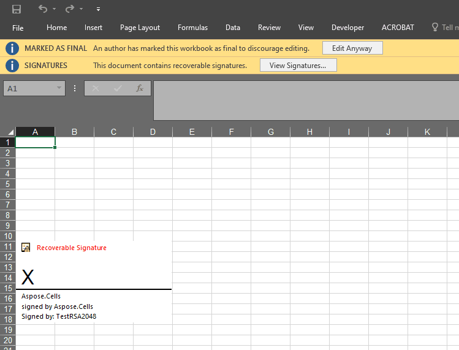

## **Introduction**

Aspose.Cells provides the [**Picture.SignatureLine**](https://reference.aspose.com/cells/cpp/aspose.cells.drawing/picture/signatureline/) property to add the signature line of the worksheet.

## **How to Add Signature Line to Worksheet**

The following sample code demonstrates how to use the [**Picture.SignatureLine**](https://reference.aspose.com/cells/cpp/aspose.cells.drawing/picture/signatureline/) property to add the signature line of the worksheet. The screenshot shows the effect of the sample code on the sample Excel file after execution.



## **Sample Code**

```c++
#include <iostream>
#include "Aspose.Cells.h"
using namespace Aspose::Cells;
using namespace Aspose::Cells::DigitalSignatures;

int main()
{
    Aspose::Cells::Startup();

    U16String srcDir(u"..\\Data\\01_SourceDirectory\\");

    Workbook wb;

    SignatureLine signatureLine;
    Guid signatureLineId = Guid::NewGuid();
    Guid providerId = Guid::Empty();
    signatureLine.SetId(signatureLineId);
    signatureLine.SetProviderId(providerId);
    signatureLine.SetSigner(u"Aspose.Cells");
    signatureLine.SetTitle(u"signed by Aspose.Cells");

    wb.GetWorksheets().Get(0).GetShapes().AddSignatureLine(1, 1, signatureLine);

    U16String certificatePath = srcDir + u"rsa2048.pfx";
    U16String password = u"123456";

    DigitalSignature signature(certificatePath, password, u"test Microsoft Office signature line", DateTime::GetNow());
    signature.SetId(signatureLineId);
    signature.SetProviderId(providerId);

    DigitalSignatureCollection dsCollection;
    dsCollection.Add(signature);

    wb.SetDigitalSignature(dsCollection);

    U16String outputPath = srcDir + u"signatureLine.xlsx";
    wb.Save(outputPath);

    std::cout << "Workbook with signature line saved successfully!" << std::endl;

    Aspose::Cells::Cleanup();
}
```