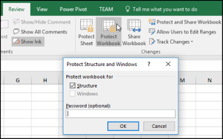

{}
To prevent other users from viewing hidden worksheets, adding, moving, deleting, or hiding worksheets, and renaming worksheets, you can protect the structure of your Excel workbook with a password.
{}

## **Protect and Unprotect Workbook Structure in MS Excel**

****

1. Click **Review > Protect Workbook**.
1. Enter a password in **the Password box**.
1. Select **OK**, re-enter the password to confirm it, and then select **OK** again.

## **Protect Workbook Structure Using Aspose.Cells for C++**
Only need the following simple lines of code to implement protecting workbook structure of Excel files.

```c++
#include <iostream>
#include "Aspose.Cells.h"
using namespace Aspose::Cells;

int main()
{
    Aspose::Cells::Startup();

    // Create a new workbook
    Workbook workbook;

    // Protect workbook structure with a password
    workbook.Protect(ProtectionType::Structure, u"password");

    // Save the workbook to a file
    workbook.Save(u"Book1.xlsx");

    std::cout << "Workbook created and protected successfully!" << std::endl;

    Aspose::Cells::Cleanup();
}
```

## **Unprotect Workbook Structure Using Aspose.Cells for C++**
Unprotecting workbook structure is easy with Aspose.Cells API.

```c++
#include <iostream>
#include "Aspose.Cells.h"

using namespace Aspose::Cells;

int main()
{
    Aspose::Cells::Startup();

    // Open an Excel file which workbook structure is protected.
    U16String inputFilePath = u"Book1.xlsx";
    Workbook workbook(inputFilePath);

    // Unprotect workbook structure.
    workbook.Unprotect(u"password");

    // Save Excel file.
    workbook.Save(inputFilePath);

    std::cout << "Workbook structure unprotected and saved successfully!" << std::endl;

    Aspose::Cells::Cleanup();
}
```

{}
Note: a correct password is required.
{}
