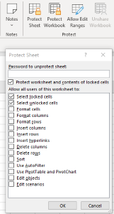

{}
To prevent other users from accidentally or deliberately changing, moving, or deleting data in a worksheet, you can lock the cells on your Excel worksheet and then protect the sheet with a password. 
{}

## **Protect and Unprotect Worksheets in MS Excel**

****

1. Click **Review > Protect Worksheet**.  
2. Enter a password in **the Password box**.  
3. Select **the allow** options.  
4. Select **OK**, re-enter the password to confirm it, and then select **OK** again.

## **Protect Worksheet Using Aspose.Cells for C++**
You only need the following simple lines of code to implement protecting the workbook structure of Excel files.

```c++
#include <iostream>
#include "Aspose.Cells.h"
using namespace Aspose::Cells;

int main()
{
    Aspose::Cells::Startup();

    // Create a new workbook
    Workbook workbook;

    // Get the first worksheet
    Worksheet sheet = workbook.GetWorksheets().Get(0);

    // Protect contents of the worksheet
    sheet.Protect(ProtectionType::Contents);

    // Protect worksheet with password
    sheet.GetProtection().SetPassword(u"test");

    // Save as Excel file
    workbook.Save(u"Book1.xlsx");

    std::cout << "Workbook created and protected successfully!" << std::endl;

    Aspose::Cells::Cleanup();
}
```

## **Unprotect Worksheet Using Aspose.Cells for C++**
Unprotecting a worksheet is easy with the Aspose.Cells API. If the worksheet is password‑protected, a correct password is required.

```cpp
#include <iostream>
#include "Aspose.Cells.h"

using namespace Aspose::Cells;

int main()
{
    Aspose::Cells::Startup();

    // Create a new workbook
    Workbook workbook(u"Book1.xlsx");

    // Get the first worksheet
    Worksheet sheet = workbook.GetWorksheets().Get(0);

    // Unprotect the worksheet with password
    sheet.Unprotect(u"password");

    // Save the workbook
    workbook.Save(u"Book1.xlsx");

    std::cout << "Worksheet unprotected successfully!" << std::endl;

    Aspose::Cells::Cleanup();
}
```

## **Advanced topics**
- [Advanced Protection Settings since Excel XP](/cells/cpp/advanced-protection-settings-since-excel-xp/)
- [Detect if Worksheet is Password Protected](/cells/cpp/detect-if-worksheet-is-password-protected/)
- [Protecting Worksheets](/cells/cpp/protecting-worksheets/)
- [Unprotect a Worksheet](/cells/cpp/unprotect-a-worksheet/)
- [Verify Password Used to Protect the Worksheet](/cells/cpp/verify-password-used-to-protect-the-worksheet/)

