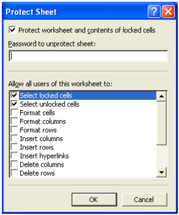

{}

Since the release of Excel 2002 or XP, Microsoft has added many advanced protection settings.

{}

## **Introduction**

These protection settings restrict or allow users to:

- Delete rows or columns.
- Edit contents, objects, or scenarios.
- Format cells, rows, or columns.
- Insert rows, columns, or hyperlinks.
- Select locked or unlocked cells.
- Use pivot tables and much more.

Aspose.Cells supports all the advanced protection settings offered by Excel XP or later versions.

### **Advanced Protection Settings Using Excel XP and Later Versions**

To view the protection settings available in Excel XP:

1. From the **Tools** menu, select **Protection** followed by **Protect Sheet**. A dialog will be displayed.

To view the protection settings available in Excel 2016:

1. From the **File** menu, select **Protect Workbook** followed by **Protect Current Sheet**.
1. Select the **Protect Sheet** in the **Review** menu.

Following the steps mentioned above will show a dialog where you can allow or restrict worksheet features or apply a password to the worksheet.

### **Advanced Protection Settings Using Aspose.Cells**

Aspose.Cells supports all of the advanced protection settings.

Aspose.Cells provides a class, [**Workbook**](https://reference.aspose.com/cells/cpp/aspose.cells/workbook/), that represents a Microsoft Excel file. The [**Workbook**](https://reference.aspose.com/cells/cpp/aspose.cells/workbook/) class contains a [**Worksheets**](https://reference.aspose.com/cells/cpp/aspose.cells/worksheetcollection/) collection that allows access to each worksheet in the Excel file. A worksheet is represented by the [**Worksheet**](https://reference.aspose.com/cells/cpp/aspose.cells/worksheet/) class.

The [**Worksheet**](https://reference.aspose.com/cells/cpp/aspose.cells/worksheet/) class provides the [**GetProtection()**](https://reference.aspose.com/cells/cpp/aspose.cells/worksheet/getprotection/) property that is used to apply these advanced protection settings. The [**GetProtection()**](https://reference.aspose.com/cells/cpp/aspose.cells/worksheet/getprotection/) property is in fact an object of the [**Protection**](https://reference.aspose.com/cells/cpp/aspose.cells/protection/) class that encapsulates several Boolean properties for disabling or enabling restrictions.

Below is a small example application. It opens an Excel file and uses most of the advanced protection settings supported by Excel XP and later versions.

```cpp
#include <iostream>
#include <memory>
#include "Aspose.Cells.h"

using namespace Aspose::Cells;

int main()
{
    Aspose::Cells::Startup();

    // Source directory path
    U16String srcDir(u"..\\Data\\01_SourceDirectory\\");

    // Path of input Excel file
    U16String inputFilePath = srcDir + u"book1.xls";

    // Create workbook
    Workbook excel(inputFilePath);

    // Access the first worksheet in the Excel file
    Worksheet worksheet = excel.GetWorksheets().Get(0);

    // Restricting users to delete columns of the worksheet
    worksheet.GetProtection().SetAllowDeletingColumn(false);

    // Restricting users to delete row of the worksheet
    worksheet.GetProtection().SetAllowDeletingRow(false);

    // Restricting users to edit contents of the worksheet
    worksheet.GetProtection().SetAllowEditingContent(false);

    // Restricting users to edit objects of the worksheet
    worksheet.GetProtection().SetAllowEditingObject(false);

    // Restricting users to edit scenarios of the worksheet
    worksheet.GetProtection().SetAllowEditingScenario(false);

    // Restricting users to filter
    worksheet.GetProtection().SetAllowFiltering(false);

    // Allowing users to format cells of the worksheet
    worksheet.GetProtection().SetAllowFormattingCell(true);

    // Allowing users to format rows of the worksheet
    worksheet.GetProtection().SetAllowFormattingRow(true);

    // Allowing users to format columns of the worksheet
    worksheet.GetProtection().SetAllowFormattingColumn(true);

    // Allowing users to insert hyperlinks in the worksheet
    worksheet.GetProtection().SetAllowInsertingHyperlink(true);

    // Allowing users to insert rows in the worksheet
    worksheet.GetProtection().SetAllowInsertingRow(true);

    // Allowing users to select locked cells of the worksheet
    worksheet.GetProtection().SetAllowSelectingLockedCell(true);

    // Allowing users to select unlocked cells of the worksheet
    worksheet.GetProtection().SetAllowSelectingUnlockedCell(true);

    // Allowing users to sort
    worksheet.GetProtection().SetAllowSorting(true);

    // Allowing users to use pivot tables in the worksheet
    worksheet.GetProtection().SetAllowUsingPivotTable(true);

    // Save the modified Excel file
    U16String outputFilePath = srcDir + u"output.xls";
    excel.Save(outputFilePath, SaveFormat::Excel97To2003);

    Aspose::Cells::Cleanup();

    return 0;
}
```

{}

Please don't call the [**Worksheet**](https://reference.aspose.com/cells/cpp/aspose.cells/worksheet/) class' [**Protect**](https://reference.aspose.com/cells/cpp/aspose.cells/worksheet/protect/) method when using the [**GetProtection()**](https://reference.aspose.com/cells/cpp/aspose.cells/worksheet/getprotection/) property. Also, save the file to Excel97To2003 or Xlsx format because the advanced protection settings are only supported by Excel XP and later versions.

{}

### **Cell Locking Issue**

If you want to restrict users from editing cells, the cells must be locked before any protection settings are applied. Otherwise, the cells can be edited even if the worksheet is protected. In Microsoft Excel XP, cells can be locked through the following dialog:

|**Dialog to lock cells in Excel XP**|
| :- |
||

It is possible to lock cells using the Aspose.Cells API too. Each cell can get [**Style**](https://reference.aspose.com/cells/cpp/aspose.cells/style/) formatting that contains a Boolean property, [**IsLocked**](https://reference.aspose.com/cells/cpp/aspose.cells/style/islocked/). Set the [**IsLocked**](https://reference.aspose.com/cells/cpp/aspose.cells/style/islocked/) property to **true** or **false** to lock or unlock the cell.

```cpp
#include <iostream>
#include "Aspose.Cells.h"

using namespace Aspose::Cells;

int main()
{
    Aspose::Cells::Startup();

    // Source directory path
    U16String srcDir(u"..\\Data\\01_SourceDirectory\\");

    // Output directory path
    U16String outDir(u"..\\Data\\02_OutputDirectory\\");

    // Path of input Excel file
    U16String inputFilePath = srcDir + u"Book1.xlsx";

    // Path of output Excel file
    U16String outputFilePath = outDir + u"output.xlsx";

    // Create workbook
    Workbook workbook(inputFilePath);

    // Accessing the first worksheet in the Excel file
    Worksheet worksheet = workbook.GetWorksheets().Get(0);

    // Lock the style of cell A1
    worksheet.GetCells().Get(u"A1").GetStyle().SetIsLocked(true);

    // Protect the sheet
    worksheet.Protect(ProtectionType::All);

    // Save the workbook
    workbook.Save(outputFilePath);

    std::cout << "Worksheet protected successfully!" << std::endl;

    Aspose::Cells::Cleanup();
}
```