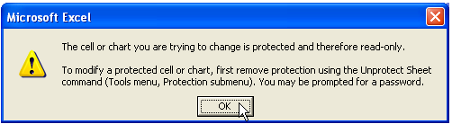
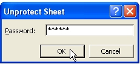

{}

When a worksheet is protected, the actions a user can take are restricted. For example, they cannot input data, insert or delete rows or columns, etc.

{}

## **Protect Worksheets**

### **Introduction**

The general protection options in Microsoft Excel are:

- Contents
- Objects
- Scenarios

Protected worksheets don't hide or protect sensitive data, so it's different from file encryption. Generally, worksheet protection is suitable for presentation purposes. It prevents the end user from modifying data, content, and formatting in the worksheet.

### **Protect a Worksheet**

Aspose.Cells provides a class, [**Workbook**](https://reference.aspose.com/cells/cpp/aspose.cells/workbook/) that represents a Microsoft Excel file. The [**Workbook**](https://reference.aspose.com/cells/cpp/aspose.cells/workbook/) class contains a [**Worksheets**](https://reference.aspose.com/cells/cpp/aspose.cells/worksheetcollection/) collection that allows access to each worksheet in an Excel file. A worksheet is represented by the [**Worksheet**](https://reference.aspose.com/cells/cpp/aspose.cells/worksheet/) class.

The [**Worksheet**](https://reference.aspose.com/cells/cpp/aspose.cells/worksheet/) class provides the [**Protect**](https://reference.aspose.com/cells/cpp/aspose.cells/worksheet/protect/) method that is used to apply protection on the worksheet. [**Protect**](https://reference.aspose.com/cells/cpp/aspose.cells/worksheet/protect/) method accepts the following parameters:

- Protection Type, the type of protection to apply on the worksheet. Protection type is applied with the help of the [**ProtectionType**](https://reference.aspose.com/cells/cpp/aspose.cells/protectiontype/) enumeration.
- New Password, the new password used to protect the worksheet.
- Old Password, the old password, if the worksheet is already password protected. If the worksheet is not already protected then just pass null.

The [**ProtectionType**](https://reference.aspose.com/cells/cpp/aspose.cells/protectiontype/) enumeration contains the following pre-defined protections types:

|**Protection Types**|**Description**|
| :- | :- |
|All|The user cannot modify anything on this worksheet|
|Contents|The user cannot enter data in this worksheet|
|Objects|The user cannot modify drawing objects|
|Scenarios|The user cannot modify saved scenarios|
|Structure|The user cannot modify the structure|
|Windows|Protection is applied to windows|
|None|No protection is applied|

The example below shows how to protect a worksheet with a password.

```cpp
#include <iostream>
#include "Aspose.Cells.h"

using namespace Aspose::Cells;

int main()
{
    Aspose::Cells::Startup();

    // Source directory path
    U16String srcDir(u"..\\Data\\01_SourceDirectory\\");

    // Output directory path
    U16String outDir(u"..\\Data\\02_OutputDirectory\\");

    // Path of input Excel file
    U16String inputFilePath = srcDir + u"book1.xls";

    // Path of output Excel file
    U16String outputFilePath = outDir + u"output.out.xls";

    // Create workbook from the input file
    Workbook excel(inputFilePath);

    // Accessing the first worksheet in the Excel file
    Worksheet worksheet = excel.GetWorksheets().Get(0);

    // Protecting the worksheet with a password
    worksheet.Protect(ProtectionType::All, u"aspose", nullptr);

    // Saving the modified Excel file in default format
    excel.Save(outputFilePath, SaveFormat::Excel97To2003);

    std::cout << "Worksheet protected and file saved successfully!" << std::endl;

    Aspose::Cells::Cleanup();
}
```

After the above code is used to protect the worksheet, you can check the protection on the worksheet by opening it. Once you open the file and try to add some data to the worksheet, you will see the following dialog:

|**A dialog warning that a user can't modify the worksheet**|
| :- |
||

To work on the worksheet, unprotect the worksheet by selecting the **Protection**, then **Unprotect Sheet** from the **Tools** menu item.

After you select Unprotect Sheet menu item, a dialog will open that would prompt you to enter the password so that you may work on the worksheet as shown below:

||

### **Protect a few Cells in the Worksheet Using Microsoft Excel**

There might be certain scenarios where you need to lock a few cells only in the worksheet. If you want to lock some specific cells in the worksheet, you have to unlock all the other cells in the worksheet. All the cells in a worksheet are already initialized for locking, you may check this opening any excel file into MS Excel and click the **Format | Cells...** to show **Format Cells** dialog box and then click the **Protection** tab and see a checkbox labeled "Locked" is checked by default.

The following points describe how to lock a few cells using MS Excel. This method applies to Microsoft Office Excel 97, 2000, 2002, 2003 and greater versions.

1. Select the entire worksheet by clicking the **Select All** button (the gray rectangle directly above the row number for row 1 and to the left of column letter A).
1. Click **Cells** on the **Format** menu, click the **Protection** tab, and then clear the **Locked** checkbox.
   This unlocks all the cells on the worksheet
   If the **Cells** command is not available, parts of the worksheet may already be locked. On the **Tools** menu, point to **Protection**, and then click **Unprotect Sheet**.
1. Select just the cells you want to lock and repeat step 2, but this time select the **Locked** checkbox.
1. On the **Tools** menu, point to **Protection**, click **Protect Sheet** and then click **OK**.
1. In the **Protect Sheet** dialog box, you have the option to specify a password and select the elements that you want users to be able to change.

### **Protect a few Cells in the Worksheet Using Aspose Cells**

In this method, we use Aspose.Cells API only to do the task.

Example: The following example exhibits how to protect a few cells in the worksheet. It unlocks all the cells in the worksheet first and then locks 3 cells (A1, B1, C1) in it. Finally, it protects the worksheet. The [**Style**](https://reference.aspose.com/cells/cpp/aspose.cells/style/) object contains a boolean property, [**IsLocked**](https://reference.aspose.com/cells/cpp/aspose.cells/style/islocked/). You can set [**IsLocked**](https://reference.aspose.com/cells/cpp/aspose.cells/style/islocked/) property to true or false and apply *Column/Row.ApplyStyle()* method to lock or unlock the row/column with your desired attributes.

```c++
#include <iostream>
#include "Aspose.Cells.h"
using namespace Aspose::Cells;

int main()
{
    Aspose::Cells::Startup();

    U16String outDir(u"../Data/02_OutputDirectory/");

    Workbook wb;
    Worksheet sheet = wb.GetWorksheets().Get(0);

    for(int i = 0; i <= 255; ++i)
    {
        Style style = sheet.GetCells().GetColumns().Get(i).GetStyle();
        style.SetIsLocked(false);
        
        StyleFlag flag;
        flag.SetLocked(true);
        
        sheet.GetCells().ApplyColumnStyle(i, style, flag);
    }

    auto lockCell = [&](const U16String& cellRef)
    {
        Style style = sheet.GetCells().Get(cellRef).GetStyle();
        style.SetIsLocked(true);
        sheet.GetCells().Get(cellRef).SetStyle(style);
    };

    lockCell(u"A1");
    lockCell(u"B1");
    lockCell(u"C1");

    sheet.Protect(ProtectionType::All);

    U16String outputPath = outDir + u"output.out.xls";
    wb.Save(outputPath, SaveFormat::Excel97To2003);

    std::cout << "Protected workbook created successfully." << std::endl;

    Aspose::Cells::Cleanup();
    return 0;
}
```

### **Protect a Row in the Worksheet**

Aspose.Cells allows you to easily lock any row in the worksheet. Here, we can make use of [**ApplyStyle()**](https://reference.aspose.com/cells/cpp/aspose.cells/row/applystyle/) method of [**Row**](https://reference.aspose.com/cells/cpp/aspose.cells/row/) class to apply [**Style**](https://reference.aspose.com/cells/cpp/aspose.cells/style/) to a particular row in the worksheet. This method takes two arguments: a [**Style**](https://reference.aspose.com/cells/cpp/aspose.cells/style/) object and [**StyleFlag**](https://reference.aspose.com/cells/cpp/aspose.cells/styleflag/) object which has all the members related to applied formatting.

The following example shows how to protect a row in the worksheet. It unlocks all the cells in the worksheet first and then locks the first row in it. Finally, it protects the worksheet. The [**Style**](https://reference.aspose.com/cells/cpp/aspose.cells/style/) object contains a boolean property, [**IsLocked**](https://reference.aspose.com/cells/cpp/aspose.cells/style/islocked/). You can set [**IsLocked**](https://reference.aspose.com/cells/cpp/aspose.cells/style/islocked/) property to true or false to lock or unlock the row/column using the [**StyleFlag**](https://reference.aspose.com/cells/cpp/aspose.cells/styleflag/) object.

```c++
#include <iostream>
#include "Aspose.Cells.h"
using namespace Aspose::Cells;

int main()
{
    Aspose::Cells::Startup();

    U16String outDir(u"..\\Data\\02_OutputDirectory\\");

    Workbook wb;
    Worksheet sheet = wb.GetWorksheets().Get(0);

    for (int i = 0; i <= 255; i++)
    {
        Column column = sheet.GetCells().GetColumns().Get(i);
        Style style = column.GetStyle();
        style.SetIsLocked(false);
        StyleFlag flag;
        flag.SetLocked(true);
        column.ApplyStyle(style, flag);
    }

    Row firstRow = sheet.GetCells().GetRows().Get(0);
    Style rowStyle = firstRow.GetStyle();
    rowStyle.SetIsLocked(true);

    StyleFlag rowFlag;
    rowFlag.SetLocked(true);
    sheet.GetCells().ApplyRowStyle(0, rowStyle, rowFlag);

    sheet.Protect(ProtectionType::All);
    wb.Save(outDir + u"output.out.xls", SaveFormat::Excel97To2003);

    std::cout << "File saved successfully!" << std::endl;

    Aspose::Cells::Cleanup();
}
```

### **Protect a Column in the Worksheet**

Aspose.Cells allows you to easily lock any column in the worksheet. Here, we can make use of [**ApplyStyle()**](https://reference.aspose.com/cells/cpp/aspose.cells/column/applystyle/) method of [**Column**](https://reference.aspose.com/cells/cpp/aspose.cells/column/) class to apply [**Style**](https://reference.aspose.com/cells/cpp/aspose.cells/style/) to a particular column in the worksheet. This method takes two arguments: a [**Style**](https://reference.aspose.com/cells/cpp/aspose.cells/style/) object and [**StyleFlag**](https://reference.aspose.com/cells/cpp/aspose.cells/styleflag/) object which has all the members related to applied formatting.

The following example shows how to protect a column in the worksheet. It unlocks all the cells in the worksheet first and then locks the first column in it. Finally, it protects the worksheet. The [**Style**](https://reference.aspose.com/cells/cpp/aspose.cells/style/) object contains a boolean property, [**IsLocked**](https://reference.aspose.com/cells/cpp/aspose.cells/style/islocked/). You can set [**IsLocked**](https://reference.aspose.com/cells/cpp/aspose.cells/style/islocked/) property to true or false to lock or unlock the row/column using the [**StyleFlag**](https://reference.aspose.com/cells/cpp/aspose.cells/styleflag/) object.

```c++
#include <iostream>
#include "Aspose.Cells.h"
using namespace Aspose::Cells;

int main()
{
    Aspose::Cells::Startup();

    U16String srcDir(u"..\\Data\\01_SourceDirectory\\");
    U16String outDir(u"..\\Data\\02_OutputDirectory\\");

    Workbook wb;
    Worksheet sheet = wb.GetWorksheets().Get(0);

    for (int i = 0; i <= 255; i++)
    {
        Style style = sheet.GetCells().GetColumns().Get((uint8_t)i).GetStyle();
        style.SetIsLocked(false);
        StyleFlag flag;
        flag.SetLocked(true);
        sheet.GetCells().GetColumns().Get((uint8_t)i).ApplyStyle(style, flag);
    }

    Style style = sheet.GetCells().GetColumns().Get(0).GetStyle();
    style.SetIsLocked(true);

    StyleFlag flag;
    flag.SetLocked(true);
    sheet.GetCells().GetColumns().Get(0).ApplyStyle(style, flag);

    sheet.Protect(ProtectionType::All);
    wb.Save(outDir + u"output.out.xls", SaveFormat::Excel97To2003);

    std::cout << "File saved successfully!" << std::endl;

    Aspose::Cells::Cleanup();
}
```

### **Allow Users to Edit Ranges**

The following example shows how to allow users to edit a range in a protected worksheet.

```cpp
#include <iostream>
#include "Aspose.Cells.h"

using namespace Aspose::Cells;

int main()
{
    Aspose::Cells::Startup();

    // Source directory path
    U16String srcDir(u"..\\Data\\01_SourceDirectory\\");

    // Output directory path
    U16String outDir(u"..\\Data\\02_OutputDirectory\\");

    // Instantiate a new Workbook
    Workbook book;

    // Get the first (default) worksheet
    Worksheet sheet = book.GetWorksheets().Get(0);

    // Get the Allow Edit Ranges
    ProtectedRangeCollection allowRanges = sheet.GetAllowEditRanges();

    // Create the range and get the ProtectedRange
    int idx = allowRanges.Add(u"r2", 1, 1, 3, 3);
    ProtectedRange protectedRange = allowRanges.Get(idx);

    // Specify the password
    protectedRange.SetPassword(u"123");

    // Protect the sheet
    sheet.Protect(ProtectionType::All);

    // Save the Excel file
    book.Save(outDir + u"protectedrange.out.xls");

    std::cout << "Protected range created successfully!" << std::endl;

    Aspose::Cells::Cleanup();
}
```