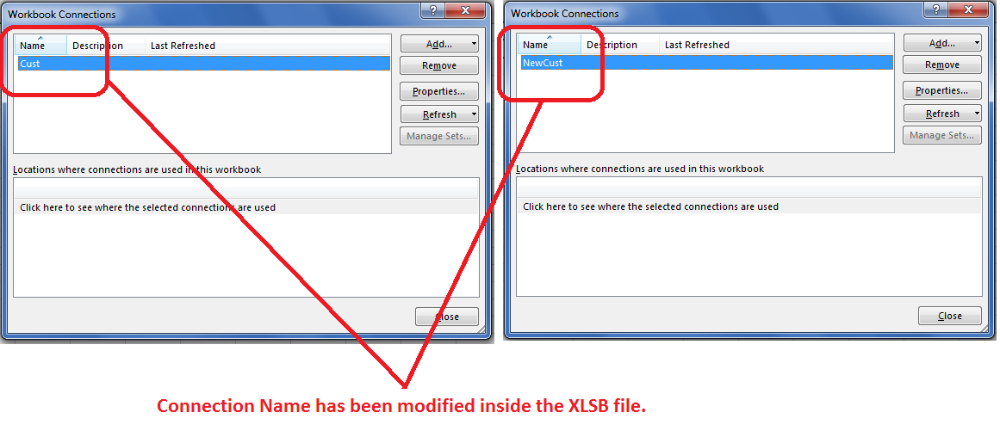

## **Possible Usage Scenarios**

Aspose.Cells for C++ supports reading and writing external connections for XLSX files and now extends this capability to XLSB and XLS formats. The same code structure works for all supported file types.

## **Read and Write External Connection of XLS/XLSB file**

The following sample code loads a sample XLSB file (also works with XLS) and modifies its first external connection (typically a Microsoft Access DB connection). The code demonstrates how to:

1. Load the spreadsheet file
2. Access external connections
3. Modify connection properties
4. Save the modified file



## **Sample Code**

This code works for both XLSB and XLS files by adjusting input/output file extensions.

```c++
#include <iostream>
#include "Aspose.Cells.h"
using namespace Aspose::Cells;

int main()
{
    Aspose::Cells::Startup();

    // Source and output directories
    U16String srcDir(u"..\\Data\\01_SourceDirectory\\");
    U16String outDir(u"..\\Data\\02_OutputDirectory\\");

    // File paths
    U16String inputFilePath = srcDir + u"sampleExternalConnection_XLSB.xlsb";
    U16String outputFilePath = outDir + u"outputExternalConnection_XLSB.xlsb";

    // Load source workbook
    Workbook workbook(inputFilePath);

    // Get first external connection
    ExternalConnectionCollection connections = workbook.GetDataConnections();
    DBConnection dbCon = connections.Get(0);

    // Print connection details
    std::cout << "Connection Name: " << dbCon.GetName().ToUtf8() << std::endl;
    std::cout << "Command: " << dbCon.GetCommand().ToUtf8() << std::endl;
    std::cout << "Connection Info: " << dbCon.GetConnectionString().ToUtf8() << std::endl;

    // Modify connection name
    dbCon.SetName(u"NewCust");

    // Save modified workbook
    workbook.Save(outputFilePath);

    std::cout << "External connection updated successfully." << std::endl;

    Aspose::Cells::Cleanup();
}
```

**C++ Equivalent:**

```cpp
#include <Aspose.Cells.h>

using namespace Aspose::Cells;
using namespace Aspose::Cells::ExternalConnections;

void Run() {
    // Load source workbook
    auto workbook = Factory::CreateWorkbook(u"source.xlsb");
    
    // Access first external connection
    auto conn = workbook->GetDataConnections()->Get(0);
    
    // Output original connection details
    std::cout << "Connection Name: " << conn->GetName().ToUtf8() << std::endl;
    std::cout << "Command: " << conn->GetCommand().ToUtf8() << std::endl;
    std::cout << "Connection Info: " << conn->GetConnectionInfo().ToUtf8() << std::endl;
    
    // Modify connection name
    conn->SetName(u"Cust_Modified");
    
    // Save updated workbook
    workbook->Save(u"output.xlsb");
}
```

## **Console Output**


Connection Name: Cust
Command: Customer
Connection Info: Provider=Microsoft.ACE.OLEDB.12.0;Password="";User ID=Admin;Data Source=C:\TempSha\Cust.accdb;Mode=Share Deny Write;Extended Properties="";Jet OLEDB:System database="";Jet OLEDB:Registry Path="";Jet OLEDB:Database Password="";Jet OLEDB:Engine Type=6;Jet OLEDB:Database Locking Mode=0;Jet OLEDB:Global Partial Bulk Ops=2;Jet OLEDB:Global Bulk Transactions=1;Jet OLEDB:New Database Password="";Jet OLEDB:Create System Database=False;Jet OLEDB:Encrypt Database=False;Jet OLEDB:Don't Copy Locale on Compact=False;Jet OLEDB:Compact Without Replica Repair=False;Jet OLEDB:SFP=False;Jet OLEDB:Support Complex Data=False;Jet OLEDB:Bypass UserInfo Validation=False;Jet OLEDB:Limited DB Caching=False;Jet OLEDB:Bypass ChoiceField Validation=False
