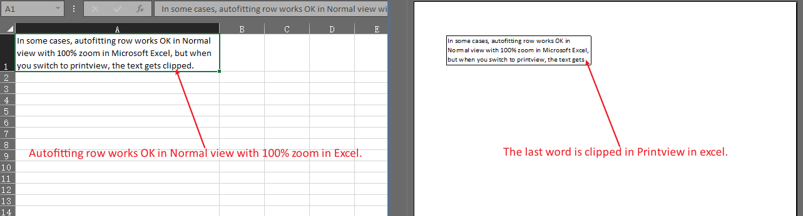

Generally, when you want to display all the text in a cell, you can autofit row in Normal view with 100% zoom in Microsoft Excel. This allows the text to be fully visible in Normal view, and even when you print or save the file as a PDF, the text will be displayed correctly.

However, in some cases, autofitting row works fine in Normal view, but when you switch to print view or save the file as a PDF, the text gets clipped. Please check the source file [Book1.xlsx](Book1.xlsx) and screenshots.



If you want to prevent text being clipped in the saved PDF file, you can autofit row with the [AutoFitterOptions.GetForRendering()](https://reference.aspose.com/cells/cpp/aspose.cells/autofitteroptions/getforrendering/) option.

```c++
#include <iostream>
#include "Aspose.Cells.h"

using namespace Aspose::Cells;

int main()
{
    Aspose::Cells::Startup();

    // Initialize workbook instance
    Workbook workbook(u"Book1.xlsx");

    // Set autofit options for rendering
    AutoFitterOptions autoFitterOptions;
    autoFitterOptions.SetForRendering(true);

    // Autofit rows with options
    workbook.GetWorksheets().Get(0).AutoFitRows(autoFitterOptions);

    // Save to PDF
    workbook.Save(u"output.pdf", SaveFormat::Pdf);

    Aspose::Cells::Cleanup();
}
```

Now, the text is not clipped in the output PDF file.



