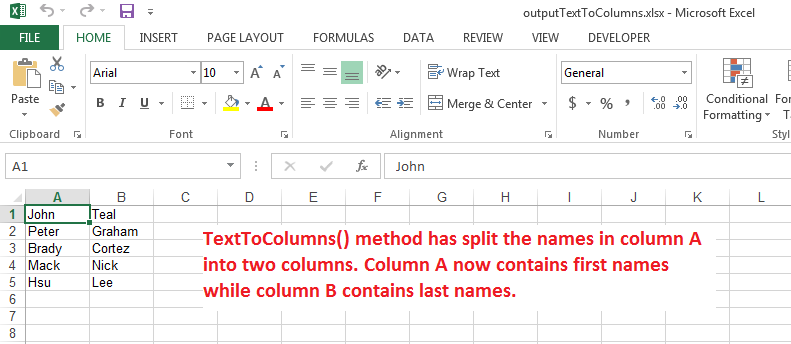

## **Possible Usage Scenarios**

You can convert your text to columns using Microsoft Excel. This feature is available from *Data Tools* under the *Data* tab. In order to split the contents of a column into multiple columns, the data should contain a specific delimiter such as a comma (or any other character) based on which Microsoft Excel splits the contents of a cell into multiple cells. Aspose.Cells also provides this feature via the [**Worksheet.Cells.TextToColumns()**](https://reference.aspose.com/cells/cpp/aspose.cells/cells/texttocolumns/) method.

## **Convert Text to Columns using Aspose.Cells**

The following sample code explains the usage of the [**Worksheet.Cells.TextToColumns()**](https://reference.aspose.com/cells/cpp/aspose.cells/cells/texttocolumns/) method. The code first adds some people's names in column A of the first worksheet. The first and last names are separated by a space character. Then it applies the [**Worksheet.Cells.TextToColumns()**](https://reference.aspose.com/cells/cpp/aspose.cells/cells/texttocolumns/) method on column A and saves the result as an output Excel file. If you open the [output Excel file](25395213.xlsx), you will see that the first names are in column A while the last names are in column B, as shown in this screenshot.



## **Sample Code**

```cpp
#include <iostream>
#include "Aspose.Cells.h"
using namespace Aspose::Cells;

int main()
{
    Aspose::Cells::Startup();

    // Source directory path
    U16String srcDir(u"..\\Data\\01_SourceDirectory\\");

    // Output directory path
    U16String outDir(u"..\\Data\\02_OutputDirectory\\");

    // Create a workbook
    Workbook wb;

    // Access first worksheet
    Worksheet ws = wb.GetWorksheets().Get(0);

    // Add people's names in column A. First name and last name are separated by a space.
    ws.GetCells().Get(u"A1").PutValue(u"John Teal");
    ws.GetCells().Get(u"A2").PutValue(u"Peter Graham");
    ws.GetCells().Get(u"A3").PutValue(u"Brady Cortez");
    ws.GetCells().Get(u"A4").PutValue(u"Mack Nick");
    ws.GetCells().Get(u"A5").PutValue(u"Hsu Lee");

    // Create text load options with space as separator
    TxtLoadOptions opts;
    opts.SetSeparator(u' ');

    // Split column A into two columns using TextToColumns() method
    // Now column A will have the first name and column B will have the last name
    ws.GetCells().TextToColumns(0, 0, 5, opts);

    // Save the workbook in xlsx format
    wb.Save(outDir + u"outputTextToColumns.xlsx");

    std::cout << "Text to columns conversion completed successfully!" << std::endl;

    Aspose::Cells::Cleanup();
}
```

