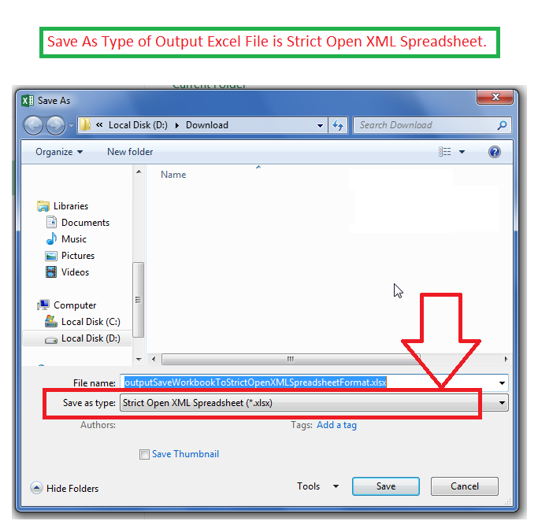

## **Possible Usage Scenarios**

Aspose.Cells allows you to save the workbook in *Strict Open XML Spreadsheet* format. For that purpose, it provides the [**GetCompliance()**](https://reference.aspose.com/cells/cpp/aspose.cells/workbooksettings/getcompliance/) property. If you set its value **to** [**OoxmlCompliance::Iso29500_2008_Strict**](https://reference.aspose.com/cells/cpp/aspose.cells/ooxmlcompliance/), then the output Excel file will be saved in Strict Open XML Spreadsheet format.

## **Save Workbook to Strict Open XML Spreadsheet Format**

The following sample code creates a workbook and sets the value of the [**GetCompliance()**](https://reference.aspose.com/cells/cpp/aspose.cells/workbooksettings/getcompliance/) property **to** [**OoxmlCompliance::Iso29500_2008_Strict**](https://reference.aspose.com/cells/cpp/aspose.cells/ooxmlcompliance/) and saves it as an output Excel file ([output.xlsx](67338272.xlsx)). If you open the output Excel file in Microsoft Excel and open the **Save As...** dialog box, you will see its format as *Strict Open XML Spreadsheet* as shown in this screenshot.



## **Sample Code**

```c++
#include <iostream>
#include "Aspose.Cells.h"

using namespace Aspose::Cells;

int main()
{
    Aspose::Cells::Startup();

    // Create workbook
    Workbook wb;

    // Specify Strict Open XML Spreadsheet format
    wb.GetSettings().SetCompliance(OoxmlCompliance::Iso29500_2008_Strict);

    // Add message in cell B4 of first worksheet
    Cell b4 = wb.GetWorksheets().Get(0).GetCells().Get(u"B4");
    b4.PutValue(u"This Excel file has Strict Open XML Spreadsheet format.");

    // Save to output Excel file
    wb.Save(u"outputSaveWorkbookToStrictOpenXMLSpreadsheetFormat.xlsx", SaveFormat::Xlsx);

    std::cout << "Workbook saved successfully with Strict Open XML Spreadsheet format!" << std::endl;

    Aspose::Cells::Cleanup();
}
```

