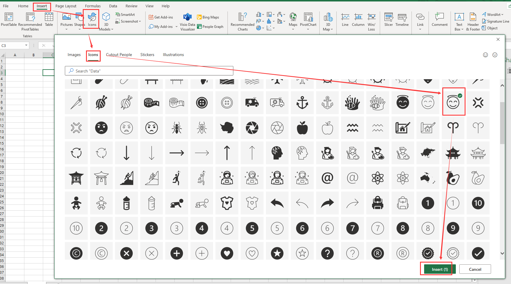
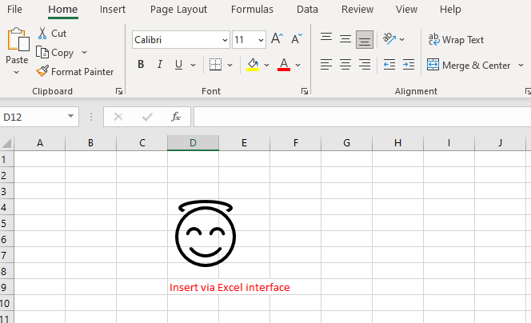

## Add Icons to Worksheet in Aspose.Cells

If you need to use [Aspose.Cells](https://products.aspose.com/cells/) to add 'icons' in an Excel file, then this document can provide you with some help.

The Excel interface corresponding to the insert icon operation is as follows:



- Select the position of the icon to be inserted in the worksheet
- Left click *Insert*->*Icons*
- In the window that opens, select the icon in the red rectangle in the figure above
- Left click *Insert*, it will be inserted into the Excel file.

The effect is as follows:



Here, we have prepared *sample code* to help you insert icons using [Aspose.Cells](https://products.aspose.com/cells/). There is also a necessary [sample file](sample.xlsx) and an icon [resource file](icon.zip). We used the Excel interface to insert an icon with the same display effect as the [resource file](icon.zip) in the [sample file](sample.xlsx).

### C++

```c++
#include <iostream>
#include <fstream>
#include <vector>
#include <memory>
#include "Aspose.Cells.h"

using namespace Aspose::Cells;

int main() {
    Aspose::Cells::Startup();

    // Read icon resource file data
    U16String fileName = u"icon.svg";
    std::ifstream fsSource(fileName.ToUtf8(), std::ios::binary);
    if (!fsSource) {
        std::cerr << "Failed to open file: " << fileName.ToUtf8() << std::endl;
        return -1;
    }

    fsSource.seekg(0, std::ios::end);
    size_t fileSize = fsSource.tellg();
    fsSource.seekg(0, std::ios::beg);

    std::vector<uint8_t> bytes(fileSize);
    fsSource.read(reinterpret_cast<char*>(bytes.data()), fileSize);
    fsSource.close();

    Aspose::Cells::Vector<uint8_t> asposeBytes(bytes.size());
    if (!bytes.empty()) {
        memcpy(asposeBytes.data(), bytes.data(), bytes.size());
    }

    // Create workbook from sample file
    Workbook workbook(u"sample.xlsx");

    // Access first worksheet from the collection
    Worksheet sheet = workbook.GetWorksheets().Get(0);

    // Add the icon to the worksheet
    sheet.GetShapes().AddIcons(3, 0, 7, 0, 100, 100, asposeBytes, nullptr);

    // Set a prompt message
    Cell c = sheet.GetCells().Get(8, 7);
    c.PutValue(u"Insert via Aspose.Cells");
    Style s = c.GetStyle();
    s.GetFont().SetColor(Color::Blue());
    c.SetStyle(s);

    // Save. You can check your icon in this way.
    workbook.Save(u"sample2.xlsx", SaveFormat::Xlsx);

    Aspose::Cells::Cleanup();
    return 0;
}
```

When you execute the above code in your project, you will get the following results:

