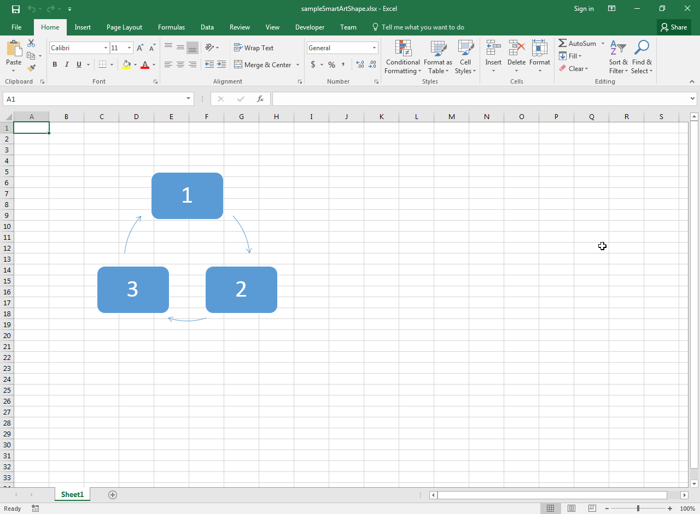

## **Possible Usage Scenarios**

Smart Art Shapes are special shapes in Microsoft Excel that allow you to create complex diagrams automatically. You can determine whether the shape is a Smart Art shape or a normal shape using the [**Shape.IsSmartArt**](https://reference.aspose.com/cells/cpp/aspose.cells.drawing/shape/issmartart/) property.

## **Determine if Shape is Smart Art Shape**

The following sample code loads the [sample Excel file](55541792.xlsx) containing a Smart Art shape as shown in this screenshot. It then prints the value of the [**Shape.IsSmartArt**](https://reference.aspose.com/cells/cpp/aspose.cells.drawing/shape/issmartart/) property of the first shape. Please see the console output of the sample code given below.



## **Sample Code**

```c++
#include <iostream>
#include "Aspose.Cells.h"

using namespace Aspose::Cells;
using namespace Aspose::Cells::Drawing;

int main()
{
    Aspose::Cells::Startup();

    // Load the sample Smart Art shape - Excel file
    U16String inputFilePath(u"sampleSmartArtShape.xlsx");
    Workbook wb(inputFilePath);

    // Access first worksheet
    WorksheetCollection sheets = wb.GetWorksheets();
    Worksheet ws = sheets.Get(0);

    // Access first shape
    ShapeCollection shapes = ws.GetShapes();
    Shape sh = shapes.Get(0);

    // Determine if shape is Smart Art
    std::cout << "Is Smart Art Shape: " << sh.IsSmartArt() << std::endl;

    Aspose::Cells::Cleanup();
}
```

## **Console Output**


Is Smart Art Shape: True



