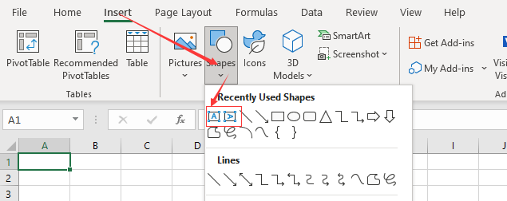

## Add Text Box to Worksheet in Excel

In the Excel program (version 07 and above), there are two places where you can insert text boxes. One is in **Insert Shapes**, and the other is on the right side of the top menu of the **Insert** option.

### Method One:



### Method Two:


## How to Create

You can create text boxes with horizontal or vertical text.

- Select the corresponding option (horizontal or vertical)  
- Left‑click on the page  
- Hold down the left button and drag to the desired size on the page  
- Release the left button  

Now you have a text box.

## Add Text Box to Worksheet in Aspose.Cells

When you need to bulk insert TextBoxes into the worksheet, the manual insertion method is obviously impractical. If this bothers you, this document will help. [Aspose.Cells](https://products.aspose.com/cells/) provides an API to easily perform bulk inserts in your code.

The following sample code creates a text box.

```cpp
#include <iostream>
#include "Aspose.Cells.h"

using namespace Aspose::Cells;
using namespace Aspose::Cells::Drawing;

int main()
{
    Aspose::Cells::Startup();

    // Source directory path
    U16String srcDir(u"..\\Data\\01_SourceDirectory\\");

    // Output directory path
    U16String outDir(u"..\\Data\\02_OutputDirectory\\");

    // Create an object of the Workbook class
    Workbook workbook;

    // Access the first worksheet from the collection
    Worksheet sheet = workbook.GetWorksheets().Get(0);

    // Add the TextBox to the worksheet
    sheet.GetTextBoxes().Add(6, 10, 100, 200);

    // Save the workbook with the text box
    workbook.Save(outDir + u"result.xlsx", SaveFormat::Xlsx);

    std::cout << "Text box added successfully!" << std::endl;

    Aspose::Cells::Cleanup();
}
```

You will get a file similar to the [result file](result.xlsx). In the file, you will see the following:



