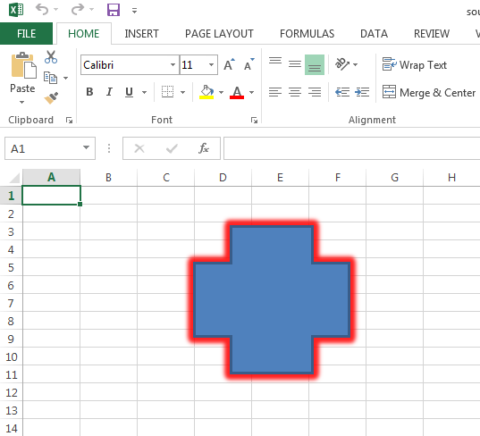

## Possible Usage Scenarios

If you want to read the color of the glow effect of any shape, please use the [**Shape.Glow.Color**](https://reference.aspose.com/cells/cpp/aspose.cells/color/) property. It will help you find the various properties related to the color of the glow effect of the shape.

## Read Color of the Glow Effect of Shape

Please see the following sample code, its source Excel file, and the console output for your reference. The following screenshot shows the glow effect of the shape inside the source Excel file when viewed in Microsoft Excel.



## C++ code to read color of shapes glow effect

```cpp
#include <iostream>
#include "Aspose.Cells.h"

using namespace Aspose::Cells;
using namespace Aspose::Cells::Drawing;

int main()
{
    Aspose::Cells::Startup();

    U16String srcDir(u"..\\Data\\01_SourceDirectory\\");
    Workbook book(srcDir + u"sourceGlowEffectColor.xlsx");
    Worksheet sheet = book.GetWorksheets().Get(0);
    Shape shape = sheet.GetShapes().Get(0);
    GlowEffect effect = shape.GetGlow();
    CellsColor color = effect.GetColor();

    Color clr = color.GetColor();
    uint32_t argb = (static_cast<uint32_t>(clr.a) << 24) | 
                    (static_cast<uint32_t>(clr.r) << 16) | 
                    (static_cast<uint32_t>(clr.g) << 8) | 
                    static_cast<uint32_t>(clr.b);

    std::cout << "Color: " << argb << std::endl;
    std::cout << "ColorIndex: " << color.GetColorIndex() << std::endl;
    std::cout << "IsShapeColor: " << color.IsShapeColor() << std::endl;
    std::cout << "Transparency: " << color.GetTransparency() << std::endl;
    std::cout << "Type: " << static_cast<int>(color.GetType()) << std::endl;

    Aspose::Cells::Cleanup();
}
```

## Console Output

Here is the console output of the above sample code when executed with the provided [source Excel file](22774108.xlsx).



Color: Color [A=222, R=255, G=0, B=0]

ColorIndex: 16711672

IsShapeColor: True

Transparency: 0.13

Type: RGB



