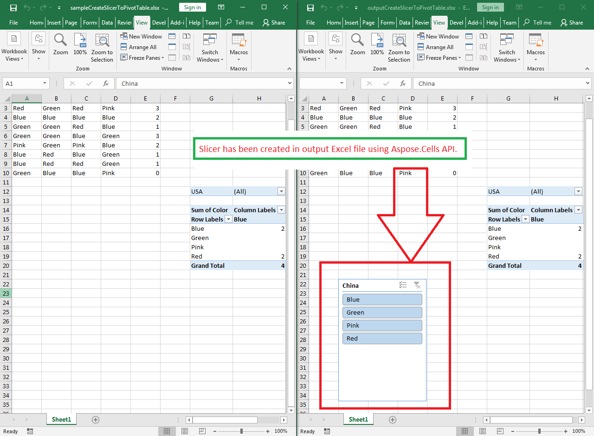

## **Possible Usage Scenarios**

A slicer is used to filter data quickly. It can be used to filter data both in a table or pivot table. Microsoft Excel allows you to create a slicer by selecting a table or pivot table and then clicking the *Insert > Slicer*. Aspose.Cells also allows you to create a slicer using the [**Worksheet.Slicers.Add()**](https://reference.aspose.com/cells/cpp/aspose.cells.slicers/slicercollection/add/) method.

## **Create Slicer to a Pivot Table**

Please see the following sample code. It loads the [sample Excel file](67338470.xlsx) that contains the pivot table. It then creates the slicer based on the first base pivot field. Finally, it saves the workbook in [output XLSX](67338471.xlsx) and [output XLSB](67338472.xlsb) format. The following screenshot shows the slicer created by Aspose.Cells in the output Excel file.



### **Sample Code**

```cpp
#include <iostream>
#include "Aspose.Cells.h"

using namespace Aspose::Cells;
using namespace Aspose::Cells::Pivot;
using namespace Aspose::Cells::Slicers;

int main()
{
    Aspose::Cells::Startup();

    // Source directory path
    U16String srcDir(u"..\\Data\\01_SourceDirectory\\");

    // Output directory path
    U16String outDir(u"..\\Data\\02_OutputDirectory\\");

    // Path of input Excel file
    U16String inputFilePath = srcDir + u"sampleCreateSlicerToPivotTable.xlsx";

    // Path of output Excel files
    U16String outputFilePathXlsx = outDir + u"outputCreateSlicerToPivotTable.xlsx";
    U16String outputFilePathXlsb = outDir + u"outputCreateSlicerToPivotTable.xlsb";

    // Load sample Excel file containing pivot table
    Workbook wb(inputFilePath);

    // Access first worksheet
    Worksheet ws = wb.GetWorksheets().Get(0);

    // Access first pivot table inside the worksheet
    PivotTable pt = ws.GetPivotTables().Get(0);

    // Add slicer relating to pivot table with first base field at cell B22
    int idx = ws.GetSlicers().Add(pt, u"B22", pt.GetBaseFields().Get(0));

    // Access the newly added slicer from slicer collection
    Slicer slicer = ws.GetSlicers().Get(idx);

    // Save the workbook in output XLSX format
    wb.Save(outputFilePathXlsx, SaveFormat::Xlsx);

    // Save the workbook in output XLSB format
    wb.Save(outputFilePathXlsb, SaveFormat::Xlsb);

    std::cout << "Slicer created and workbooks saved successfully!" << std::endl;

    Aspose::Cells::Cleanup();
}
```

## **Create Slicer to Excel Table**

Please see the following sample code. It loads the [sample Excel file](sampleCreateSlicerToExcelTable.xlsx) that contains a table. It then creates the slicer based on the first column. Finally, it saves the workbook in [output XLSX](outputCreateSlicerToExcelTable.xlsx) format.

### **Sample Code**

```cpp
#include <iostream>
#include "Aspose.Cells.h"

using namespace Aspose::Cells;

int main()
{
    Aspose::Cells::Startup();

    // Source directory path
    U16String srcDir(u"..\\Data\\01_SourceDirectory\\");

    // Output directory path
    U16String outDir(u"..\\Data\\02_OutputDirectory\\");

    // Load sample Excel file containing a table
    Workbook workbook(srcDir + u"sampleCreateSlicerToExcelTable.xlsx");

    // Access first worksheet
    Worksheet worksheet = workbook.GetWorksheets().Get(0);

    // Access first table inside the worksheet
    ListObject table = worksheet.GetListObjects().Get(0);

    // Add slicer
    int idx = worksheet.GetSlicers().Add(table, 0, u"H5");

    // Save the workbook in output XLSX format
    workbook.Save(outDir + u"outputCreateSlicerToExcelTable.xlsx", SaveFormat::Xlsx);

    std::cout << "Slicer added successfully to the Excel table!" << std::endl;

    Aspose::Cells::Cleanup();
}
```

## **Advance Topics**
- [Change Slicer Properties](/cells/cpp/change-slicer-properties/)
- [Draw Slicer while rendering Excel to PDF](/cells/cpp/draw-slicer-while-rendering-excel-to-pdf/)
- [Formatting Slicer](/cells/cpp/formatting-slicer/)
- [Removing Slicer](/cells/cpp/removing-slicer/)
- [Rendering Slicer](/cells/cpp/rendering-slicer/)
- [Updating Slicer](/cells/cpp/updating-slicer/)