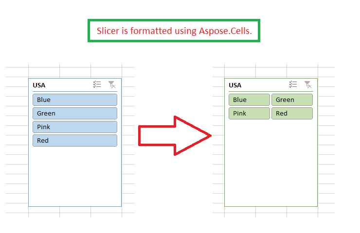

## **Possible Usage Scenarios**

You can format the slicer in Microsoft Excel by setting its number of columns or by setting its style, etc. Aspose.Cells also allows you to do this using the [**Slicer.GetNumberOfColumns()**](https://reference.aspose.com/cells/cpp/aspose.cells.slicers/slicer/getnumberofcolumns/) and [**Slicer.GetStyleType()**](https://reference.aspose.com/cells/cpp/aspose.cells.slicers/slicer/getstyletype/) properties.

## **Formatting Slicer**

Please see the following code; it loads the sample Excel file that contains a slicer. It accesses the slicer, sets its number of columns and style type, and saves it as an output Excel file. The screenshot shows how the slicer looks after the execution of the sample code.



## **Sample Code**

```c++
#include <iostream>
#include "Aspose.Cells.h"
using namespace Aspose::Cells;

int main()
{
    Aspose::Cells::Startup();

    // For complete examples and data files, please go to https://github.com/aspose-cells/Aspose.Cells-for-C

    // Load the sample Excel file containing a slicer.
    Workbook workbook(u"sampleFormattingSlicer.xlsx");

    // Access first worksheet.
    Worksheet worksheet = workbook.GetWorksheets().Get(0);

    // Access the first slicer inside the slicer collection.
    Slicer slicer = worksheet.GetSlicers().Get(0);

    // Set the number of columns of the slicer.
    slicer.SetNumberOfColumns(2);

    // Set the type of slicer style.
    slicer.SetStyleType(SlicerStyleType::SlicerStyleLight6);

    // Save the workbook in output XLSX format.
    workbook.Save(u"outputFormattingSlicer.xlsx", SaveFormat::Xlsx);

    std::cout << "Slicer formatted and workbook saved successfully!" << std::endl;

    Aspose::Cells::Cleanup();
}
```

