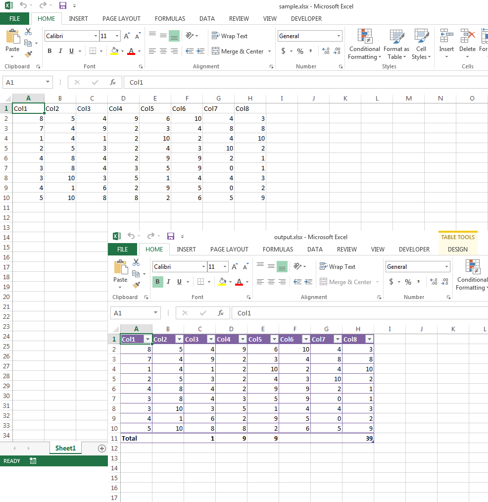

## **Possible Usage Scenarios**
Aspose.Cells allows you to create and manipulate new or existing list objects or tables. You can make use of various methods of the list object or table, e.g., header‑row style, column stripes, style type, ShowSubtotal, etc., and also work with individual columns of the table and set their names and totals‑calculation functions, which could be Min, Max, Count, Average, Sum, etc.

## **Create and Manipulate Excel Table**
The following sample code loads the [sample Excel file](23167015.xlsx) and then creates a list object or table in the range A1:H10. It then makes use of its various methods and sets the ShowSubtotal flag. Next, it sets the total functions of the 3rd, 4th, and 5th columns to Min, Max, and Count, respectively, and writes the [output Excel file](23167016.xlsx). The following screenshot shows the effect of the sample code on the [sample Excel file](23167015.xlsx) after execution.

## **Sample Code**


