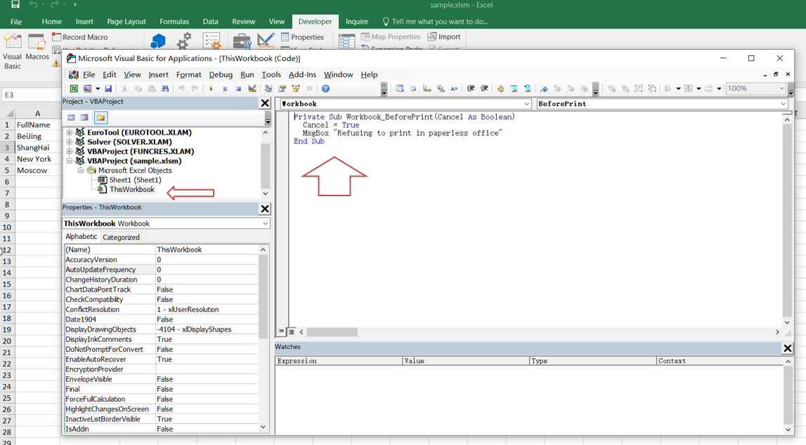
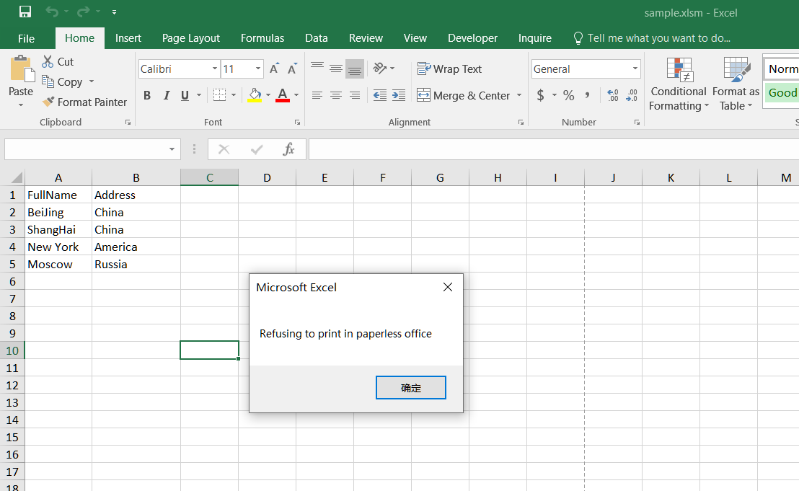

---  
title: How to Prevent Users from Printing Excel File with C++  
linktitle: How to Prevent Users from Printing Excel File  
type: docs  
weight: 600  
url: /cpp/how-to-prevent-printing-excel/  
description: Learn how to prevent users from printing excel through the Aspose.Cells for C++ API.  
keywords: excel printing, prevent printing excel, how to prevent users from printing excel, excel prevent printing, prevent printing workbook, Prevent users from printing the whole workbook with VBA.  
---  
  
## **Possible Usage Scenarios**  
In our daily work, there may be some important information in the Excel file; in order to protect the internal data from spreading, the company will not allow us to print them. This document will tell you how to prevent others from printing Excel files.  
  
## **How to Prevent Users from Printing File in MS-Excel**  
You can apply the following VBA code to protect your specific file from being printed.  
1. Open your workbook which you don’t allow others to print.  
1. Select the "Developer" tab in the Excel ribbon and click on the "View Code" button in the "Controls" section. Alternatively, you can hold down the ALT + F11 keys to open the Microsoft Visual Basic for Applications window.  
<br>  
  
1. Then in the left Project Explorer, double-click on ThisWorkbook to open the module and add some VBA codes.  
<br>  
  
1. Then save and close this code, go back to the workbook, and now when you print the sample file, it will not be allowed to be printed, and you will get the following warning box:  
<br>  
  
  
## **How to Prevent Users from Printing Excel File using Aspose.Cells for C++**  
  
The following sample code illustrates how to prevent users from printing an Excel file:  
  
1. Load the [sample file](sample.xlsx).  
1. Get the VbaModuleCollection object from the VbaProject property of the Workbook.  
1. Get the VbaModule object via "ThisWorkbook" name.  
1. Set the codes property of VbaModule.  
1. Save the sample file to [xlsm format](out.xlsm).  
  
```c++
#include <iostream>
#include "Aspose.Cells.h"
using namespace Aspose::Cells;

int main()
{
    Aspose::Cells::Startup();

    // Create workbook from existing Excel file
    Workbook workbook(u"Sample.xlsx");
    
    // Access VBA project modules
    VbaModuleCollection modules = workbook.GetVbaProject().GetModules();

    // Set VBA code for 'ThisWorkbook' module
    modules.Get(u"ThisWorkbook").SetCodes(u"Private Sub Workbook_BeforePrint(Cancel As Boolean)\r\n  Cancel = True\r\n  MsgBox \"Refusing to print in paperless office\"\r\nEnd Sub\r\n");

    // Save the workbook as macro-enabled Excel file
    workbook.Save(u"out.xlsm");

    std::cout << "VBA code added and workbook saved successfully!" << std::endl;

    Aspose::Cells::Cleanup();
}
```  
