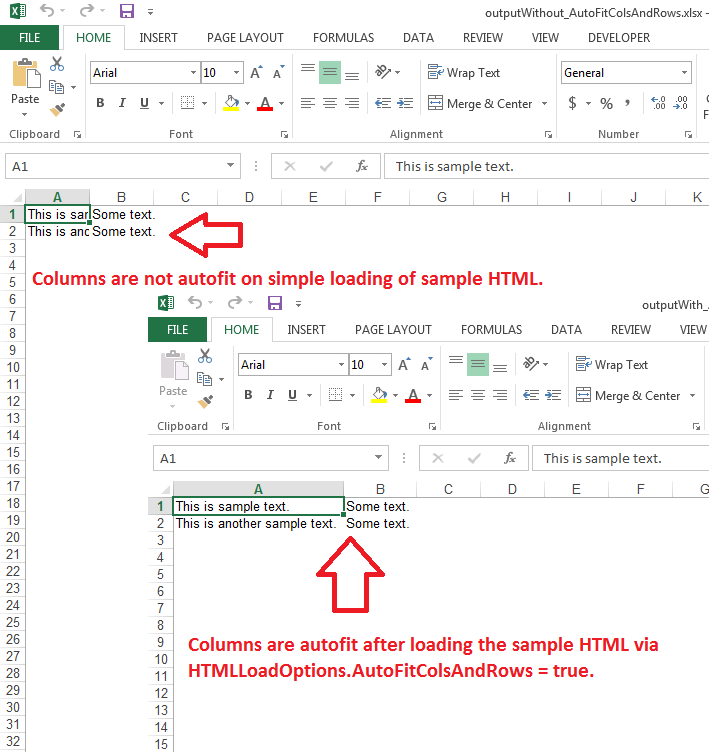

---  
title: AutoFit Columns and Rows while loading HTML in Workbook with C++  
linktitle: AutoFit Columns and Rows while loading HTML in Workbook  
type: docs  
weight: 120  
url: /cpp/autofit-columns-and-rows-while-loading-html-in-workbook/  
description: Learn how to autofit columns and rows while loading HTML into a Workbook using Aspose.Cells for C++.  
ai_search_scope: cells_cpp
ai_search_endpoint: "https://docsearch.api.aspose.cloud/ask"
---  

## **Possible Usage Scenarios**  

You can autofit columns and rows while loading your HTML file inside the Workbook object. Please set the [**HtmlLoadOptions.GetAutoFitColsAndRows()**](https://reference.aspose.com/cells/cpp/aspose.cells/htmlloadoptions/getautofitcolsandrows/) property to **true** for this purpose.  

## **AutoFit Columns and Rows while loading HTML in Workbook**  

The following sample code first loads the sample HTML into a Workbook without any load options and saves it in XLSX format. It then loads the sample HTML into a Workbook again, but this time it loads the HTML after setting the [**HtmlLoadOptions.GetAutoFitColsAndRows()**](https://reference.aspose.com/cells/cpp/aspose.cells/htmlloadoptions/getautofitcolsandrows/) property to **true** and saves it in XLSX format. Please download both output Excel files, i.e., [Output Excel File Without AutoFitColsAndRows](outputWithout_AutoFitColsAndRows.xlsx) and [Output Excel File With AutoFitColsAndRows](outputWith_AutoFitColsAndRows.xlsx). The following screenshot shows the effect of [**HtmlLoadOptions.GetAutoFitColsAndRows()**](https://reference.aspose.com/cells/cpp/aspose.cells/htmlloadoptions/getautofitcolsandrows/) property on both output Excel files.  

  

## **Sample Code**  

```cpp
#include <iostream>
#include "Aspose.Cells.h"
using namespace Aspose::Cells;

int main()
{
    Aspose::Cells::Startup();

    // Source directory path
    U16String srcDir(u"..\\Data\\01_SourceDirectory\\");

    // Output directory path
    U16String outDir(u"..\\Data\\02_OutputDirectory\\");

    // Sample HTML string
    U16String sampleHtml(u"<html><body><table><tr><td>This is sample text.</td><td>Some text.</td></tr><tr><td>This is another sample text.</td><td>Some text.</td></tr></table></body></html>");

    // Convert HTML string to memory stream
    std::string utf8Data = sampleHtml.ToUtf8();
    Vector<uint8_t> ms(utf8Data.size());
    std::memcpy(ms.GetData(), utf8Data.data(), utf8Data.size());

    // Load memory stream into workbook
    Workbook wb(ms);

    // Save the workbook in xlsx format
    wb.Save(outDir + u"outputWithout_AutoFitColsAndRows.xlsx");

    // Specify the HtmlLoadOptions and set AutoFitColsAndRows = true
    HtmlLoadOptions opts;
    opts.SetAutoFitColsAndRows(true);

    // Load memory stream into workbook with the above HtmlLoadOptions
    Workbook wbWithOptions(ms, opts);

    // Save the workbook in xlsx format
    wbWithOptions.Save(outDir + u"outputWith_AutoFitColsAndRows.xlsx");

    std::cout << "HTML to Excel conversion completed successfully!" << std::endl;

    Aspose::Cells::Cleanup();
}
```  

