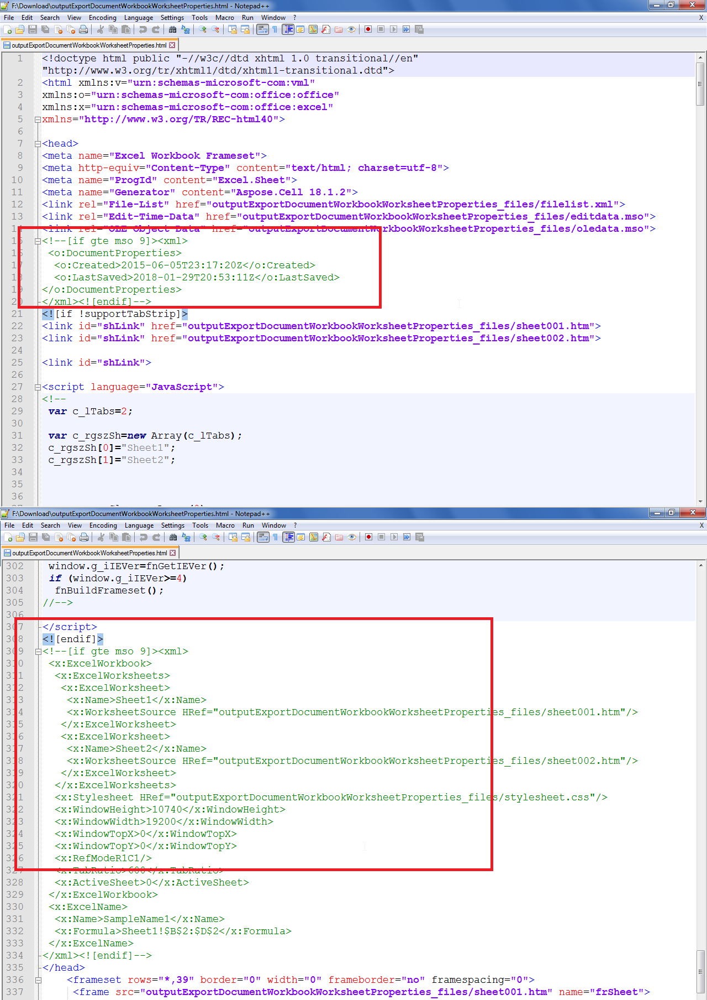

## **Possible Usage Scenarios**

When a Microsoft Excel file is exported to HTML using Microsoft Excel or Aspose.Cells, it also exports various types of Document, Workbook, and Worksheet properties as shown in the following screenshot. You can avoid exporting these properties by setting the [**HtmlSaveOptions.GetExportDocumentProperties()**](https://reference.aspose.com/cells/cpp/aspose.cells/htmlsaveoptions/getexportdocumentproperties/), [**HtmlSaveOptions.GetExportWorkbookProperties()**](https://reference.aspose.com/cells/cpp/aspose.cells/htmlsaveoptions/getexportworkbookproperties/), and [**HtmlSaveOptions.GetExportWorksheetProperties()**](https://reference.aspose.com/cells/cpp/aspose.cells/htmlsaveoptions/getexportworksheetproperties/) to **false**. The default value of these properties is **true**. The following screenshot shows how these properties look like in exported HTML.



## **Export Document, Workbook, and Worksheet Properties in Excel to HTML Conversion**

The following sample code loads the [sample Excel file](61767776.xlsx) and converts it to HTML without exporting the Document, Workbook, and Worksheet properties in the [output HTML](61767779.zip).

## **Sample Code**

```c++
#include <iostream>
#include "Aspose.Cells.h"

using namespace Aspose::Cells;

int main()
{
    Aspose::Cells::Startup();

    // Source directory path
    U16String srcDir(u"..\\Data\\01_SourceDirectory\\");

    // Output directory path
    U16String outDir(u"..\\Data\\02_OutputDirectory\\");

    // Path of input Excel file
    U16String inputFilePath = srcDir + u"sampleExportDocumentWorkbookAndWorksheetPropertiesInHTML.xlsx";

    // Path of output HTML file
    U16String outputFilePath = outDir + u"outputExportDocumentWorkbookAndWorksheetPropertiesInHTML.html";

    // Load the sample Excel file
    Workbook workbook(inputFilePath);

    // Specify Html Save Options
    HtmlSaveOptions options;

    // We do not want to export document, workbook and worksheet properties
    options.SetExportDocumentProperties(false);
    options.SetExportWorkbookProperties(false);
    options.SetExportWorksheetProperties(false);

    // Export the Excel file to Html with Html Save Options
    workbook.Save(outputFilePath, options);

    std::cout << "Excel file exported to HTML successfully!" << std::endl;

    Aspose::Cells::Cleanup();
}
```
