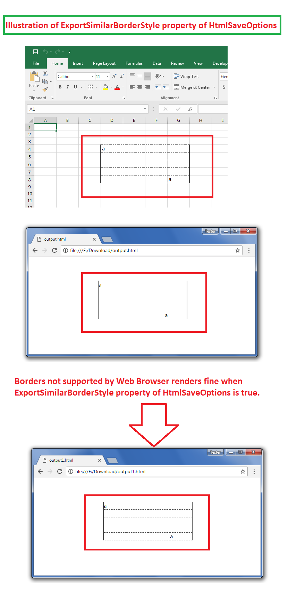

## **Possible Usage Scenarios**

Microsoft Excel supports some types of dashed borders that are not supported by web browsers. When you convert such an Excel file to HTML using Aspose.Cells, those borders are removed. However, Aspose.Cells can also display such borders with the [**HtmlSaveOptions.GetExportSimilarBorderStyle()**](https://reference.aspose.com/cells/cpp/aspose.cells/htmlsaveoptions/getexportsimilarborderstyle/) property. Please set its value to **true**, and the unsupported borders will also be exported to the HTML file.

## **Export Similar Border Style When Border Style Is Not Supported by Web Browsers**

The following sample code loads the [sample Excel file](64716806.xlsx) that contains some unsupported borders, as shown in the following screenshot. The screenshot further illustrates the effect of the [**HtmlSaveOptions.GetExportSimilarBorderStyle()**](https://reference.aspose.com/cells/cpp/aspose.cells/htmlsaveoptions/getexportsimilarborderstyle/) property in the [output HTML](64716804.zip).



## **Sample Code**

```c++
#include <iostream>
#include "Aspose.Cells.h"
using namespace Aspose::Cells;

int main()
{
    Aspose::Cells::Startup();

    // For complete examples and data files, please go to https://github.com/aspose-cells/Aspose.Cells-for-C

    // Load the sample Excel file
    U16String inputFilePath(u"sampleExportSimilarBorderStyle.xlsx");
    Workbook workbook(inputFilePath);

    // Specify Html Save Options - Export Similar Border Style
    HtmlSaveOptions opts;
    opts.SetExportSimilarBorderStyle(true);

    // Save the workbook in Html format with specified Html Save Options
    U16String outputFilePath(u"outputExportSimilarBorderStyle.html");
    workbook.Save(outputFilePath, opts);

    std::cout << "Workbook saved successfully in HTML format with similar border styles!" << std::endl;

    Aspose::Cells::Cleanup();
}
```

