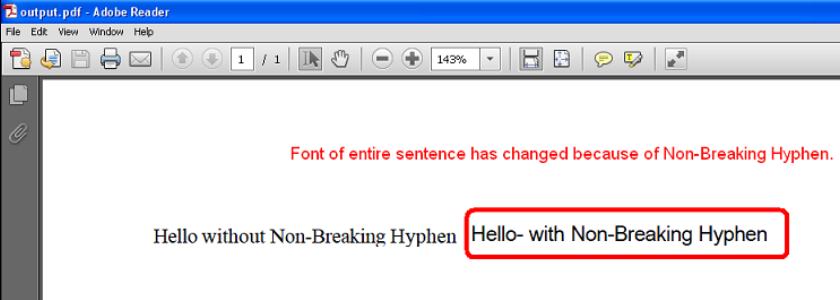

{}

Some Unicode characters are not displayable by the user-specified font. One such Unicode character is **Non-breaking Hyphen** (U+2011) and its Unicode number is 8209. This character cannot be displayed with **Times New Roman**, but it can be displayed with other fonts like **Arial Unicode MS**.

When such a character occurs inside some word or sentence which is in some specific font like Times New Roman, then Aspose.Cells changes the font of the entire word or sentence to a font which could display this character like Arial Unicode MS.

However, this is undesirable behavior for some users, and they want only that specific character's font to be changed instead of changing the font of the entire word or sentence.

To deal with this problem, Aspose.Cells provides the `PdfSaveOptions.IsFontSubstitutionCharGranularity` property, which should be set to `true` so that only the font of the specific character which is not displayable is changed to a displayable font, and the rest of the word or sentence remains in the original font.

{}

## **Example**

The following screenshot compares the two output PDFs generated by the sample code below.

One is generated without setting the `PdfSaveOptions.IsFontSubstitutionCharGranularity` property, and the other was generated after setting the `PdfSaveOptions.IsFontSubstitutionCharGranularity` property to `true`.

As you can see in the first PDF, the font of the entire sentence has changed from Times New Roman to Arial Unicode MS because of the Non-Breaking Hyphen. While in the second PDF, only the font of the Non-Breaking Hyphen has changed.

|**First PDF File**|
| :- |
||

|**Second PDF File**|
| :- |
||

### **Sample Code**

```c++
#include <iostream>
#include "Aspose.Cells.h"
using namespace Aspose::Cells;

int main()
{
    Aspose::Cells::Startup();

    // Source directory path
    U16String srcDir(u"..\\Data\\01_SourceDirectory\\");

    // Output directory path
    U16String outDir(u"..\\Data\\02_OutputDirectory\\");

    // Create workbook object
    Workbook workbook;

    // Access the first worksheet
    Worksheet worksheet = workbook.GetWorksheets().Get(0);

    // Access cells
    Cell cell1 = worksheet.GetCells().Get(u"A1");
    Cell cell2 = worksheet.GetCells().Get(u"B1");

    // Set the styles of both cells to Times New Roman
    Style style = cell1.GetStyle();
    style.GetFont().SetName(u"Times New Roman");
    cell1.SetStyle(style);
    cell2.SetStyle(style);

    // Put the values inside the cell
    cell1.PutValue(u"Hello without Non-Breaking Hyphen");
    cell2.PutValue(u"Hello\u2011 with Non-Breaking Hyphen");

    // Autofit the columns
    worksheet.AutoFitColumns();

    // Save to Pdf without setting PdfSaveOptions.IsFontSubstitutionCharGranularity
    workbook.Save(outDir + u"SampleOutput_out.pdf");

    // Save to Pdf after setting PdfSaveOptions.IsFontSubstitutionCharGranularity to true
    PdfSaveOptions opts;
    opts.SetIsFontSubstitutionCharGranularity(true);
    workbook.Save(outDir + u"SampleOutput2_out.pdf", opts);

    std::cout << "Files saved successfully!" << std::endl;

    Aspose::Cells::Cleanup();
}
```

