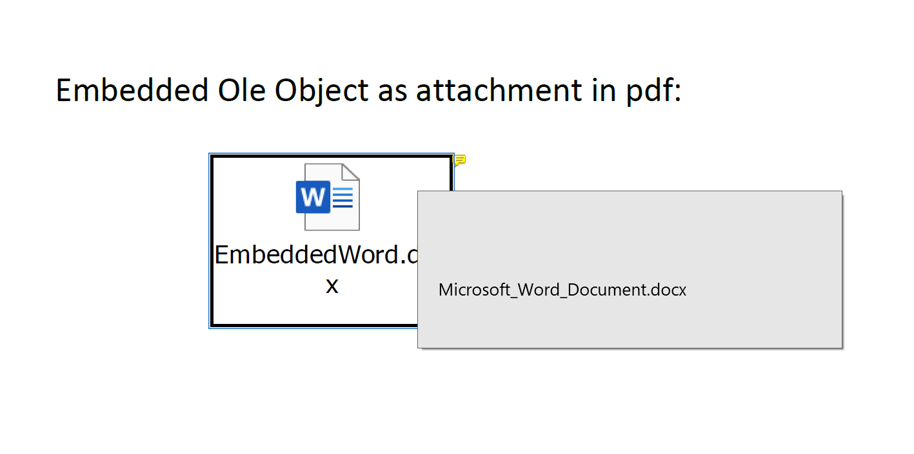

In Excel, you can insert an Ole Object with source data ([embedded-attachments-example.xlsx](embedded-attachments-example.xlsx)). Double click the Ole Object, the embedded file will be opened.

Generally, while converting to PDF, the Ole Object will be rendered as an icon or a thumbnail without the Ole Object source data. With option [PdfSaveOptions.EmbedAttachments](https://reference.aspose.com/cells/cpp/aspose.cells/pdfsaveoptions/embedattachments/), you can embed the Ole Object source data as an attachment in PDF. You can double click the icon or the thumbnail in PDF to open the source file of the Ole Object.

```c++
#include <iostream>
#include "Aspose.Cells.h"
using namespace Aspose::Cells;

int main()
{
    Aspose::Cells::Startup();

    // For complete examples and data files, please go to https://github.com/aspose-cells/Aspose.Cells-for-C

    // Open the template file
    Workbook workbook(u"embedded-attachments-example.xlsx");

    // Set to embed Ole Object attachment.
    PdfSaveOptions pdfSaveOptions;
    pdfSaveOptions.SetEmbedAttachments(true);

    // Save the pdf file with PdfSaveOptions
    workbook.Save(u"output.pdf", pdfSaveOptions);

    std::cout << "PDF saved successfully with embedded attachments!" << std::endl;

    Aspose::Cells::Cleanup();
}
```

