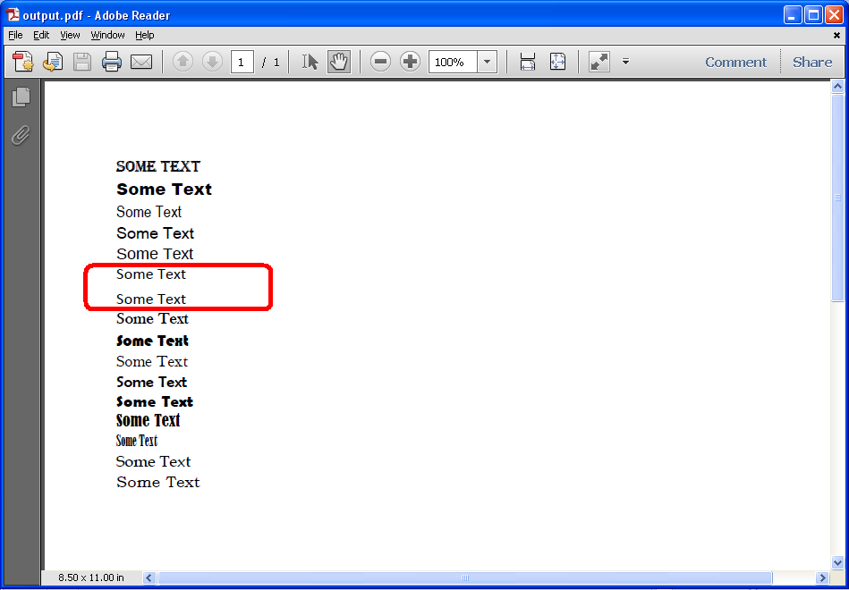

{}

Sometimes, when rendering a Microsoft Excel file to PDF, Aspose.Cells substitutes fonts. Aspose.Cells provides a feature that lets developers know what particular font has been substituted by firing a warning. This is a useful feature that can help you identify why an Aspose.Cells rendered PDF looks different from the original Microsoft Excel file so you can take appropriate actions. For example, installing the missing fonts so that rendering results look the same.

{}

To get warnings for font substitution when rendering Excel files to PDF, implement the `IWarningCallback` interface and set the `PdfSaveOptions.WarningCallback` property with your implemented interface.

The screenshot below shows a source Excel file that we will use in the following code. It has some text in the cells A6 and A7 in fonts that are not rendered fine by Microsoft Excel.

|**Not all fonts are rendered correctly**|
| :- |
||

Aspose.Cells will substitute the fonts in the cells A6 and A7 with suitable fonts as shown below.

|**Substituted fonts**|
| :- |
||

## **Download Source File and Output PDF**
You can download the source Excel file and the output PDF from the following links:

- [source.xlsx](5112611.xlsx)
- [output.pdf](5112616.pdf)

## **Code**
The following code implements the `IWarningCallback` and sets the `PdfSaveOptions.WarningCallback` property with the implemented interface. Now, whenever any font will be substituted in any cell, Aspose.Cells will fire a warning inside the `WarningCallback.Warning()` method.

```c++
#include <iostream>
#include "Aspose.Cells.h"
using namespace Aspose::Cells;

class GetWarningsForFontSubstitution : public IWarningCallback
{
public:
    void Warning(WarningInfo& info) override
    {
        if (info.GetType() == ExceptionType::FontSubstitution)
        {
            std::cout << "WARNING INFO: " << info.GetDescription().ToUtf8() << std::endl;
        }
    }

    static void Run()
    {
        U16String srcDir(u"..\\Data\\01_SourceDirectory\\");
        U16String outDir(u"..\\Data\\02_OutputDirectory\\");
        Workbook workbook(srcDir + u"source.xlsx");
        PdfSaveOptions options;
        auto callback = std::make_shared<GetWarningsForFontSubstitution>();
        options.SetWarningCallback(callback.get());
        workbook.Save(outDir + u"output_out.pdf", options);
        std::cout << "PDF saved successfully with font substitution warnings!" << std::endl;
    }
};

int main()
{
    Aspose::Cells::Startup();
    GetWarningsForFontSubstitution::Run();
    Aspose::Cells::Cleanup();
    return 0;
}
```

## **Output**
After converting the source Excel file to PDF, the warnings are output to the debug console like this:


WARNING INFO: Font substitution: Font [ Athene Logos; Regular ] has been substituted in Cell [ A6 ] in Sheet [ Sheet1 ].
WARNING INFO: Font substitution: Font [ B Traffic; Regular ] has been substituted in Cell [ A7 ] in Sheet [ Sheet1 ].


{}

If your spreadsheet contains formulas, it is best to call `Workbook.CalculateFormula` method just before rendering the spreadsheet to PDF format. Doing so will ensure that the formula-dependent values are recalculated, and the correct values are rendered in the PDF.

{}

