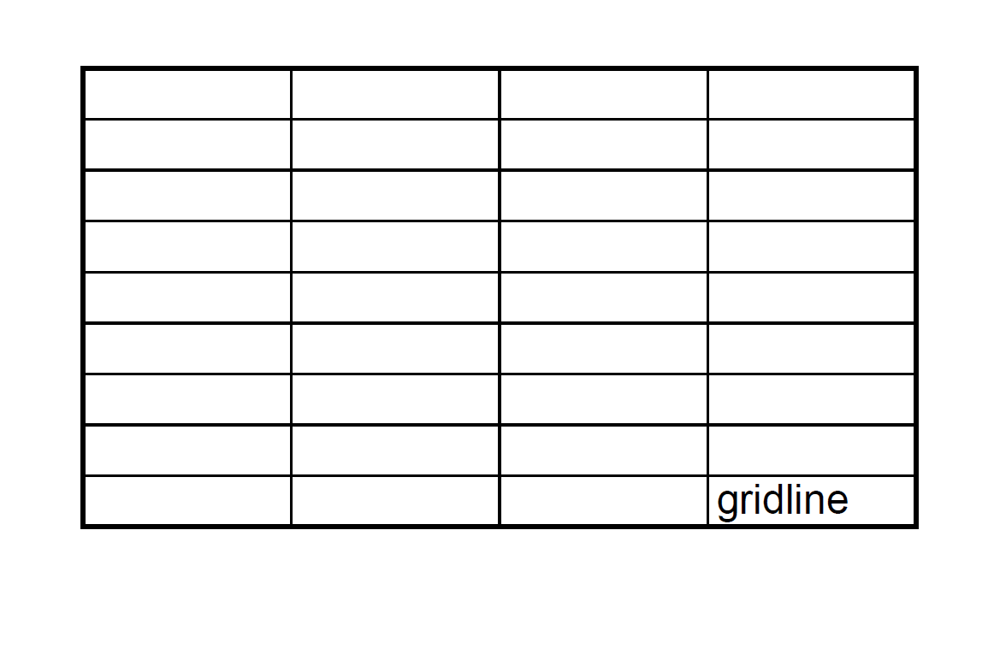

For compatibility with older versions, Aspose.Cells renders gridlines as dotted lines by default while converting Excel to PDF. However, modern Excel renders gridlines as solid lines nowadays.

With the option [PdfSaveOptions.PaginatedSaveOptions(PaginatedSaveOptions_Impl* impl)](https://reference.aspose.com/cells/cpp/aspose.cells/paginatedsaveoptions/~paginatedsaveoptions/), Aspose.Cells can also render gridlines as solid lines.

```cpp
#include <iostream>
#include "Aspose.Cells.h"

using namespace Aspose::Cells;
using namespace Aspose::Cells::Rendering;

int main()
{
    Aspose::Cells::Startup();

    // Create an empty Workbook
    Workbook wb;

    // Prepare data
    wb.GetWorksheets().Get(0).GetCells().Get(u"D9").PutValue(u"gridline");

    // Enable to print gridline
    wb.GetWorksheets().Get(0).GetPageSetup().SetPrintGridlines(true);

    // Set to render gridline as solid line
    PdfSaveOptions pdfSaveOptions;
    pdfSaveOptions.SetGridlineType(GridlineType::Hair);

    // Save the pdf file with PdfSaveOptions
    wb.Save(u"..\\Data\\02_OutputDirectory\\test_Cpp.pdf", pdfSaveOptions);

    std::cout << "PDF file saved successfully with gridlines!" << std::endl;

    Aspose::Cells::Cleanup();
}
```

