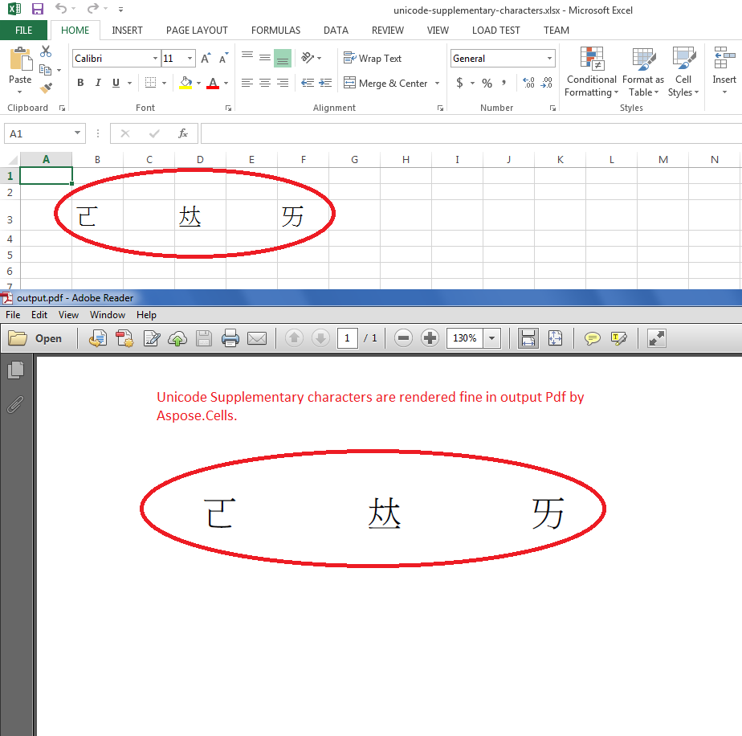

{}

Normal Unicode characters are 2-bytes long while Unicode Supplementary characters are 4-bytes long. Aspose.Cells now supports rendering of these 4-bytes Unicode characters.

In the Unicode Character Standard, Supplementary Characters are the characters assigned code points from U+10000 to U+10FFFF. In other words, these are the Unicode characters greater than U+FFFF.

- In UTF-8 these characters are each 4 bytes long.
- In UTF-16 these characters require 2 surrogates (16-bit units).

{}

## Render Unicode Supplementary characters in output PDF by Aspose.Cells

The following screenshot shows how Aspose.Cells rendered the [source excel file](5115563.xlsx) into the [output PDF](5115564.pdf). As you can see all three Unicode Supplementary characters have been rendered exactly same as done by Microsoft Excel.



## Sample Code

You can use this sample code to convert [source excel file](5115563.xlsx) into [output PDF](5115564.pdf).

```c++
#include <iostream>
#include "Aspose.Cells.h"

using namespace Aspose::Cells;

int main()
{
    Aspose::Cells::Startup();

    // Source directory path
    U16String srcDir(u"..\\Data\\01_SourceDirectory\\");

    // Output directory path
    U16String outDir(u"..\\Data\\02_OutputDirectory\\");

    // Path of input excel file
    U16String inputFilePath = srcDir + u"unicode-supplementary-characters.xlsx";

    // Path of output PDF file
    U16String outputFilePath = outDir + u"RenderUnicodeInOutput_out.pdf";

    // Load the source excel file containing Unicode Supplementary characters
    Workbook wb(inputFilePath);

    // Save the workbook as PDF
    wb.Save(outputFilePath, SaveFormat::Pdf);

    std::cout << "Workbook saved successfully with Unicode Supplementary characters!" << std::endl;

    Aspose::Cells::Cleanup();

    return 0;
}
```
