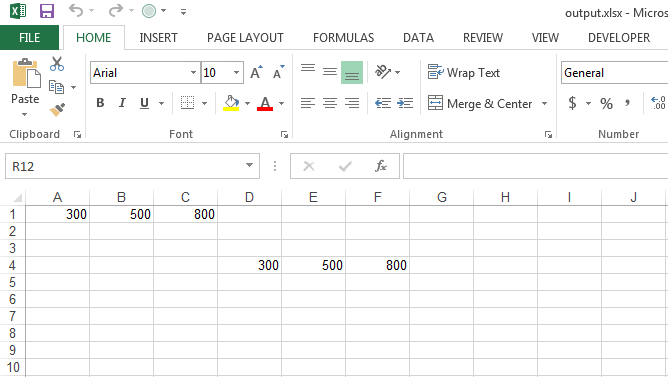

{} 

CSV files mostly contain textual data and do not typically include any formulas. However, there are cases when CSV files might contain formulas. Such CSV files should be loaded by setting the [TxtLoadOptions.GetHasFormula()](https://reference.aspose.com/cells/cpp/aspose.cells/txtloadoptions/gethasformula/) to **true**. Once this property is set to **true**, Aspose.Cells will not treat formulas as simple text. They will be treated as formulas, and the Aspose.Cells formula calculation engine will process them as usual.

{} 

The following code illustrates how you can load and import a CSV file with formulas. You can use any CSV file. For illustration purposes, we use the [simple CSV file](5115034.csv) which contains this data. As you can see, it contains a formula.


300,500,=Sum(A1:B1)


```c++
#include <iostream>
#include "Aspose.Cells.h"
using namespace Aspose::Cells;

int main()
{
    Aspose::Cells::Startup();

    //For complete examples and data files, please go to https://github.com/aspose-cells/Aspose.Cells-for-C

    //Source directory path
    U16String srcDir(u"..\\Data\\01_SourceDirectory\\");

    //Output directory path
    U16String outDir(u"..\\Data\\02_OutputDirectory\\");

    //Create TxtLoadOptions with specified settings
    TxtLoadOptions opts;
    opts.SetSeparator(u','); // Set the separator to a comma
    opts.SetHasFormula(true); // Indicate that the CSV may have formulas

    // Load the CSV file into a Workbook object
    Workbook workbook(srcDir + u"sample.csv", opts);

    // You can also import the CSV file starting from cell D4 (indices 3,3)
    Worksheet worksheet = workbook.GetWorksheets().Get(0);
    worksheet.GetCells().ImportCSV(srcDir + u"sample.csv", opts, 3, 3);

    // Save the workbook in XLSX format
    workbook.Save(outDir + u"output_out.xlsx");

    std::cout << "CSV file loaded and saved successfully!" << std::endl;

    Aspose::Cells::Cleanup();
}
```

The code first loads the CSV file, then imports it again at cell D4. Finally, it saves the workbook object in XLSX format. The [output XLSX file](5115052.xlsx) looks like this. As you can see, cells C3 and F4 contain formulas, and their result is 800.

||
| :- |

