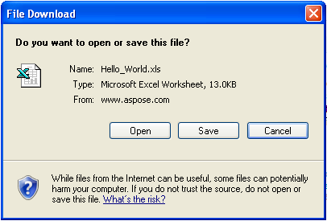
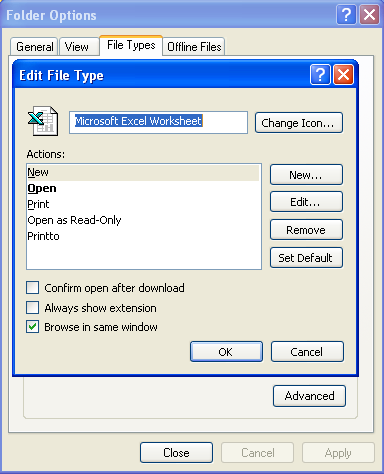

{} 

This document explains how to open a Microsoft Excel file in a browser without showing the Open‑Save‑Cancel dialog box. 

It should be noted that the security restriction that does not allow direct download of a file is enforced by Microsoft (or other browser vendors), not by Aspose. It is imposed to block and restrict potentially harmful files from being downloaded to local machines. 

It is risky for the client’s local system to allow download without showing the Open‑Save‑Cancel dialog to prompt for download. There is no option or workaround available from Aspose as it would be a very big security risk.

{} 

## **Why a security risk?**
The following image shows the Open‑Save‑Cancel dialog box displayed by Internet Explorer when trying to download a file.

|**The Open‑Save‑Cancel dialog**|
| :- |
||

As explained above, allowing a file to open or run on your system without confirmation that you really want it to is a security risk. Some files contain viruses, and some sites will try to download harmful files to your machine without prompting you. It is therefore not recommended to allow file download without the download prompt, as users need to verify the file and its source before downloading or running it. Disabling the download dialog box makes the system vulnerable to viruses, Trojans, and hackers who may silently affect your system. 

## **Opening a File without the Open‑Save‑Cancel dialog box**
While it is a major security concern, Microsoft still provides Internet Explorer settings that allow users to disable the Open‑Save‑Cancel prompt for file download. 

In Windows Explorer:

1. On the **Tools** menu, select **Folder Options**.  
2. Click the **File Types** tab in the Folder Options dialog.  
3. Select the **XLS** extension file type.  
4. Click **Advanced**.  
   A dialog box is displayed. It has three options at the bottom.  
5. Uncheck **Confirm open after download**.  
6. Select the third option — **Browse in same window** — to view the Excel file in Internet Explorer without launching Microsoft Excel as a standalone application.  

|**Editing file type options**|
| :- |
||

This setting allows files to run directly in the web browser, without the Open‑Save‑Cancel dialog appearing when downloading or opening the file.


